# 🚀 ai4future: Advanced AI & Agentic Systems Engineering Roadmap

Welcome to the **ai4future** repository—a centralized, portfolio-grade technical ledger documenting advanced AI engineering, generative models, autonomous agentic workflows, cloud infrastructures, and multimodal systems. This repository details both the mathematical mechanics and production architectures required to design and deploy modern cognitive systems.

---

## 🛠️ What I Built

Hands-on labs and sandbox implementations completed throughout the course:

| Lab | Tech Stack | Description |
| :--- | :--- | :--- |
| [🔍 Document Search Engine](labs/document-search/) | Python · LangChain · watsonx.ai · ChromaDB | Semantic-search sandbox: index, query, and retrieve document chunks via high-dimensional similarity matching |
| [📝 Document Summarizer](labs/document-summarizer/) | Python · LangChain · watsonx.ai | Multi-stage document summarization using Map-Reduce chain operations and custom templates |
| [🧠 RAG Implementation](labs/rag-implementation/) | Python · LlamaIndex · watsonx.ai · Milvus | End-to-end Retrieval-Augmented Generation pipeline with text chunking, embedding, vector indexing, and grounded generation |
| [🎫 Ticket Router](labs/ticket-router/) | Python · CrewAI · watsonx.ai | Multi-agent coordination and Mixture of Experts routing for support ticket classification and dispatch |

---

## 📖 What I Learned

Detailed notes organized by module — each file covers concepts, architectures, and worked examples:

### Module 1: AI Fundamentals & Generative AI
- [Exploring Artificial Intelligence](docs/01-fundamentals/exploring-ai.md) — AI lifecycle, ML/DL/NLP subfields, cognitive automation vs. rule-based systems
- [Introduction to Generative AI](docs/01-fundamentals/intro-to-generative-ai.md) — Foundation Models, Transformer mechanics, LLM customization techniques
- [Exploring Data](docs/01-fundamentals/exploring-data.md) — Data structures, DBMS, ETL pipelines, statistical analysis

### Module 2: Agentic & Multi-Agent Systems
- [Power of AI Agents](docs/02-agentic-systems/ai-agents-power.md) — ReAct loop, autonomy spectrum, tool invocation patterns
- [Rise of Multi-Agent Systems](docs/02-agentic-systems/multi-agent-systems.md) — Coordination architectures, MoE routing, vertical/horizontal orchestration
- [Ticket Routing & Recommendations](docs/02-agentic-systems/ticket-routing.md) — NLU classification, recommendation filtering, GDPR compliance

### Module 3: RAG & Embeddings
- [Vector Embeddings](docs/03-rag-embeddings/vector-embeddings.md) — Embedding mechanics, similarity metrics, vector database indexing
- [Build Smarter AI with Embeddings](docs/03-rag-embeddings/smarter-ai-embeddings.md) — RAG pipelines, context grounding, hallucination mitigation

### Module 4: Infrastructure & Security
- [Cloud Computing](docs/04-infra-security/cloud-computing.md) — Virtualization, shared responsibility, deployment topologies
- [Cybersecurity](docs/04-infra-security/cybersecurity.md) — Threat modeling, Zero Trust, cryptographic protocols

### Module 5: Advanced Topics
- [Multimodal AI](docs/05-advanced-topics/multimodal-ai.md) — CLIP alignment, cross-modal embedding, multimodal RAG
- [Quantum Computing](docs/05-advanced-topics/quantum-computing.md) — Qubit states, quantum gates, cryogenic hardware

---

## 🎖️ Earned Digital Credentials

Below is the collection of skills credentials earned and documented throughout this engineering curriculum:

### 🔍 Retrieval-Augmented Generation & Vector Spaces

| Vector Embeddings | Retrieval-Augmented Generation (Intro) | Build Smarter AI with Embeddings |
| :---: | :---: | :---: |
|  |  |  |
| **Vector Embeddings: Key to Meaning** | **Introduction to RAG** | **Build Smarter AI with Embeddings** |
| [Notes Ledger](docs/03-rag-embeddings/vector-embeddings.md) | [Notes Ledger](docs/03-rag-embeddings/smarter-ai-embeddings.md) | [Notes Ledger](docs/03-rag-embeddings/smarter-ai-embeddings.md) |

### 🤖 Agentic Systems & Advanced Topics

| Autonomous AI Agents | Multi-Agent Coordination | Make Agentic AI Work for You | Multimodal AI Architectures |
| :---: | :---: | :---: | :---: |
|  |  |  |  |
| **Power of AI Agents** | **Rise of Multi-Agent Systems** | **Make Agentic AI Work for You** | **Multimodal RAG** |
| [Notes Ledger](docs/02-agentic-systems/ai-agents-power.md) | [Notes Ledger](docs/02-agentic-systems/multi-agent-systems.md) | [Notes Ledger](docs/02-agentic-systems/ticket-routing.md) | [Notes Ledger](docs/05-advanced-topics/multimodal-ai.md) |

---

## 📂 Course Module Index

| Module / Directory | Resource Navigator Badge | Primary Technical Focus |
| :--- | :---: | :--- |
| **Module 1: Fundamentals** |  | AI lifecycles, ML/DL/NLP, Transformer architectures, DBMS, ETL |
| **Module 2: Agentic Systems** |  | Single-agent planning, tool invocation, multi-agent coordination |
| **Module 3: RAG & Embeddings** |  | Context-grounded generation, semantic search, vector space alignment |
| **Module 4: Infrastructure & Security** |  | Cloud resource abstraction, shared responsibility, threat mitigation |
| **Module 5: Advanced Topics** |  | Vision-semantic alignment, multimodal inputs, quantum computing |
| **Practical Laboratories** |  | Document Search, Summarizers, Ticket Routers, Vector RAG implementations |

---

## 🗺️ Architectural Concept Map

The relationships between the modules and their architectural integrations are visualized below:

```mermaid
graph TD
    subgraph Conceptual Pipeline
        Data[Exploring Data: DBMS & ETL] -->|Feeds Training| Model[Foundational Models & Transformers]
        Model -->|Powers Reasoning| Agent[Autonomous Agents: ReAct Loop]
        Agent -->|Coordinates| MAS[Multi-Agent Coordination: MoE Routing]
        MAS -->|Retrieves context from| RAG[RAG & High-Dimensional Vectors]
    end
    subgraph Infrastructure Layer
        RAG -->|Deploys to| Cloud[Virtualization & Cloud Topologies]
        Cloud -->|Secured by| Sec[Zero Trust & Cryptographic Policies]
    end
    subgraph Advanced Frontiers
        Cloud -->|Enables| Multi[Multimodal Alignment: CLIP]
        Multi -->|Future Compute| Quantum[Quantum States & Logic Gates]
    end
    
    style Conceptual Pipeline fill:#1a1c23,stroke:#3b82f6,stroke-width:2px;
    style Infrastructure Layer fill:#1c1917,stroke:#8b5cf6,stroke-width:2px;
    style Advanced Frontiers fill:#1e1b4b,stroke:#ec4899,stroke-width:2px;
```

---

> [!NOTE]  
> **Repository Maintenance & Chronology**  
> All architectural definitions, concept comparison tables, and execution workflows are updated dynamically. To view the chronological progress, updates, and daily logs, refer to the [Course Devlog](devlog.md).
