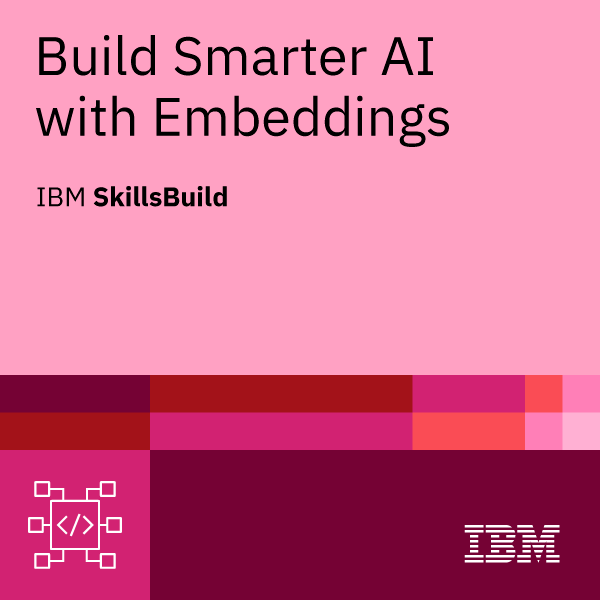
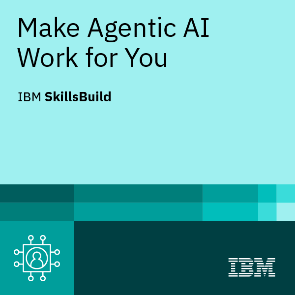
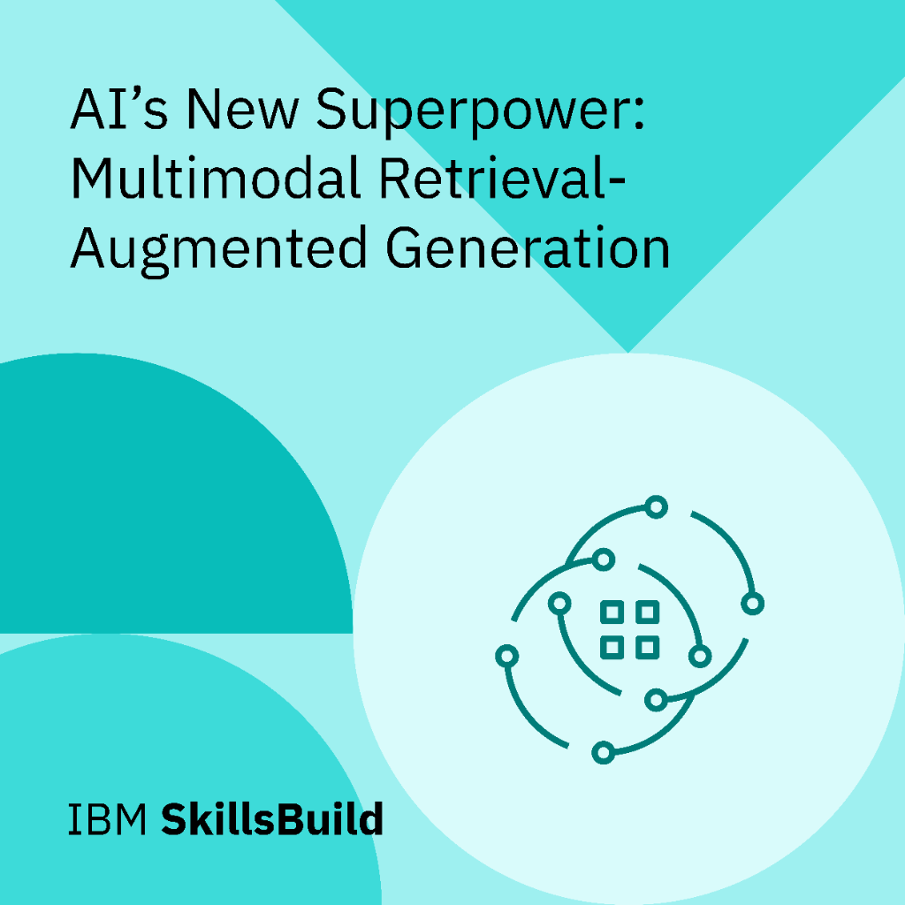

# 🚀 ai4future: Advanced AI & Agentic Systems Engineering Roadmap

Welcome to the **ai4future** repository—a centralized, portfolio-grade technical ledger documenting advanced AI engineering, generative models, autonomous agentic workflows, cloud infrastructures, and multimodal systems. This repository details both the mathematical mechanics and production architectures required to design and deploy modern cognitive systems.

---

## 🎖️ Earned Digital Credentials

Below is the collection of skills credentials earned and documented throughout this engineering curriculum:

### 🔍 Retrieval-Augmented Generation & Vector Spaces

| Vector Embeddings | Retrieval-Augmented Generation (Intro) | Build Smarter AI with Embeddings |
| :---: | :---: | :---: |
|  |  |  |
| **Vector Embeddings: Key to Meaning** | **Introduction to RAG** | **Build Smarter AI with Embeddings** |
| [Notes Ledger](docs/03-rag-embeddings/vector-embeddings.md) | [Notes Ledger](docs/03-rag-embeddings/smarter-ai-embeddings.md) | [Notes Ledger](docs/03-rag-embeddings/smarter-ai-embeddings.md) |

### 🤖 Agentic Systems & Advanced Topics

| Autonomous AI Agents | Multi-Agent Coordination | Make Agentic AI Work for You | Multimodal AI Architectures |
| :---: | :---: | :---: | :---: |
|  |  |  |  |
| **Power of AI Agents** | **Rise of Multi-Agent Systems** | **Make Agentic AI Work for You** | **Multimodal RAG** |
| [Notes Ledger](docs/02-agentic-systems/ai-agents-power.md) | [Notes Ledger](docs/02-agentic-systems/multi-agent-systems.md) | [Notes Ledger](docs/02-agentic-systems/ticket-routing.md) | [Notes Ledger](docs/05-advanced-topics/multimodal-ai.md) |

---

## 📂 Repository Workspace Index

| Module / Directory | Resource Navigator Badge | Primary Technical Focus | Core Milestones |
| :--- | :---: | :--- | :--- |
| **Module 1: Fundamentals** |  | Core AI lifecycles, ML/DL/NLP subfields, Transformer architectures, DBMS, and ETL | Attention weight computation, subword tokenizers, SQL execution layers, and IQR/Pearson |
| **Module 2: Agentic Systems** |  | Autonomous single-agent planning, tool invocation, and multi-agent coordination architectures | ReAct (Reason + Act) loop execution, memory models, Mixture of Experts (MoE) routing |
| **Module 3: RAG & Embeddings** |  | Context-grounded generative pipelines, semantic search indices, and vector space alignments | High-dimensional embedding metrics, cosine similarity clustering, index distance formulas |
| **Module 4: Infrastructure & Security** |  | Cloud resource abstraction, shared responsibility models, and threat-mitigation frameworks | Hypervisor scheduling overhead, deployment topologies, Amdahl's Law, and Zero Trust |
| **Module 5: Advanced Topics** |  | Vision-semantic alignment models, multimodal inputs, and quantum computing foundations | Multimodal contrastive loss (InfoNCE), Qubit superposition, and Quantum Gate matrices |
| **Practical Laboratories** |  | Production-like testbeds and sandbox automation utilities for engineering verification | Document Search, Summarizers, Ticket Routers, and Vector RAG implementations |

---

## 🛠️ Technical Deep Dive by Module

---

### 📦 [Module 1: AI Fundamentals & Generative AI](docs/01-fundamentals/)
*   **Operational AI Lifecycle:** Deconstructs the iterative four-step data cycle:
    $$\text{Data Collection} \longrightarrow \text{Pattern Recognition} \longrightarrow \text{Inference/Prediction} \longrightarrow \text{Feedback Loop Optimization}$$
*   **Data Science Outliers & Correlations:** Employs Interquartile Range (IQR) for boxplot anomaly fences:
    $$\text{IQR} = Q_3 - Q_1$$
    $$\text{Lower Fence} = Q_1 - 1.5 \times \text{IQR}, \quad \text{Upper Fence} = Q_3 + 1.5 \times \text{IQR}$$
    Measures linear dependency via the Pearson correlation coefficient ($r$):
    $$r = \frac{\sum_{i=1}^n (x_i - \bar{x})(y_i - \bar{y})}{\sqrt{\sum_{i=1}^n (x_i - \bar{x})^2 \sum_{i=1}^n (y_i - \bar{y})^2}}$$
*   **Transformer Mechanics & Self-Attention:** Details the scaled dot-product self-attention scoring driving modern LLM token relationships:
    $$\text{Attention}(Q, K, V) = \text{softmax}\left(\frac{Q K^T}{\sqrt{d_k}}\right) V$$
*   **NLP Vector Representations:** Maps term frequency-inverse document frequency (TF-IDF):
    $$\text{TF-IDF}(t, d, D) = \text{TF}(t, d) \times \text{IDF}(t, D)$$
*   **Activation Functions:** Normalizes neural network forward passes ($z = W^T x + b$) via Sigmoid ($\sigma$), ReLU, or Softmax:
    $$\sigma(z) = \frac{1}{1 + e^{-z}}, \quad \text{ReLU}(z) = \max(0, z), \quad \text{Softmax}(z_i) = \frac{e^{z_i}}{\sum_{j=1}^{K} e^{z_j}}$$
*   **Prerequisites:** Familiarity with basic probability, matrix multiplication, and database schemas.

---

### 🤖 [Module 2: Agentic & Multi-Agent Systems](docs/02-agentic-systems/)
*   **The ReAct Planning Loop:** Implements the iterative execution cycle:
    $$\text{Thought} \longrightarrow \text{Action} \longrightarrow \text{Observation}$$
*   **Autonomy Spectrum:** Charts the progression from deterministic if-else scripts to fully autonomous, feedback-driven goal seeking.
*   **Mixture of Experts (MoE) & Gate Routing:** Models load balancing and token assignment across heterogeneous expert models:
    $$y = \sum_{i=1}^{N} G(x)_i E_i(x)$$
    where the gating network $G(x) = \text{Softmax}(W_g x)$ outputs the distribution routing score across specialist experts $E_i(x)$.
*   **Ticket Routing & Recommendation Systems:** Details NLU classification pipelines, collaborative and content-based recommendation filtering models, and data privacy compliance structures (e.g., GDPR Article 5/7).
*   **Prerequisites:** Module 1 completion, basic knowledge of API structures and REST operations.

---

### 🔍 [Module 3: Retrieval-Augmented Generation (RAG) & Embeddings](docs/03-rag-embeddings/)
*   **Context Grounding:** Mitigates LLM hallucinations by intercepting inputs and appending highly relevant contextual tokens extracted at query time.
*   **Vector Search & Cosine Similarity:** Computes semantic proximity in high-dimensional embedding spaces:
    $$\text{similarity}(A, B) = \cos(\theta) = \frac{A \cdot B}{\|A\| \|B\|} = \frac{\sum_{i=1}^n A_i B_i}{\sqrt{\sum_{i=1}^n A_i^2} \sqrt{\sum_{i=1}^n B_i^2}}$$
*   **Distance Metrics:** Compares Euclidean distance ($L_2$) vs. Inner Product ($IP$) metrics for dense vector clustering.
*   **Prerequisites:** Vector mathematics (dot products, vector normalization) and indexing patterns.

---

### ☁️ [Module 4: Infrastructure & Security](docs/04-infra-security/)
*   **Virtualization & Hypervisors:** Explores resources scaling from physical host CPUs to hypervisor-isolated guest OS (Virtual Machines).
*   **Shared Responsibility Matrix:** Breaks down the operational boundaries between client and Cloud Service Provider (CSP) across IaaS, PaaS, SaaS, and FaaS.
*   **Performance Scaling (Amdahl's Law):** Models theoretical latency improvements when parallelizing distributed workloads:
    $$S_{\text{latency}}(s) = \frac{1}{(1 - p) + \frac{p}{s}}$$
    where $p$ is the parallelizable proportion and $s$ is the scaling factor of execution nodes.
*   **Security Architectures:** Explores cryptographic protocol standards, threat-modeling methodologies, and Zero Trust validation loops.
*   **Prerequisites:** Operating system fundamentals, network routing, and IP protocol stacks.

---

### 🚀 [Module 5: Advanced Topics](docs/05-advanced-topics/)
*   **Multimodal Alignment (CLIP):** Connects disparate unimodal encoders (Vision ViT and Text Transformer) into a shared semantic embedding space using contrastive InfoNCE loss:
    $$\text{InfoNCE Loss} = -\log \frac{e^{\cos(v_i, t_i)/\tau}}{\sum_{j} e^{\cos(v_i, t_j)/\tau}}$$
*   **Quantum Computing Foundations:** Models qubits under superposition and entanglement states:
    $$|\psi\rangle = \alpha|0\rangle + \beta|1\rangle \quad \text{subject to} \quad |\alpha|^2 + |\beta|^2 = 1$$
*   **Quantum Logic Gates:** Evaluates rotation transformations via the Hadamard Gate matrix:
    $$H = \frac{1}{\sqrt{2}}\begin{pmatrix} 1 & 1 \\ 1 & -1 \end{pmatrix}$$
*   **Quantum Hardware & Cryogenics:** Covers sub-kelvin thermal dilution refrigerator architecture (15 mK), physical qubit isolation, signal filtering, and cryogenic amplification.
*   **Prerequisites:** Linear algebra (matrix tensor products, complex vector spaces) and deep neural network encoders.

---

## 🗺️ Architectural Concept Map

The relationships between the modules and their architectural integrations are visualized below:

```mermaid
graph TD
    subgraph Conceptual Pipeline
        Data[Exploring Data: DBMS & ETL] -->|Feeds Training| Model[Foundational Models & Transformers]
        Model -->|Powers Reasoning| Agent[Autonomous Agents: ReAct Loop]
        Agent -->|Coordinates| MAS[Multi-Agent Coordination: MoE Routing]
        MAS -->|Retrieves context from| RAG[RAG & High-Dimensional Vectors]
    end
    subgraph Infrastructure Layer
        RAG -->|Deploys to| Cloud[Virtualization & Cloud Topologies]
        Cloud -->|Secured by| Sec[Zero Trust & Cryptographic Policies]
    end
    subgraph Advanced Frontiers
        Cloud -->|Enables| Multi[Multimodal Alignment: CLIP]
        Multi -->|Future Compute| Quantum[Quantum States & Logic Gates]
    end
    
    style Conceptual Pipeline fill:#1a1c23,stroke:#3b82f6,stroke-width:2px;
    style Infrastructure Layer fill:#1c1917,stroke:#8b5cf6,stroke-width:2px;
    style Advanced Frontiers fill:#1e1b4b,stroke:#ec4899,stroke-width:2px;
```

---

> [!NOTE]  
> **Repository Maintenance & Chronology**  
> All architectural definitions, concept comparison tables, and execution workflows are updated dynamically. To view the chronological progress, updates, and daily logs, refer to the [Course Devlog](devlog.md).
