# 📚 Module 1: AI Fundamentals & Generative AI

Welcome to the foundational core of the **ai4future** roadmap. This module details the operational lifecycles of Artificial Intelligence, the historical shift into Large Language Models (LLMs), the transformer architecture mechanics, and the pipelines of data engineering.

---

## 📂 What's in this Folder

| File / Resource | Access Badge | Technical Focus | Core Key Concepts |
| :--- | :---: | :--- | :--- |
| **Exploring AI** |  | High-level AI paradigms, operational lifecycles, and subfield alignments | Collect ➔ Pattern ➔ Predict ➔ Optimize loop, Automation vs. Cognitive AI |
| **Intro to Generative AI** |  | Foundation Models, Transformers, tokenizers, and vector embeddings | Self-Attention, BPE/WordPiece/SentencePiece, Softmax, Risk Mitigations |
| **Exploring Data** |  | Database systems, SQL executions, and ETL engineering pipelines | DBMS schema, SQL execution flow, ETL (Extract/Transform/Load), and 5-step analysis |

---

## 🧮 Theoretical & Mathematical Foundations

This module sets the algorithmic and mathematical groundwork for modeling intelligent behavior and managing structured information.

---

### 1. Data Science & Statistical Prep
In processing raw datasets, identifying anomalies and measuring linear relations is crucial before model training.

#### A. Interquartile Range (IQR) Outlier Fences
The IQR measures statistical dispersion by computing the difference between the 75th percentile ($Q_3$) and the 25th percentile ($Q_1$). We define outlier boundaries as:
$$\text{IQR} = Q_3 - Q_1$$
$$\text{Lower Fence} = Q_1 - 1.5 \times \text{IQR}$$
$$\text{Upper Fence} = Q_3 + 1.5 \times \text{IQR}$$
Any data point $x_i$ falling outside $[\text{Lower Fence}, \text{Upper Fence}]$ is statistically treated as an outlier.

#### B. Pearson Correlation Coefficient
Measures the linear correlation between two random variables $X$ and $Y$. It maps to a range $[-1, 1]$:
$$r_{xy} = \frac{\sum_{i=1}^n (x_i - \bar{x})(y_i - \bar{y})}{\sqrt{\sum_{i=1}^n (x_i - \bar{x})^2 \sum_{i=1}^n (y_i - \bar{y})^2}}$$
where $\bar{x}$ and $\bar{y}$ are the sample means.

---

### 2. Machine Learning Decision Logic & Optimization
Machine learning utilizes statistical structures to divide datasets and optimize model parameters.

#### A. Shannon Entropy
Measures the impurity or randomness of a dataset $S$ containing $c$ target classes:
$$H(S) = -\sum_{i=1}^{c} p_i \log_2 p_i$$
where $p_i$ is the probability/proportion of elements belonging to class $i$ in $S$.

#### B. Gini Impurity
An alternative metric to entropy used by decision trees to measure how often a randomly chosen element from the set would be incorrectly labeled:
$$I_G(p) = 1 - \sum_{i=1}^{J} p_i^2$$

#### C. Information Gain
Calculates the expected reduction in entropy achieved by partitioning a dataset $T$ on an attribute $a$:
$$IG(T, a) = H(T) - H(T|a) = H(T) - \sum_{v \in \text{Values}(a)} \frac{|T_v|}{|T|} H(T_v)$$

#### D. Gradient Descent Step Rule
The core optimization algorithm used to update weights $\theta$ to minimize a cost function $L(\theta)$ with learning rate $\eta$:
$$\theta_{t+1} = \theta_t - \eta \nabla_\theta L(\theta_t)$$

---

### 3. Deep Learning Forward Passes & Activations
Deep learning processes information by feeding inputs through artificial neural network layers.

#### A. Forward Pass Linear Combination
For a given layer with weights $W$, bias vector $b$, and input feature vector $x$:
$$z = W^T x + b$$

#### B. Activation Functions
To model non-linear boundaries, $z$ is passed through activation functions:
*   **Rectified Linear Unit (ReLU):**
    $$\text{ReLU}(z) = \max(0, z)$$
*   **Sigmoid Function (Binary Classification):**
    $$\sigma(z) = \frac{1}{1 + e^{-z}}$$
*   **Softmax Function (Multi-class Probability Distribution):**
    $$\text{Softmax}(z_i) = \frac{e^{z_i}}{\sum_{j=1}^{K} e^{z_j}}$$

---

### 4. Natural Language Processing & Attention Mechanics
Language processing relies on converting tokens into vectors and weighting context dynamically.

#### A. Term Frequency-Inverse Document Frequency (TF-IDF)
Scores word importance within a document $d$ belonging to a corpus $D$:
$$\text{TF}(t, d) = \frac{f_{t,d}}{\sum_{t' \in d} f_{t',d}}$$
$$\text{IDF}(t, D) = \log\left(\frac{|D|}{|\{d \in D : t \in d\}|}\right)$$
$$\text{TF-IDF}(t, d, D) = \text{TF}(t, d) \times \text{IDF}(t, D)$$

#### B. Transformer Scaled Dot-Product Self-Attention
Maps a query matrix $Q$, key matrix $K$, and value matrix $V$ to compute weighted semantic representation vectors:
$$\text{Attention}(Q, K, V) = \text{softmax}\left(\frac{Q K^T}{\sqrt{d_k}}\right) V$$
where $d_k$ is the dimensionality of the key vectors, scaling the dot product to prevent vanishing gradients in the softmax.

---

## 🗺️ Architectural Concept Map

The relationships between the foundational topics covered in this module are mapped below:

```mermaid
graph TD
    Data[Exploring Data: DBMS & ETL] -->|Feeds Clean Data| ML[Machine Learning & Deep Learning]
    ML -->|Enables| NLP[Natural Language Processing]
    NLP -->|Transitions To| FM[Foundation Models & LLMs]
    FM -->|Powers| GenAI[Generative AI Content Systems]

    style Data fill:#2e1f47,stroke:#9d4edd,stroke-width:2px;
    style ML fill:#1f3a52,stroke:#4cc9f0,stroke-width:2px;
    style FM fill:#124e3f,stroke:#2a9d8f,stroke-width:2px;
```

---

## 🛠️ Navigating the Notes

To dive into the specific logs, use the direct paths below:
*   Read the core AI fundamentals: [exploring-ai.md](exploring-ai.md)
*   Dive into LLMs & Transformers: [intro-to-generative-ai.md](intro-to-generative-ai.md)
*   Explore DBMS & ETL pipelines: [exploring-data.md](exploring-data.md)

---

[Root Overview](../../README.md) | [Next: Agentic Systems →](../02-agentic-systems/)
