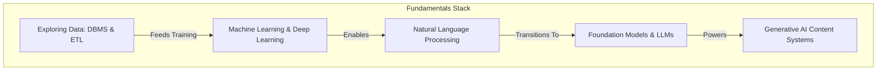

# 📚 Module 1: AI Fundamentals & Generative AI

Welcome to the foundational core of the **ai4future** roadmap. This module covers the core concepts of artificial intelligence, the historical transition into generative foundation models, the mechanics of transformer architectures, and the lifecycle of data engineering and DBMS operations.

---

## 📂 Directory Contents & Technical Summaries

This folder contains three critical technical ledgers documenting the base layers of modern intelligence systems:

### 1. 🤖 [Exploring AI](file:///c:/Programming/Ai%20-%20Engineer/ai4future/docs/01-fundamentals/exploring-ai.md)
*   **Operational Lifecycle:** Maps out the 4-step execution lifecycle of AI systems (*Data Collection ➔ Pattern Recognition ➔ Inference ➔ Continuous Feedback Optimization*).
*   **Automation vs. Cognitive AI:** Contradicts deterministic software (rule-based if-else branches) with dynamic statistical inference systems that learn and adapt.
*   **Enabling Technologies:** Explores the relationship between Machine Learning (Supervised, Unsupervised, Reinforcement Learning), Deep Learning (neural networks), and Natural Language Processing (NLP).
*   **Syllabus Focus:** Strategic business advantages, McKinsey economic projections across sectors, and the transition toward autonomous Agentic AI.

### 2. ⚡ [Introduction to Generative AI](file:///c:/Programming/Ai%20-%20Engineer/ai4future/docs/01-fundamentals/intro-to-generative-ai.md)
*   **Architectural Foundations:** Traces the evolutionary shift from Variational Autoencoders (VAEs) to Stanford's unified Foundation Models, detailing the scale metrics of Large Language Models.
*   **Tokenization Mechanics:** Compares subword tokenizers (Byte Pair Encoding, WordPiece, SentencePiece) along with computational vocabulary constraints.
*   **Semantic Embeddings:** Explores high-dimensional vector mappings and the Softmax normalization process.
*   **The Transformer Shift:** Compares recurrent models (RNN sequential bottlenecks) with the parallel attention mechanism, mapped using the *Prep Chefs vs. Head Chef* culinary metaphor.
*   **Self-Attention Matrix:** Deconstructs how Query ($Q$), Key ($K$), and Value ($V$) matrices compute multi-head attention weights, alongside auto-regressive masked attention properties.

### 3. 💾 [Exploring Data](file:///c:/Programming/Ai%20-%20Engineer/ai4future/docs/01-fundamentals/exploring-data.md)
*   **Data Classification:** Distinguishes data by Nature (Qualitative vs. Quantitative), Sourcing Method (Primary vs. Secondary), and Schema Structure (Structured tables, JSON semi-structured tags, and free-form unstructured blobs).
*   **Data Management & SQL Systems:** Explains the Database Management System (DBMS) using the *Librarian Metaphor*. Details the four steps of query lifecycle execution: *Write ➔ Validate ➔ Filter ➔ Fetch*.
*   **ETL (Extract, Transform, Load) Pipeline:** Deconstructs enterprise data preparation using the *Healthy Eating Exhibition* case study.
*   **Analysis Workflow:** Outlines the 5-step data analysis lifecycle (*Prepare, Collect, Process, Analyze, Interpret*) using the *Alice's Fitness Center* case study.

---

## 🗺️ Architectural Concept Map

The relationships between the foundational topics covered in this module are mapped below:

---

## 🛠️ Navigating the Notes

To dive into the specific logs, use the direct paths below:
*   Read the core AI fundamentals: [exploring-ai.md](file:///c:/Programming/Ai%20-%20Engineer/ai4future/docs/01-fundamentals/exploring-ai.md)
*   Dive into LLMs & Transformers: [intro-to-generative-ai.md](file:///c:/Programming/Ai%20-%20Engineer/ai4future/docs/01-fundamentals/intro-to-generative-ai.md)
*   Explore DBMS & ETL pipelines: [exploring-data.md](file:///c:/Programming/Ai%20-%20Engineer/ai4future/docs/01-fundamentals/exploring-data.md)
