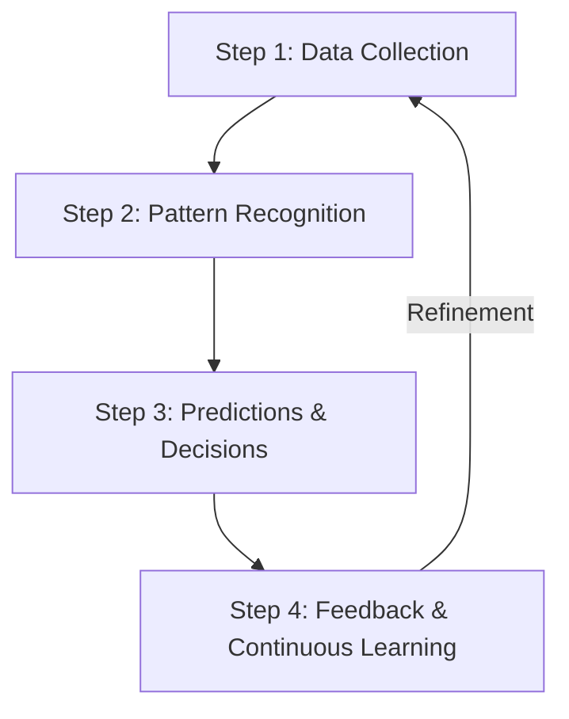

# Module 1: Exploring Artificial Intelligence (AI)

Welcome to the fundamentals of Artificial Intelligence. This document outlines the core concepts of AI, its operational lifecycle, how it differs from traditional automation, and common misconceptions in the field.

---

## 1. What is Artificial Intelligence?

**Artificial Intelligence (AI)** is a branch of computer science and technology that enables computers and machines to simulate human cognitive functions, including:
*   **Learning** (acquiring information and rules for using it)
*   **Comprehension/Reasoning** (using rules to reach approximate or definite conclusions)
*   **Problem-Solving**
*   **Decision-Making**
*   **Creativity**
*   **Autonomy**

### AI vs. Traditional Software
*   **Traditional Software**: Follows rigid, pre-programmed, hand-coded rules. It cannot handle scenarios outside of its programmed logic without human code updates.
*   **Artificial Intelligence**: Analyzes data, identifies underlying patterns, and **adapts and evolves** over time. It can manage complex tasks like speech recognition, natural language processing, and predictions dynamically.

> [!NOTE]  
> **Case Study: Intelligent Smartphone Cameras**  
> Modern smartphone cameras use AI to instantly sharpen blurry photos. Instead of using generic sharpening filters, the AI model has been trained on millions of images to recognize patterns of sharp vs. blurry edges. When processing a new image, it analyzes pixels, detects blur, and intelligently reconstructs details. The more data the system processes, the more accurate its enhancements become.

---

## 2. The 4-Step Operational Process of AI

AI systems do not work by magic; they follow a structured, iterative lifecycle to simulate human intelligence.

### Step 1: Data Collection (*Veri Toplama*)
Data is the foundational fuel of any AI system. 
*   **Format**: Can be text, images, numbers, audio, video, or physical movements.
*   **Quality & Diversity**: The performance of an AI model is directly proportional to the variety and quality of the collected data. 
*   *Note*: Raw data is not enough; the system requires a methodology to process and interpret it.

### Step 2: Finding Patterns using Algorithms (*Kalıpları Bulma*)
Once data is collected, the AI analyzes it to extract hidden patterns, connections, and trends.
*   **Role of Algorithms**: AI doesn't search randomly. It uses algorithms (structured mathematical instructions) to sort information, analyze correlations, and draw conclusions.
*   Different AI architectures utilize different algorithms depending on their target objectives.

### Step 3: Making Predictions & Decisions (*Tahmin ve Karar*)
After identifying patterns, the AI applies this knowledge to new, unseen data to make predictions, answer queries, or recommend actions.
*   **Example**: Keyboard auto-complete or search engines suggesting the next word. It does not read your mind; it analyzes millions of historical sentences to predict the most probable next word.
*   AI predictions are probabilistic and require a feedback loop to achieve near-perfection.

### Step 4: Learning & Improving through Feedback (*Geri Bildirimle Gelişme*)
Static systems are of limited use. AI improves by analyzing its mistakes and adjusting its parameters accordingly.
*   **Feedback Loops**:
    *   *Direct Input (Supervised/User-in-the-loop)*: Marking an email as spam directly trains the model to recognize similar patterns in future messages.
    *   *Automated Tuning*: Many modern AI models dynamically adjust their internal weights (parameters) based on error rates without human intervention.

---

## 3. Distinguishing AI from Automation

Automation and AI are frequently conflated because both automate tasks. However, they are fundamentally different.

> [!IMPORTANT]  
> **Automation** refers to rule-based systems that execute repetitive, pre-programmed tasks *without* learning or evolving. It is highly efficient but lacks cognitive flexibility. If a rule-based system encounters an unexpected scenario, it fails unless updated manually by a developer.

### Comparative Scenarios

| Domain | Automation (Rule-Based) | Artificial Intelligence (Adaptive) |
| :--- | :--- | :--- |
| **Email Spam Filtering** | Categorizes spam by looking for exact banned words (e.g., "sales", "discount"). If spammers change the text to "limited-time offer", the filter misses it until a human updates the rules. | Analyzes the semantic context, sender behavior, and changing language patterns to detect spam even if the spammers use new terminology. |
| **HR Resume Screening** | Filters resumes by scanning for literal keywords (e.g., "Python", "Project Management"). Resumes lacking those exact terms are immediately rejected. | Analyzes the candidate's entire profile, infers underlying skills and experience, and matches them to job roles based on context, even if they use different vocabulary. |
| **Educational Systems** | Delivers pre-made lessons. If a student scores below 60%, it automatically sends generic remedial worksheets, but cannot adjust the material's difficulty level. | Analyzes how the student interacts with the material, identifies specific weak points (e.g., struggling with algebra but excelling in geometry), and customizes the difficulty level dynamically. |
| **Content Moderation** | Flags and deletes posts containing exact blacklisted terms. If users use sarcasm or coded words, the automation is bypassed. | Comprehends context, tone, and evolving slang. It recognizes harmful intent even in sarcastic or coded language, improving over time from moderator feedback. |

### Summary Comparison Table

| Feature | Artificial Intelligence (AI) | Automation |
| :--- | :--- | :--- |
| **Operational Mechanism** | Learns from data; self-optimizes over time. | Follows pre-determined static rules. |
| **Flexibility** | Dynamic; adapts to new inputs and novel situations. | Rigid; repeats the exact same task. |
| **Improvement Path** | Enhances accuracy via feedback loops. | Remains static until manually updated. |
| **Typical Example** | A voice assistant (e.g., Siri, Alexa) that refines its understanding of your voice. | A basic customer service chatbot that only outputs pre-written answers to specific button clicks. |

---

## 4. Misconceptions about AI

As systems become more complex, the label "AI" is often applied incorrectly to standard software.

### Misconception: "Advanced Analytics is AI"
*   **The Myth**: If a system performs deep data analysis and generates insights, it is AI.
*   **The Reality**: Advanced analytics processes historical data to generate reports, charts, and trends. However, it cannot make autonomous decisions or self-improve without manual software modifications.
*   **Example**: A dashboard that plots weekly sales charts is **automation/analytics**. A system that learns from those sales trends to predict future inventory demand and automatically issues purchase orders is **AI**.

> [!WARNING]  
> A system that does not learn from data and improve its accuracy over time is **not AI**; it is simply advanced software.

---

## 5. Key Concepts to Remember

1.  **AI Simulation**: AI is about simulating human intelligence—specifically learning, reasoning, and decision-making.
2.  **The Lifecycle**: AI operates in a loop: **Collect Data ➔ Find Patterns ➔ Make Predictions ➔ Optimize via Feedback**.
3.  **Self-Evolution**: The hallmark of AI is its ability to learn from new data and feedback to increase its accuracy level over time.
4.  **Intelligence ≠ Automation**: Not all smart tech is AI. Rule-based automation, static analytics, and simple smart devices do not learn, adapt, or think beyond their explicit coding.
