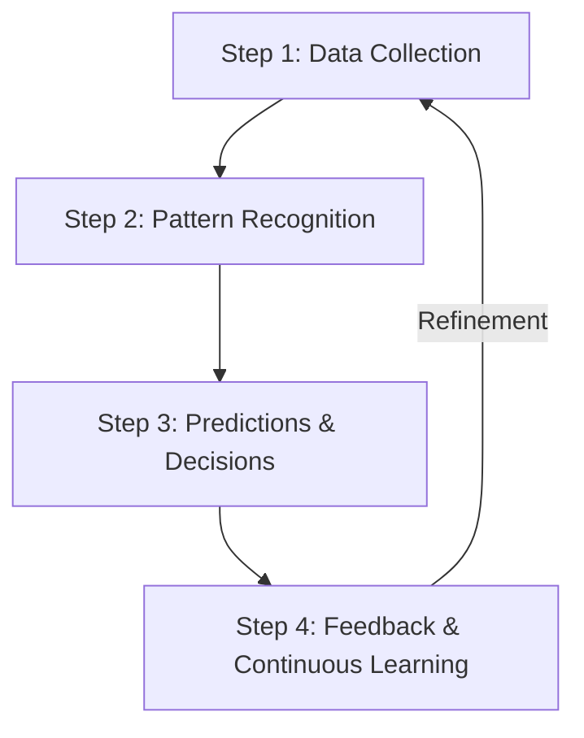
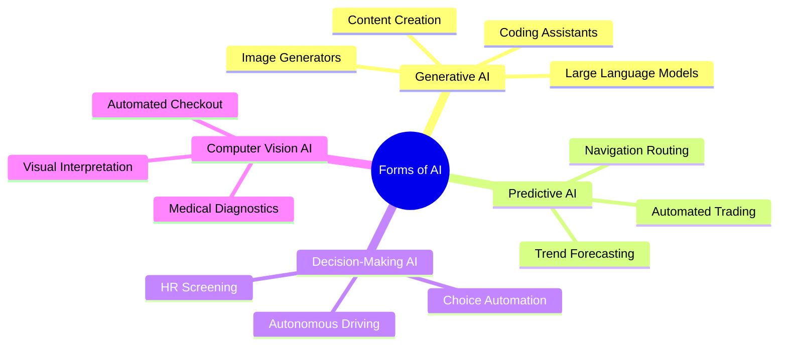

# Module 1: Exploring Artificial Intelligence (AI)

Welcome to the fundamentals of Artificial Intelligence. This document outlines the core concepts of AI, its operational lifecycle, how it differs from traditional automation, and common misconceptions in the field.

---

## 1. What is Artificial Intelligence?

**Artificial Intelligence (AI)** is a branch of computer science and technology that enables computers and machines to simulate human cognitive functions, including:
*   **Learning** (acquiring information and rules for using it)
*   **Comprehension/Reasoning** (using rules to reach approximate or definite conclusions)
*   **Problem-Solving**
*   **Decision-Making**
*   **Creativity**
*   **Autonomy**

### AI vs. Traditional Software
*   **Traditional Software**: Follows rigid, pre-programmed, hand-coded rules. It cannot handle scenarios outside of its programmed logic without human code updates.
*   **Artificial Intelligence**: Analyzes data, identifies underlying patterns, and **adapts and evolves** over time. It can manage complex tasks like speech recognition, natural language processing, and predictions dynamically.

> [!NOTE]  
> **Case Study: Intelligent Smartphone Cameras**  
> Modern smartphone cameras use AI to instantly sharpen blurry photos. Instead of using generic sharpening filters, the AI model has been trained on millions of images to recognize patterns of sharp vs. blurry edges. When processing a new image, it analyzes pixels, detects blur, and intelligently reconstructs details. The more data the system processes, the more accurate its enhancements become.

---

## 2. The 4-Step Operational Process of AI

AI systems do not work by magic; they follow a structured, iterative lifecycle to simulate human intelligence.



### Step 1: Data Collection
Data is the foundational fuel of any AI system. 
*   **Format**: Can be text, images, numbers, audio, video, or physical movements.
*   **Quality & Diversity**: The performance of an AI model is directly proportional to the variety and quality of the collected data. 
*   *Note*: Raw data is not enough; the system requires a methodology to process and interpret it.

### Step 2: Finding Patterns using Algorithms
Once data is collected, the AI analyzes it to extract hidden patterns, connections, and trends.
*   **Role of Algorithms**: AI doesn't search randomly. It uses algorithms (structured mathematical instructions) to sort information, analyze correlations, and draw conclusions.
*   Different AI architectures utilize different algorithms depending on their target objectives.

### Step 3: Making Predictions & Decisions
After identifying patterns, the AI applies this knowledge to new, unseen data to make predictions, answer queries, or recommend actions.
*   **Example**: Keyboard auto-complete or search engines suggesting the next word. It does not read your mind; it analyzes millions of historical sentences to predict the most probable next word.
*   AI predictions are probabilistic and require a feedback loop to achieve near-perfection.

### Step 4: Learning & Improving through Feedback
Static systems are of limited use. AI improves by analyzing its mistakes and adjusting its parameters accordingly.
*   **Feedback Loops**:
    *   *Direct Input (Supervised/User-in-the-loop)*: Marking an email as spam directly trains the model to recognize similar patterns in future messages.
    *   *Automated Tuning*: Many modern AI models dynamically adjust their internal weights (parameters) based on error rates without human intervention.

---

## 3. The Forms of Artificial Intelligence

AI is not a single, monolithic technology. It manifests in various forms, each designed to address specific types of tasks and challenges. While these forms differ in functionality, they all share a core characteristic: **they learn from data and improve their performance over time.**



### A. Generative AI
Generative AI focuses on creating entirely new, original content by learning the underlying patterns of existing training data.
*   **Capabilities**: Generates text, realistic images, music, voices, video, and source code.
*   **Key Daily Applications**:
    *   **Large Language Models (LLMs)**: Process and generate human-like text. Power applications such as interactive chatbots, real-time translation tools, and writing assistants.
    *   **Image Generation Tools**: Convert natural language text descriptions into high-fidelity, realistic visuals, accelerating design and creative workflows.
    *   **Coding Assistants**: Predict next lines of code, write functional snippets, and assist developers in writing code faster with fewer syntax errors.

### B. Predictive AI
Predictive AI analyzes historical data and identifies statistical patterns to forecast future outcomes, trends, and events.
*   **Capabilities**: Allows analysts, businesses, and systems to make proactive, data-driven decisions.
*   **Key Daily Applications**:
    *   **Navigation & Routing Apps**: Analyze live traffic patterns, construction data, and historical speeds to predict the fastest route and estimate travel times.
    *   **Automated Trading Platforms**: Evaluate complex financial market trends in real-time to predict asset movements and execute optimized trading strategies.

### C. Decision-Making AI
Decision-making AI automates complex choices by evaluating multiple factors, scenarios, and constraints to select the optimal course of action.
*   **Capabilities**: Minimizes manual intervention in high-risk environments and dynamically reacts to real-time inputs.
*   **Key Daily Applications**:
    *   **Advanced Recruitment Platforms**: Screen candidate resumes, cross-reference qualifications, and rank applicants objectively to streamline hiring.
    *   **Autonomous Driving Systems**: Process streaming environmental data (pedestrians, lane lines, traffic lights) and make split-second driving decisions (braking, steering, accelerating) to maximize safety.

### D. Computer Vision AI
Computer Vision AI enables machines to "see", process, and interpret visual data from the physical world.
*   **Capabilities**: Recognizes faces, detects objects, interprets scenes, and flags anomalies in images and video streams.
*   **Key Daily Applications**:
    *   **Automated Checkout Systems**: Enable cashier-less retail shopping by tracking items selected by shoppers and processing transactions automatically (e.g., grab-and-go stores).
    *   **Medical Diagnostic Tools**: Analyze medical images (such as X-rays, MRIs, and CT scans) with high precision to detect abnormalities and assist clinicians.

---

## 4. The Enabling Technologies of AI

Modern AI’s capacity to learn, comprehend context, and evolve is powered by three foundational enabling technologies. These technologies are not mutually exclusive; rather, they form concentric layers of capabilities developed over decades.

```
┌─────────────────────────────────────────────────────────┐
│ Artificial Intelligence (1950s)                         │
│   ┌─────────────────────────────────────────────────┐   │
│   │ Machine Learning (1980s)                        │   │
│   │   ┌─────────────────────────────────────────┐   │   │
│   │   │ Deep Learning (2010s)                   │   │   │
│   │   │   ┌─────────────────────────────────┐   │   │   │
│   │   │   │ Natural Language Processing*    │   │   │   │
│   │   │   └─────────────────────────────────┘   │   │   │
│   │   └─────────────────────────────────────────┘   │   │
│   └─────────────────────────────────────────────────┘   │
└─────────────────────────────────────────────────────────┘
*Note: Modern NLP is heavily powered by DL and ML models.
```

### A. Machine Learning (ML)
**Machine Learning** is a subset of AI that allows systems to learn from data, identify patterns, and make decisions without being explicitly programmed.
*   **How it Works**: Unlike traditional software built on hand-coded rules, ML models automatically adjust their internal logic based on patterns in the training data they consume.
*   **Spam Filter Case Study**: Instead of checking emails against a hard-coded blacklist of keywords, an ML-based spam filter analyzes millions of spam and non-spam emails. It learns characteristics (sender behavior, wording ratios, attachment metadata) and continuously improves its detection accuracy as it processes more mail.
*   **Key Training Methods**:
    1.  **Supervised Learning**: The model is trained on labeled data where the correct answers are already known (e.g., a quality control system trained on images labeled "passed" or "failed").
    2.  **Unsupervised Learning**: The model groups and finds structure in unlabeled data based on behavioral patterns (e.g., clustering shoppers into market segments based on buying habits).
    3.  **Reinforcement Learning**: The model learns through trial-and-error using rewards for correct decisions and penalties for errors (e.g., a chess AI playing millions of games against itself to refine strategies).
*   **Limitation**: ML works exceptionally well with **structured data** (e.g., database tables, spreadsheets). However, it struggles with **unstructured data** (e.g., raw images, video streams, audio, and documents) where features cannot be easily predefined by humans.

### B. Deep Learning (DL)
**Deep Learning** is a specialized subfield of Machine Learning that uses multi-layered **Artificial Neural Networks (ANN)** to simulate the human brain's complex decision-making processes.
*   **How it Works**: Neural networks process data in multiple hierarchical layers. Each layer refines the incoming information and automatically extracts features directly from **raw, unstructured data** without human intervention.
*   **Facial Recognition Case Study**: While traditional ML can detect if a face exists in an image, Deep Learning can extract microscopic facial vectors, identify specific individuals, and adapt to visual variables like aging, makeup, or changing lighting conditions.

#### Machine Learning vs. Deep Learning Matrix
| Feature | Machine Learning | Deep Learning |
| :--- | :--- | :--- |
| **Data Suitability** | Works best with structured tables and spreadsheets. | Processes unstructured data (images, text, speech). |
| **Feature Extraction** | Relies on human-defined features/attributes. | Learns patterns directly from raw data. |
| **Data Requirements** | Performs well on relatively small datasets. | Requires massive volumes of data for accuracy. |
| **Compute Power** | Runs efficiently on standard CPUs. | Requires high-performance GPUs / TPUs. |
| **Common Examples** | Email spam filtering, basic fraud detection. | Face recognition, autonomous driving. |

### C. Natural Language Processing (NLP)
**Natural Language Processing** is a specialized domain of AI that enables machines to understand, interpret, and generate human language.
*   **How it Works**: NLP moves beyond simple word recognition to comprehend tone, grammatical relationships, intent, and semantic context.
*   **Voice Assistant Case Study**: When asking a voice assistant about the weather, NLP breaks the spoken phrase into parts, identifies the intent (weather request) and entity (location/time), and constructs a natural voice response. It learns from conversational feedback to resolve ambiguities.
*   *Note*: Modern NLP is built upon Machine Learning and Deep Learning architectures.

### D. Technology Synergy: How They Work Together
Real-world AI systems rarely rely on a single technology. They integrate ML, DL, and NLP to solve complex tasks.

#### Case Study 1: AI-Powered Medical Diagnosis System
*   **Machine Learning (ML)**: Identifies risk factors by analyzing structured medical records, blood tests, and lifestyle data (e.g., predicting diabetes risk).
*   **Deep Learning (DL)**: Analyzes unstructured medical images (X-rays, MRIs, CT scans) to detect microscopic abnormalities that human radiologists might overlook.

#### Case Study 2: AI-Powered Customer Service System
*   **Natural Language Processing (NLP)**: Parses user messages to extract core intent and meaning (e.g., identifying that "I need help with my package" means an order issue).
*   **Machine Learning (ML)**: Scans historical logs of customer inquiries to predict the most relevant and helpful response category.
*   **Deep Learning (DL)**: Conducts sentiment analysis on the conversation in real-time, detecting frustration or satisfaction to dynamically adjust the chatbot's tone.

---

## 5. Distinguishing AI from Automation

Automation and AI are frequently conflated because both automate tasks. However, they are fundamentally different.

> [!IMPORTANT]  
> **Automation** refers to rule-based systems that execute repetitive, pre-programmed tasks *without* learning or evolving. It is highly efficient but lacks cognitive flexibility. If a rule-based system encounters an unexpected scenario, it fails unless updated manually by a developer.

### Comparative Scenarios

| Domain | Automation (Rule-Based) | Artificial Intelligence (Adaptive) |
| :--- | :--- | :--- |
| **Email Spam Filtering** | Categorizes spam by looking for exact banned words (e.g., "sales", "discount"). If spammers change the text to "limited-time offer", the filter misses it until a human updates the rules. | Analyzes the semantic context, sender behavior, and changing language patterns to detect spam even if the spammers use new terminology. |
| **HR Resume Screening** | Filters resumes by scanning for literal keywords (e.g., "Python", "Project Management"). Resumes lacking those exact terms are immediately rejected. | Analyzes the candidate's entire profile, infers underlying skills and experience, and matches them to job roles based on context, even if they use different vocabulary. |
| **Educational Systems** | Delivers pre-made lessons. If a student scores below 60%, it automatically sends generic remedial worksheets, but cannot adjust the material's difficulty level. | Analyzes how the student interacts with the material, identifies specific weak points (e.g., struggling with algebra but excelling in geometry), and customizes the difficulty level dynamically. |
| **Content Moderation** | Flags and deletes posts containing exact blacklisted terms. If users use sarcasm or coded words, the automation is bypassed. | Comprehends context, tone, and evolving slang. It recognizes harmful intent even in sarcastic or coded language, improving over time from moderator feedback. |

### Summary Comparison Table

| Feature | Artificial Intelligence (AI) | Automation |
| :--- | :--- | :--- |
| **Operational Mechanism** | Learns from data; self-optimizes over time. | Follows pre-determined static rules. |
| **Flexibility** | Dynamic; adapts to new inputs and novel situations. | Rigid; repeats the exact same task. |
| **Improvement Path** | Enhances accuracy via feedback loops. | Remains static until manually updated. |
| **Typical Example** | A voice assistant (e.g., Siri, Alexa) that refines its understanding of your voice. | A basic customer service chatbot that only outputs pre-written answers to specific button clicks. |

---

## 6. Misconceptions about AI

As systems become more complex, the label "AI" is often applied incorrectly to standard software.

### Misconception: "Advanced Analytics is AI"
*   **The Myth**: If a system performs deep data analysis and generates insights, it is AI.
*   **The Reality**: Advanced analytics processes historical data to generate reports, charts, and trends. However, it cannot make autonomous decisions or self-improve without manual software modifications.
*   **Example**: A dashboard that plots weekly sales charts is **automation/analytics**. A system that learns from those sales trends to predict future inventory demand and automatically issues purchase orders is **AI**.

> [!WARNING]  
> A system that does not learn from data and improve its accuracy over time is **not AI**; it is simply advanced software.

---

## 7. Business Advantages & Real-World Applications of AI

In the modern enterprise, AI serves as a powerful utility to overcome complex operations involving massive datasets, time-sensitive decision-making, and high-accuracy requirements.

### Case Studies: Resolving Enterprise Challenges

*   **Clinical Radiology (Healthcare)**: 
    *   *Challenge*: Radiologists like Sarah face intense pressure examining hundreds of complex, highly detailed medical scans daily to detect early signs of disease.
    *   *AI Intervention*: AI-powered image analysis software flags suspicious regions on scans and prioritizes high-risk cases, allowing doctors to focus their expertise where it is most critically needed.
*   **Inventory Management (Retail)**: 
    *   *Challenge*: Inventory managers like John must balance customer demand against stock levels to prevent stockouts while minimizing over-ordering and waste, which is difficult using only historical monthly data.
    *   *AI Intervention*: AI-driven demand forecasting integrates real-time variables—including customer shopping trends, historical sales data, broader market patterns, and local weather forecasts—to optimize inventory levels.
*   **Fraud Detection (Finance)**: 
    *   *Challenge*: Fraud investigators like Emily screen hundreds of flagged transactions daily, struggling to isolate true positive fraud cases amidst a high volume of false alarms.
    *   *AI Intervention*: AI systems filter out routine transactions and identify complex, suspicious behavioral patterns in real-time, allowing security teams to focus on active threats and stop fraud before it occurs.

### The Top 5 Core Business Advantages of AI

1.  **Focus on High-Value Tasks**: By automating time-consuming data entry and routing tasks, AI allows human employees to focus on cognitive, strategic, and high-value work.
2.  **Data-Driven Decision-Making**: AI rapidly processes massive datasets, enabling faster, evidence-based, and objective decisions.
3.  **Error Reduction**: AI operates under strict mathematical guidelines, scanning for structural inconsistencies and reducing operational mistakes.
4.  **24/7 Operational Support**: Unlike humans, AI runs continuously without fatigue, driving round-the-clock efficiency in customer support, systems monitoring, and logistics.
5.  **Hazardous Task Delegation**: AI handles dangerous tasks—ranging from chemical processing to operating under extreme physical conditions—protecting human workers from safety risks.

### Sector-Specific AI Innovations

*   **Healthcare**: Powering early disease diagnosis through visual pattern matching and enabling **personalized medicine** by analyzing a patient's genetics, lifestyle, and medical history.
*   **Finance**: Securing digital transactions via real-time fraud monitoring and automating credit score evaluations to make lending faster and more accurate.
*   **Education**: Adapting learning pathways through personalized education platforms that adjust testing difficulty and providing interactive, dialogue-driven AI tutoring.
*   **Retail**: Driving sales and customer loyalty via personalized recommendation engines and automating logistics to ensure inventory availability.
*   **Transportation**: Processing sensor arrays to guide autonomous vehicles and optimizing supply chain delivery routes to minimize fuel usage and delays.

> [!IMPORTANT]  
> **Global Economic Potential**  
> According to a June 2023 McKinsey Digital report, **Generative AI alone** has the potential to add between **$2.6 trillion and $4.4 trillion USD annually** to the global economy. This is greater than the total annual GDP of many developed nations, indicating the immense value potential when other forms of AI (predictive, computer vision, etc.) are factored in.

---

## 8. Limitations & The Future of AI

Despite its impressive capabilities, current AI systems are not infallible and operate under distinct boundaries.

### Current Limitations of AI

*   **Lack of Genuine Comprehension**: AI models identify statistical probabilities and patterns; they **do not understand meaning, logic, or reason** the way humans do. They struggle to apply generalized knowledge to novel scenarios outside their training domain.
*   **Data Bias and Fairness**: AI learns from historical datasets. If those datasets contain human biases, the AI will learn and reinforce those biases, leading to discriminatory hiring practices, unfair credit assessments, or skewed risk modeling.
*   **Extremely High Compute Demand**: Training and running advanced models (especially deep learning neural networks) requires massive computational infrastructure (GPUs/TPUs). This makes them financially expensive and ecologically challenging.
*   **Prompt Dependency**: Current AI is passive. It only acts when explicitly triggered by a human prompt or API call; it cannot self-schedule, plan long-term workflows, or act with full independence.

### The Next Breakthroughs

To address these limitations, researchers are focusing on two major frontiers:
1.  **Architectural Efficiency**: Creating optimized models that maintain high performance while requiring significantly less energy, data, and compute power.
2.  **Agentic AI**: Transitioning AI from a passive assistant into a pro-active partner. Agentic AI is designed to take the initiative—planning, executing, and optimizing multi-step workflows autonomously with minimal human oversight.

```
┌──────────────────────────────────────────────────────────┐
│               THE FUTURE EVOLUTION OF AI                 │
├────────────────────────────┬─────────────────────────────┤
│   FROM (Passive Assistant) │    TO (Proactive Agent)     │
├────────────────────────────┼─────────────────────────────┤
│ • Reacts to prompts        │ • Takes initiative          │
│ • Simple tasks             │ • Plans multi-step goals    │
│ • Rules-bound execution    │ • Dynamically adapts        │
│ • Human-in-the-loop        │ • Autonomous workflows      │
└────────────────────────────┴─────────────────────────────┘
```

### Future Predictions
*   **Autonomous Personal Assistants**: Shifting from simple smart speakers to proactive assistants that manage calendars, book travel, and coordinate complex schedules autonomously.
*   **Complex Workflow Delegation**: AI agents planning and executing full-scale business operations, from software engineering pipelines to investment strategies.
*   **Ethical & Trustworthy Frameworks**: A heavy industry focus on algorithmic fairness, explainability (*XAI*), model robustness, transparency, and user data privacy as AI integrates into law and healthcare.
*   **Multi-Modal Creative Expansion**: Generative models pushing past text and static images to produce full-length music, dynamic videos, and interactive real-time storytelling environments.

---

## 9. Key Concepts to Remember

1.  **AI Simulation**: AI is about simulating human intelligence—specifically learning, reasoning, and decision-making.
2.  **The Lifecycle**: AI operates in a loop: **Collect Data ➔ Find Patterns ➔ Make Predictions ➔ Optimize via Feedback**.
3.  **Forms of AI**: AI is applied in distinct forms including **Generative AI** (content creation), **Predictive AI** (forecasting), **Decision-making AI** (automating choices), and **Computer Vision** (interpreting visual data).
4.  **Enabling Layers**: Modern AI relies on a stack of technologies: **Machine Learning** (learning from structured data), **Deep Learning** (neural networks for unstructured data), and **NLP** (comprehending human language).
5.  **Intelligence ≠ Automation**: Not all smart tech is AI. Rule-based automation, static analytics, and simple smart devices do not learn, adapt, or think beyond their explicit coding.
6.  **Human-AI Synergy**: AI delivers enterprise value by augmenting human decision-making, increasing productivity, and lowering errors across healthcare, finance, retail, and education.
7.  **Transition to Agentic AI**: The future of AI lies in **efficiency** and **agency**—shifting from passive tools that require continuous prompting to proactive agents that can plan and execute complex workflows independently.


