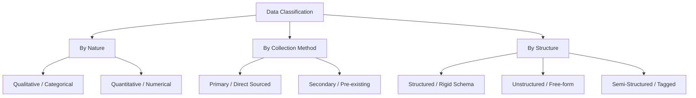
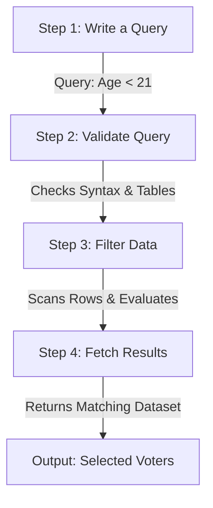
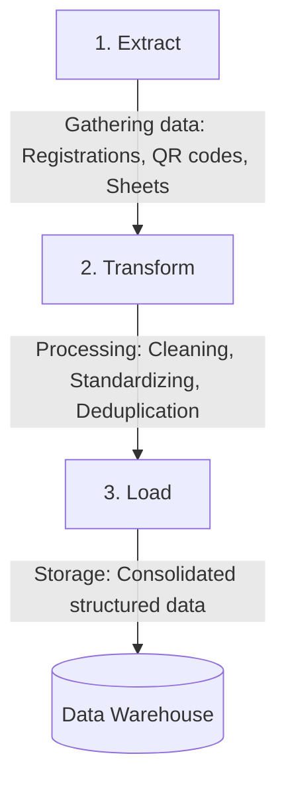
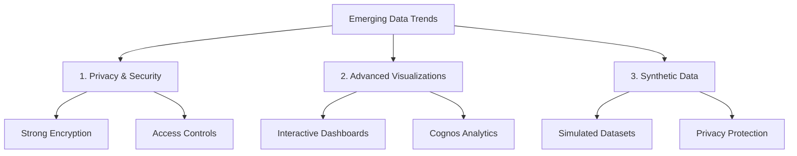

# Exploring Data

Welcome to the documentation for Module 1, Course 3: **Exploring Data**. This document covers fundamental data concepts, its importance in decision-making, and structural classifications (by nature, collection method, and schema).

---

## 1. Introduction to Data

### What is Data?
**Data** is a structured or unstructured collection of information that can be captured, observed, recorded, analyzed, and interpreted to make informed, evidence-based decisions. 

In daily life, humans often make decisions based on **intuition** (gut feelings or familiarity). While intuitive decision-making works for minor, low-risk choices (e.g., deciding what to wear based on the weather or what to eat based on a craving), it is insufficient for complex problem-solving, identifying large-scale patterns, or making critical business and medical decisions. 

> [!NOTE]  
> **Intuition vs. Data in Diagnostics**  
> A doctor diagnosing a patient cannot rely on a gut feeling. To identify the underlying illness, the doctor must systematically gather data: patient history, symptoms, and medical test results (lab panels, X-rays). This collection of information constitutes **data**, which is analyzed to form an accurate diagnosis.

### Why is Data Important?
Deploying data effectively offers organizations several critical advantages:

1.  **Informed Decision-Making**: Replaces guesses with evidence.
    *   *Example*: A city council analyzes traffic accident logs to determine the safest locations to install new traffic lights, rather than placing them randomly.
2.  **Improved Operational Efficiency**: Identifies processes that are slow or wasteful.
    *   *Example*: A logistics company analyzes delivery route coordinates and driver delays to optimize travel paths, reducing transit times and fuel costs.
3.  **Competitive Advantage**: Provides insights into market trends, competitor strategies, and customer behavior.
    *   *Example*: A smartphone manufacturer analyzes customer feedback regarding battery life and camera features to refine its next product design, helping it stand out in a crowded market.
4.  **Performance Management**: Establishes clear, measurable metrics to track progress.
    *   *Example*: A retail chain monitors sales metrics across different store locations to find high-performing strategies and apply them to lower-performing branches.
5.  **Accountability & Transparency**: Provides a record of how resources and funds are used, building trust.
    *   *Example*: A non-profit organization publishes reports showing exactly how donations were spent, proving accountability to its donors and stakeholders.

---

## 2. Classification of Data

All data is not identical; it serves different purposes based on how it is categorized. Data is classified using three primary dimensions: **by nature**, **by collection method**, and **by structure**.

---

### A. Classification by Nature

This dimension defines the type of information data contains—whether it is descriptive or numerical.

#### 1. Qualitative Data
*   **Definition**: Also known as **categorical data**. It represents non-numerical characteristics such as appearances, experiences, opinions, behaviors, attitudes, or beliefs. Qualitative data captures context and nuances that numbers alone cannot express.
*   *Note*: Qualitative data is not always subjective. For example, eye color (e.g., blue, brown) is objective and factual, but it is qualitative because it is descriptive and non-numerical.
*   *Example*: A customer describes a coffee shop experience: *"The pastries were delicious, the service was slow, and the atmosphere was warm."*

#### 2. Quantitative Data
*   **Definition**: Numerical data that can be counted, measured, or assigned a specific numerical value. It is factual and allows for precise mathematical calculations and comparisons.
*   *Example*: Instead of describing service as "slow", the customer provides quantitative data: *"I waited 15 minutes for my order, and there were 50 tables in the restaurant."*

---

### B. Classification by Collection Method

This dimension defines how data is sourced—whether it is gathered first-hand or inherited from external sources.

#### 1. Primary Data
*   **Definition**: Original data collected directly by the researcher or organization for a specific, immediate purpose (e.g., answering a business question).
*   *Collection Methods*: Surveys, experiments, observations, and interviews.
*   *Trade-offs*:
    *   *Pros*: High quality, customizable, and under full control of the investigator.
    *   *Cons*: Time-consuming and expensive to organize and execute.
*   *Example*: A coffee shop owner posts an online survey or interviews customers directly to determine their favorite seasonal drink options.

#### 2. Secondary Data
*   **Definition**: Pre-existing data collected by another person, department, or organization for their own purposes, which is repurposed for the current project.
*   *Sourcing Channels*: Government census reports, online review databases (e.g., Yelp, Google reviews), and industry market studies.
*   *Trade-offs*:
    *   *Pros*: Saves significant time, labor, and financial resources. Offers a much larger and more diverse dataset than could be collected independently.
    *   *Cons*: The researcher has no control over data quality or parameters, and much of the data may be irrelevant to the specific goals (e.g., online reviews discussing a restaurant's building condition rather than food quality).
*   *Example*: A business reviews public average cost ratings and Yelp reviews to evaluate competitor pricing and popularity.

---

### C. Classification by Structure

This dimension defines how data is organized—whether it conforms to a rigid schema or exists in a free-form state.

#### 1. Structured Data
*   **Definition**: Data organized in a rigid, highly defined format, typically represented as tables with rows and columns.
*   *Key Concept (Schema)*: Adheres to a predefined blueprint or **schema** that dictates what type of data (text, integers, decimals, dates) can be stored in each column.
*   *Example*: An employee database table:

| Employee ID | Name | Department | Hire Date |
| :---: | :--- | :--- | :---: |
| 1001 | John Doe | Information Technology | 01/15/2023 |
| 1002 | Jane Smith | Human Resources | 03/05/2023 |
| 1003 | Bob Johnson | Finance | 04/10/2023 |

#### 2. Unstructured Data
*   **Definition**: Data that does not conform to a predefined structure or layout. It is free-form and cannot be stored easily in standard rows and columns without transformation.
*   *Formats*: Text files, images, audio recordings, and videos.
*   *Example*: A photo of children playing contains visual data but lacks predefined columns. Similarly, a text message: *"Hey, it is pouring rain! My yard is flooded. Work was so stressful today."* contains weather, emotional, and schedule contexts mixed together without metadata labels.

#### 3. Semi-Structured Data
*   **Definition**: A hybrid form. It does not conform to a rigid table schema but contains tags, organizational keys, or markers that separate data elements and make it easier to parse.
*   *Formats*: JSON, XML, and tagged lists.
*   *Example*: A project details list:
    *   **Project Name**: Photosynthesis model
    *   **Group Members**: Ali, Pelin, Melis
    *   **Materials Used**: Cardboard, paint, string
    *   *Reason*: It has no rigid column constraints, but the tags (`Project Name`, `Materials Used`) organize the free-form text.

---

## 3. Data Management

As data volume grows, storing and accessing it raw becomes unsustainable. Organizations require systems to manage, secure, and retrieve data efficiently.

### Data Overload
**Data overload** describes a state where the volume, speed, and complexity of incoming data exceed the capacity of systems or individuals to process, filter, and interpret it.
*   *Context*: Every digital action—from online transactions to social media interactions—creates data. 
*   *Example*: A social media platform where millions of users post, like, comment, and share content simultaneously. Without structured management, this continuous generation of data quickly leads to chaos.
*   *Solution*: Databases are utilized to organize, store, and process this information systematically.

### What is a Database?
A **database** is an organized, structured collection of data stored and accessed electronically within a computer system. 
*   *Design*: Databases are engineered to store and process large volumes of information using organized formats like tables.
*   *Core Goal*: To ensure data remains easily accessible, manageable, secure, and up-to-date.

### Advantages of Databases
Implementing a database over manual file storage provides five primary advantages:

1.  **Efficient Data Organization**: Structures data systematically to eliminate redundancies and maintain logical connections.
2.  **Efficient Data Retrieval**: Facilitates rapid searches, fetching specific subsets of data instantly regardless of dataset size.
3.  **Data Security**: Secures sensitive data through user authentication, encryption, and permission levels.
4.  **Multi-user Support**: Allows multiple users or applications to view, edit, and access data simultaneously without conflicts.
5.  **Scalable Storage**: Scales seamlessly to hold growing volumes of data as the organization expands.

---

### Interacting with a Database

To interact with the data stored inside a database, specialized tools and languages are required:

#### 1. Database Management System (DBMS)
A **Database Management System (DBMS)** is the software package used to manage, query, and manipulate a database. It serves as an interface between the database and the end-users or applications.

> [!TIP]
> **The Library Analogy**
> *   **Data** represents the **books** in a library.
> *   The **Database** represents the **bookshelves** where the books are organized and stored.
> *   The **DBMS** represents the **librarian**, who knows exactly where each book is, keeps them in order, and manages check-outs, returns, and updates.

#### 2. Structured Query Language (SQL)
**Structured Query Language (SQL)** is a specialized programming language designed for managing and querying data held in a relational database management system. It allows users to ask questions (queries) and edit database entries.

---

### How SQL Works: Step-by-Step Processing

Let's look at an example. Imagine a database table holding registered voter information:

| Name | Polling Station | Party Affiliation | Age |
| :--- | :--- | :--- | :---: |
| Michael Miller | Central High School | Independent | 19 |
| Emily Davis | West Park | Democrat | 20 |
| David Wilson | East Primary School | Republican | 23 |
| Sarah Taylor | North Stadium | Democrat | 18 |

**Goal**: Identify all voters under the age of 21 (Age < 21).

When a query is run, the DBMS processes the request in four key steps:

#### Step 1: Writing a Query
The user drafts an SQL statement defining what data they need. For this task, the query translates to:
*"Find all rows in the table where the voter age is less than 21."*

#### Step 2: Validating the Query
The DBMS reviews the query to ensure correctness:
*   **Syntax**: Checks if the query structure and formatting are correct.
*   **Data Availability**: Verifies that the requested table and columns actually exist.
*   If valid, the system proceeds to the next stage.

#### Step 3: Filtering the Data
The DBMS scans the rows in the table and evaluates each row against the condition (`Age < 21`):
*   *Michael Miller* (Age 19) -> **Yes** (Matches condition)
*   *Emily Davis* (Age 20) -> **Yes** (Matches condition)
*   *David Wilson* (Age 23) -> **No** (Skipped)
*   *Sarah Taylor* (Age 18) -> **Yes** (Matches condition)

#### Step 4: Fetching the Results
The DBMS filters out the non-matching rows and returns a structured list containing only the voters under 21:

| Name | Polling Station | Party Affiliation | Age |
| :--- | :--- | :--- | :---: |
| Michael Miller | Central High School | Independent | 19 |
| Emily Davis | West Park | Democrat | 20 |
| Sarah Taylor | North Stadium | Democrat | 18 |

> [!NOTE]
> **Real-World Scaling**
> Although this example uses only four rows for simplicity, real-world databases regularly store millions or billions of rows. SQL is optimized to execute queries and retrieve matching records in milliseconds, regardless of the database scale.

---

## 4. Data Analysis

### What is Data Analysis?
**Data analysis** is the systematic process of cleaning, transforming, and modeling raw data to discover patterns, draw conclusions, and extract meaningful, actionable insights that guide decision-making. 

*   *Key Concept*: Raw data alone does not carry meaning. A single data point must be put into context with a goal or purpose to become valuable.
*   *Example (Fitness Steps)*: Tracking that you took 5,000 steps today is just a raw data point. It holds no intrinsic value until it is compared against a specific goal (e.g., a daily fitness target of 10,000 steps). By adding this goal, the data becomes meaningful, allowing you to determine if you are on track or need to increase your activity level.

---

### Case Study: Staging a Healthy Eating Exhibition (ETL & Data Processing)

To understand how data is prepared for analysis, consider the case of planning a **Healthy Eating Exhibition**. 

#### The Problem
After a successful event last year, the organizers want to increase attendee satisfaction and boost visits to vendor stands this year. To achieve this, they need data-driven answers to key questions:
*   Which stands were most popular?
*   What topics interested attendees most (e.g., vitamins vs. cooking utensils)?
*   Which dietary lifestyles (e.g., vegan, keto) drew the most attention?

#### The ETL (Extract, Transform, Load) Solution
Before analyzing the data, the organizers must process it using the ETL pipeline:

1.  **Extract**: Gather raw data collected from last year's event. This includes online pre-registrations, QR code scans at stand entrances, and manual guestbooks filled out on-site.
2.  **Transform**: Merge the disparate datasets into a consistent, clean format. This is the most complex phase of the ETL process.
    *   *Cleaning*: Ensuring all date fields conform to the same template.
    *   *Standardizing*: Verifying that numbers are stored as numerical values rather than text strings.
    *   *Deduplication*: Removing duplicate entries (e.g., an attendee who registered online but also filled out a physical sheet on-site).
3.  **Load**: Load the cleaned, unified data into a **Data Warehouse**—a centralized repository designed to store consolidated data from multiple sources for analytical querying.

#### The Analysis
Once the data is loaded, the organizers can run quantitative analyses (e.g., visitor counts per stand), statistical tests (e.g., popularity of different diets), and demographic profiles (e.g., age, gender, location of attendees) to optimize stand placement and attract high-performing vendors.

---

### The Five Steps of the Data Analysis Process

Data analysts follow a structured five-step lifecycle to transform raw data into organizational strategies. 

Let’s explore this process through a case study of **Alice**, a data analyst at a local fitness center. Alice notices that while new members continue to sign up, monthly membership renewals have steadily declined. She decides to run an analysis to solve this retention issue.

#### Step 1: Preparing for Analysis
Analysts focus on defining goals, identifying required resources, and building a structured roadmap.
*   *Defining the Goal*: Alice meets with the gym owner, Robert, to understand the problem. She establishes the primary goal: *Identify the key factors driving the decline in membership renewals.*
*   *Assessing Data Requirements*: Alice determines she needs monthly renewal counts and direct member feedback.
*   *Planning the Process*: She reviews available software, selects Microsoft Excel for its usability and analytical features, and drafts a structured project schedule.

#### Step 2: Collecting Data
Analysts gather the necessary data from identified sources and organize it in a secure, centralized location.
*   *Extracting Data*: Alice extracts monthly renewal records from the gym's database system. To collect qualitative feedback, she distributes a short online survey to current and former members.
*   *Storing Data*: She consolidates these datasets into a central Excel file, organizing them into two separate sheets: "Renewals" and "Feedback".

#### Step 3: Processing Data
Analysts clean the collected data to ensure it is accurate, consistent, and free of anomalies.
*   *Removing Duplicates*: Alice deletes repeated records to prevent metrics (like renewal counts) from being artificially inflated.
*   *Standardizing*: She standardizes date formats (e.g., converting mixed `MM/DD/YYYY` and `DD/MM/YYYY` entries into a unified `MM/DD/YYYY` format) to prevent sorting errors.
*   *Handling Gaps and Privacy*: She filters out incomplete entries (e.g., profiles missing renewal dates) and removes sensitive personal details (e.g., contact phone numbers and emails) to preserve user privacy.

#### Step 4: Analyzing Data
Analysts apply statistical and analytical techniques to the clean data to discover trends and create visual representations of their findings.
*   *Alice's Analysis & Visualizations*:
    *   **Bar Chart**: Visualizes monthly renewals, revealing a steady, continuous decline from January through June.
    *   **Pie Chart**: Breaks down renewals by age group (18-30: **15%**, 31-45: **40%**, 46+: **45%**). This highlights that younger members have significantly lower renewal rates.
    *   **Word Cloud**: Analyzes open-ended survey answers. The most frequent and prominent words are **"boring"**, **"suffocating"**, and **"outdated"**.

#### Step 5: Interpreting Results
Analysts review the visual patterns, draw logical conclusions, and make strategic recommendations to stakeholders.
*   *Drawing Conclusions*: By combining the visual insights, Alice concludes that the gym is failing to retain younger members because they find the current fitness classes unexciting, stuffy, and outdated.
*   *Making Recommendations*: Alice presents two main proposals to Robert:
    1.  Introduce modern, high-energy exercise trends (e.g., spin classes or functional training) to appeal to younger demographics.
    2.  Elevate the studio atmosphere by playing upbeat, modern music during class sessions.

---

## 5. The Future of Data

### Business Impact & Market Trends
Data has transformed problem-solving methodologies for businesses, governments, and individuals. 
*   *McKinsey & Company Finding*: Businesses that rely on data-driven commercial strategies grow significantly faster than their peers, experiencing a **15% to 25%** increase in profit margins.
*   *Key Drivers*: The capacity of data to adapt, scale, and provide cost-effective insights has made it a core structural asset across all industrial sectors.

---

### Key Enabling Technologies

The future of data is deeply intertwined with several adjacent technologies:

#### A. Artificial Intelligence
**Artificial Intelligence (AI)** refers to a machine's ability to learn patterns and make predictions from data. AI tools are transforming how data is processed, analyzed, and secured:
1.  **Automated Data Processing**: Minimizes time-consuming manual workflows. AI automatically extracts data from multiple sources (like databases and spreadsheets) and cleans it by identifying errors, removing duplicate rows, and filling in missing parameters.
2.  **Advanced Data Analysis**: Employs sophisticated ML algorithms to process complex, high-volume datasets, increasing the speed and depth of analytical workflows.
3.  **Enhanced Data Security**: Monitioring sensitive data automatically, AI detects abnormal access activities, recognizes threat patterns, and blocks potential security breaches.

#### B. The Internet of Things (IoT)
The **Internet of Things (IoT)** is a network of physically connected devices equipped with sensors, software, and other technologies that collect, share, and exchange data automatically.
*   *Example (Smart Thermostats)*: A smart thermostat senses room temperature and occupancy. Using this data, it automatically controls heating or cooling to match occupant habits. Users can also configure settings remotely via a smartphone app.

IoT platforms optimize data pipelines in three major areas:
1.  **Real-Time Data Processing**: Devices continuously record environmental metrics (e.g., temperature, humidity, GPS location, motion). This real-time stream lets organizations monitor infrastructure and react immediately to changes.
2.  **Improved Predictive Analytics**: IoT systems integrate dashboard tools that visualize live data, enabling businesses to identify anomalies, evaluate usage patterns, and forecast maintenance needs.
3.  **Scalable Storage and Management**: Architected to absorb high-concurrency data, IoT platforms scale storage dynamically to prevent system overload even as the volume of connected devices grows.

---

### Emerging Trends in Data Management

Beyond AI and IoT, three emerging trends are shaping the future of data:

#### 1. Data Privacy and Security
As organizations gather larger quantities of sensitive personal details, enforcing strict data boundaries is critical. Companies are implementing robust privacy layers and access controls to prevent unauthorized data exposure.
*   *Example*: Platforms like **IBM SkillsBuild** employ strict password policies and end-to-end data encryption to secure user profiles.

#### 2. Advanced Data Visualization
As datasets grow in density and structural complexity, static charts are replaced by interactive dashboards. These tools allow non-technical business leaders to easily slice and interpret large volumes of information.
*   *Example*: **IBM Cognos Analytics** enables users to quickly compile multi-source data into clean, interactive, and shareable dashboard visualizations.

#### 3. Synthetic Data
**Synthetic data** is artificially generated data that mimics the statistical properties of real-world datasets. It is used when real data is unavailable, expensive to collect, or too sensitive to expose.
*   *Example*: In financial services, organizations generate synthetic transaction logs to train fraud-detection models. This allows them to refine model accuracy without exposing real customer names, account numbers, or balances.
