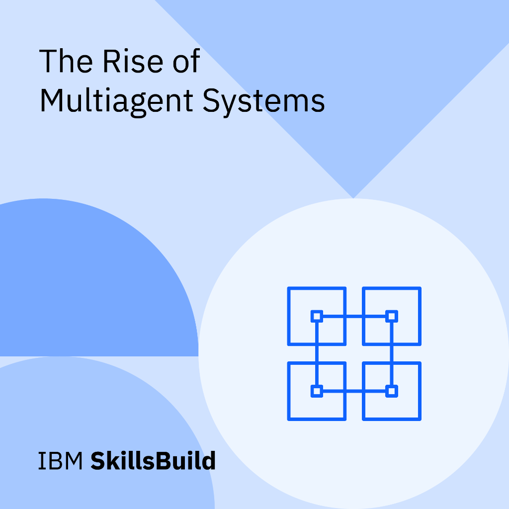

# 🤖 Module 2: Agentic & Multi-Agent Systems

Welcome to the documentation for **Module 2: Agentic Systems**. This module transitions our exploration from static text processing models to active, goal-oriented software agents. These agents are capable of autonomous planning, tool invocation, and cooperative multi-agent coordination.

---

## 📂 What's in this Folder

| File / Resource | Access Badge | Technical Focus | Core Key Concepts |
| :--- | :---: | :--- | :--- |
| **Power of AI Agents** |  | Single-agent autonomous architectures, decision logic, and tool interfaces | 3 Pillars of agency (Reasoning, Memory, Actions), ReAct loop execution |
| **Multi-Agent Systems** |  | Cooperative and competitive multi-agent frameworks, coordination, and MoE | Centralized vs. Decentralized MAS, hybrid routing, safety boundaries |
| **Ticket Routing & Recommendations** |  | AI-powered ticket routing, recommendation architectures, and NLU/sentiment classification | Collaborative/Content filtering, GDPR, NLU core features, IBM Watson NLU |

---

## 🎖️ Earned Digital Credentials

In this module, I earned the following skills credentials:

| Credential / Badge | Subject Matter | Documented Ledger |
| :---: | :--- | :---: |
|  | **Unleashing the Power of AI Agents** | [ai-agents-power.md](ai-agents-power.md) |
|  | **The Rise of Multi-Agent Systems** | [multi-agent-systems.md](multi-agent-systems.md) |

---

## 🧮 Algorithmic & Mathematical Depth

---

### 1. The ReAct Trajectory Execution Model
The **Reason + Act (ReAct)** framework formalizes agent interaction with environment spaces. Let:
*   $\mathcal{S}$ be the set of environmental states.
*   $\mathcal{A}$ be the set of available actions (e.g., calling web APIs, executing queries, utilizing calculators).
*   $\mathcal{O}$ be the set of observation spaces returned by tools.
*   $\mathcal{C}$ be the space of thoughts (reasoning traces).

Let $h_t = (c_0, a_0, o_1, c_1, a_1, o_2, \dots, c_{t-1}, a_{t-1}, o_t)$ represent the historical context trace (agent memory) at step $t$. The execution loop progresses as follows:

1.  **Thought Generation:** The agent model $f_\theta$ generates a cognitive reasoning thought $c_t$:
    $$c_t = f_\theta(h_t, q)$$
    where $q$ is the initial user query or system objective.
2.  **Action Selection:** Based on the reasoning trace, the agent decides which action $a_t$ to execute:
    $$a_t = g_\theta(h_t, c_t, q) \quad \text{where} \quad a_t \in \mathcal{A}$$
3.  **Observation Feedback:** The selected tool executes the action, modifying the state and returning feedback $o_{t+1}$ from the environment:
    $$o_{t+1} \sim \mathcal{T}(S_t, a_t) \quad \text{where} \quad o_{t+1} \in \mathcal{O}$$
    This loop continues until the model outputs a halt action, routing the consolidated historical answer back to the user.

---

### 2. Mixture of Experts (MoE) & Gating Networks
Multi-agent structures leverage specialization. Instead of feeding queries to a monolithic model, tasks are distributed among $N$ specialist agents (experts) $E_1(x), E_2(x), \dots, E_N(x)$.

The final system output $y$ is computed as a weighted combination of the outputs of the selected experts:
$$y = \sum_{i=1}^{N} G(x)_i E_i(x)$$
where $G(x)_i$ represents the gating routing probability assigned to expert $i$. The routing distribution is computed via Softmax:
$$G(x) = \text{Softmax}(W_g x)$$
where $W_g$ represents the gating weight matrix.

To optimize compute efficiency, we employ a **Top-$k$ Gating** mechanism where only the top-$k$ experts are activated (routing remaining weights to $0$):
$$G(x)_i = \text{Softmax}\left(\text{KeepTopK}(W_g x, k)\right)_i$$
$$\text{KeepTopK}(v, k)_i = \begin{cases} v_i & \text{if } v_i \text{ is in the top } k \text{ elements of } v \\ -\infty & \text{otherwise} \end{cases}$$

---

## 🗺️ Architectural Concept Map

The coordinate workflows from single agents to multi-agent experts are visualized below:

```mermaid
graph TD
    subgraph Single Agent Loop
        Env[Environment] -->|Perception| Agent[Reasoning Engine / LLM]
        Agent -->|Plan / Action| Tool[Tools & APIs]
        Tool -->|Observation| Agent
    end
    subgraph Multi-Agent Orchestration
        Router[MoE Router Agent] -->|Assign Tasks| SpecialA[Specialist Agent A]
        Router -->|Assign Tasks| SpecialB[Specialist Agent B]
        SpecialA <-->|Cooperate| SpecialB
    end

    style Single Agent Loop fill:#181824,stroke:#3b82f6,stroke-width:2px;
    style Multi-Agent Orchestration fill:#142217,stroke:#22c55e,stroke-width:2px;
```

---

## 🛠️ Navigating the Notes

To read the technical notes directly:
*   Study single-agent architectures: [ai-agents-power.md](ai-agents-power.md)
*   Study multi-agent systems & coordination: [multi-agent-systems.md](multi-agent-systems.md)
*   Study ticket routing & recommendation systems: [ticket-routing.md](ticket-routing.md)

---

[← Fundamentals](../01-fundamentals/) | [Next: RAG & Embeddings →](../03-rag-embeddings/)
