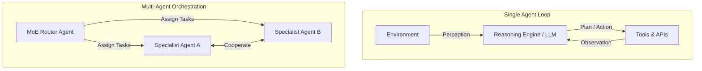

# 🤖 Module 2: Agentic & Multi-Agent Systems

Welcome to the documentation for **Module 2: Agentic Systems**. This module transitions our exploration from passive large language models to active, goal-oriented software agents capable of autonomous planning, tool invocation, and cooperative multi-agent coordination.

---

## 🎖️ Earned Digital Credentials

In this module, I earned the following skills credentials:

| Credential / Badge | Subject Matter | Documented Ledger |
| :---: | :--- | :---: |
|  | **Unleashing the Power of AI Agents** | [ai-agents-power.md](file:///c:/Programming/Ai%20-%20Engineer/ai4future/docs/02-agentic-systems/ai-agents-power.md) |
|  | **The Rise of Multi-Agent Systems** | [multi-agent-systems.md](file:///c:/Programming/Ai%20-%20Engineer/ai4future/docs/02-agentic-systems/multi-agent-systems.md) |

---

## 📂 Directory Contents & Technical Summaries

### 1. ⚙️ [Unleashing the Power of AI Agents](file:///c:/Programming/Ai%20-%20Engineer/ai4future/docs/02-agentic-systems/ai-agents-power.md)
*   **The Three Pillars of Agency:** Maps out the critical architectural elements of an agent:
    *   *Reasoning:* The cognitive LLM brain.
    *   *Memory:* Short-term context memory vs. long-term vector/RAG databases.
    *   *Actions & Tools:* API endpoints, calculators, and search interfaces.
*   **The ReAct Framework:** Details the iterative **Reason + Act** loop (*Thought ➔ Action ➔ Observation*) that enables agents to solve multi-stage problems dynamically.
*   **Autonomy Spectrum:** Compares rules-based execution with fully agentic control.
*   **Case Study (Sunscreen Trip Planner):** Details the 5-step workflow (*Perceive ➔ Process ➔ Decision ➔ Action ➔ Learn*) as Alex plans a custom vacation.

### 2. 👥 [The Rise of Multi-Agent Systems (MAS)](file:///c:/Programming/Ai%20-%20Engineer/ai4future/docs/02-agentic-systems/multi-agent-systems.md)
*   **Single-Agent Bottlenecks:** Details why single agents hit walls (context window limits, tool conflicts, specialization bottlenecks) and why MAS is the solution.
*   **Information Architectures:** Explores **Centralized (Vertical)** hub-and-spoke models, **Decentralized (Horizontal)** peer-to-peer databases, and **Hybrid** coordination setups.
*   **Cooperation Paradigms:** Analyzes Cooperative (joint cybersecurity), Competitive (algorithmic trading), Mixed (e-commerce bidding), Hierarchical (layered moderation), Heterogeneous (diverse roles), and **Mixture of Experts (MoE)** routing architectures.
*   **Case Studies:**
    *   *Music Festival Management:* Traces entry queues, dynamic ticket pricing, transport routing, and event production through cooperations.
    *   *Freelance Gig Platform:* Deconstructs coordination failure and cascading agent errors in listing, pricing, and scheduling.
    *   *Sector Transformations:* Explores multi-agent applications in Sports, ride-sharing, proactive cybersecurity defense, and cancer therapy.

---

## 🗺️ Architectural Concept Map

The coordinate workflows from single agents to multi-agent experts are visualized below:

---

## 🛠️ Navigating the Notes

To read the technical notes directly:
*   Study single-agent architectures: [ai-agents-power.md](file:///c:/Programming/Ai%20-%20Engineer/ai4future/docs/02-agentic-systems/ai-agents-power.md)
*   Study multi-agent systems & coordination: [multi-agent-systems.md](file:///c:/Programming/Ai%20-%20Engineer/ai4future/docs/02-agentic-systems/multi-agent-systems.md)
