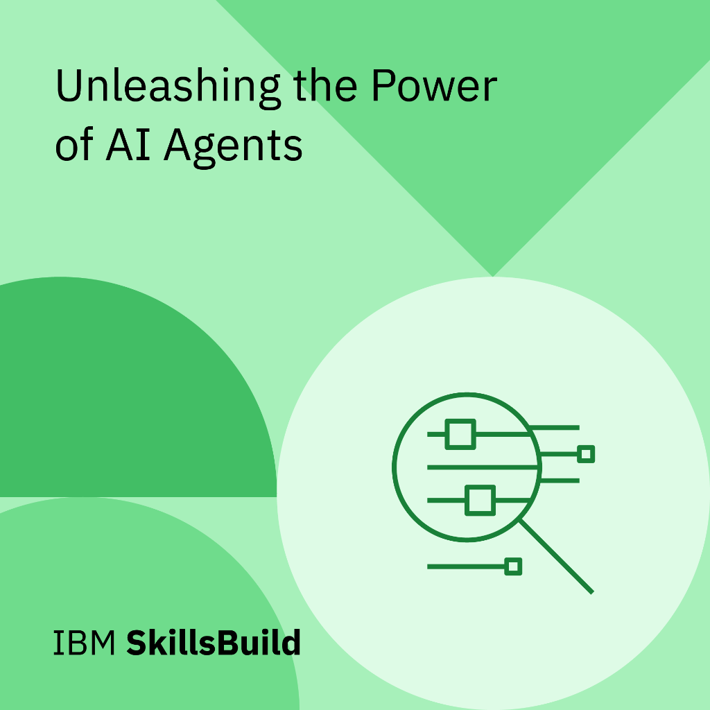
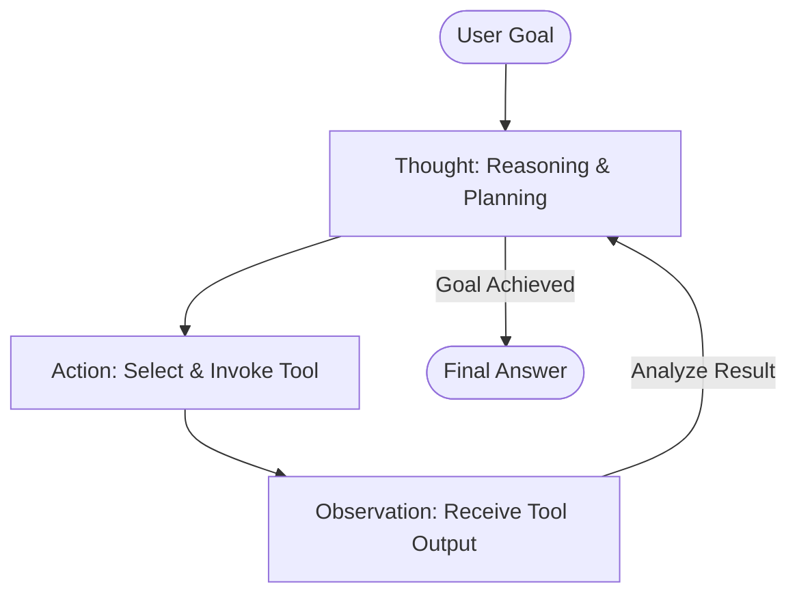

# Unleashing the Power of AI Agents




Welcome to the documentation for Module 2, Section 1: **Unleashing the Power of AI Agents**. This section covers the core concepts, classifications, architectural workflows, and real-world applications of agentic AI systems.

---

## Overview

The AI landscape is undergoing a fundamental paradigm shift from **monolithic models** to **compound AI systems**. While standalone models are highly capable, they are structurally limited by their static training data and lack of real-time environment integration. 

The true potential of generative AI is unlocked when models are embedded within dynamic systems that connect them to databases, APIs, and tools. Within this compound architecture, **AI Agents** represent the pinnacle of autonomous execution, shifting control logic from human-defined programs to LLM-driven reasoning.

> [!NOTE]  
> **IBM Definition of an AI Agent (July 2024)**  
> An AI agent is a system or program that can independently perform tasks on behalf of a user or another system by designing its own workflow and utilizing a suite of provided tools. It is characterized by its ability to perceive its environment, reason through complex goals, act autonomously, and learn from past outcomes.

---

## Key Technical Details

### 1. Core Capabilities & Characteristics of AI Agents

AI agents are distinguished from traditional automation software by several defining characteristics:

*   **Autonomy**: Agents execute tasks without step-by-step human intervention. Instead of waiting for explicit commands, they analyze high-level goals and determine the necessary sub-tasks.
    *   *Example*: A virtual scheduling agent checks calendars, coordinates availabilities, and schedules meetings without asking the user for confirmation at every step.
*   **Perception**: Agents gather and interpret data from their environment to react dynamically to changes.
    *   *Example*: A voice-activated assistant interprets a query to find pet-friendly restaurants by sensing both the user's intent and their real-time GPS location.
*   **Decision Making**: Agents analyze collected information and choose the best sequence of actions to reach their goal.
    *   *Example*: A fraud detection agent monitors bank transactions in real-time, identifying and flagging anomalous spending patterns before a transaction is approved.
*   **Memory & Learning**: Agents recognize patterns and store historical interaction logs to personalize and refine their behavior over time.
    *   *Example*: A streaming music platform agent analyzes user listening habits to dynamically customize and improve personalized playlists.
*   **Communication**: Powered by NLP and NLG, agents interact with humans and other systems via intuitive, conversational interfaces.
    *   *Example*: Customer support agents resolve complex queries and provide real-time assistance through natural, human-like dialogue.
*   **Goal-Orientedness**: All actions and reasoning cycles within the agent are directed toward achieving a specific, measurable objective.

---

### 2. The Three Types of AI Agents

AI agents are classified into three primary categories based on their internal decision-making logic:

```
                  ┌─────────────────────────────┐
                  │       AI Agent Types        │
                  └──────────────┬──────────────┘
                                 │
         ┌───────────────────────┼───────────────────────┐
         ▼                       ▼                       ▼
┌──────────────────┐   ┌──────────────────┐   ┌──────────────────┐
│  Goal-Oriented   │   │ Utility-Oriented │   │  Learning Agent  │
├──────────────────┤   ├──────────────────┤   ├──────────────────┤
│ Follows a static │   │ Balances trade-  │   │ Learns from past │
│ target; adapts   │   │ offs to maximize │   │ experiences to   │
│ path to reach it │   │ utility / reward │   │ adapt behavior   │
└──────────────────┘   └──────────────────┘   └──────────────────┘
```

#### A. Goal-Oriented AI Agents
*   **Logic**: Operates under a static, non-negotiable, and measurable goal. It analyzes actions and uses planning/reasoning to adapt its path to changing conditions.
*   **Differentiating Feature**: Strict, single-minded focus on achieving the target, adjusting dynamically to small disruptions along the way.
*   **Ideal Domains**: Logistics, task scheduling, automated quality inspection.
*   **Example**: An e-commerce fulfillment agent guarantees 1-day delivery by selecting the most efficient distribution center, automatically rerouting the order to a secondary warehouse if a shipping delay occurs.

#### B. Utility-Oriented AI Agents
*   **Logic**: Used when there is no single "correct" answer, but rather a spectrum of options. It evaluates competing variables to choose the sequence of actions that maximizes overall utility (rewards).
*   **Differentiating Feature**: Balances trade-offs (e.g., cost vs. speed, accuracy vs. latency, short-term gain vs. long-term stability) to identify the most advantageous option at any given moment.
*   **Ideal Domains**: Pricing optimization, resource allocation, recommendation engines.
*   **Example**: An airline ticket pricing agent dynamically adjusts seat prices based on real-time demand, season, and customer historical preferences to balance high seat occupancy with maximum profitability.

#### C. Learning AI Agents
*   **Logic**: Analyzes past outcomes (successes and failures) and feedback to modify its own underlying decision-making algorithms and behavior patterns over time.
*   **Differentiating Feature**: Remembers past interactions and refines its strategies, becoming more effective and personalized the more it is used.
*   **Ideal Domains**: Personal tutoring, adaptive cybersecurity, fraud prevention.
*   **Example**: An AI tutor monitors a student’s progress, identifying concepts they struggle with, and adjusts lesson difficulties, exercise types, and explanations to match the student’s learning speed.

---

### 3. Agent Classification Comparison Table

| Category | Goal-Oriented AI Agents | Utility-Oriented AI Agents | Learning AI Agents |
| :--- | :--- | :--- | :--- |
| **Decision Logic** | Follows a strict path to reach a predefined, measurable target. | Evaluates multiple options and trade-offs to maximize the reward. | Analyzes past outcomes and feedback to adjust its decision mechanism over time. |
| **Best-Suited Domains** | Logistics, manufacturing assembly, automated scheduling. | Dynamic pricing, asset allocation, portfolio management. | Evolving fraud detection, adaptive learning, personalized support. |
| **Differentiating Feature** | Maintains focus on the target while adapting to minor environmental changes. | Continuously analyzes real-time conditions to make the most profitable decision. | Retains memory of past interactions, adjusting its overall behavioral strategy. |
| **Real-World Example** | Rerouting a package delivery if a primary hub faces weather delays. | Adjusting hotel room pricing dynamically based on booking velocity and seasons. | Personalizing algebra exercises for a student based on their historical error patterns. |

---

## Architectural & Theoretical Notes

### 1. The Three Pillars of an AI Agent
An agent is built upon the integration of three core architectural elements:

```
  ┌────────────────────────────────────────────────────────┐
  │                       AI Agent                         │
  └─────┬───────────────────┬────────────────────────┬─────┘
        │                   │                        │
        ▼                   ▼                        ▼
  ┌───────────┐       ┌──────────────┐        ┌─────────────┐
  │ Reasoning │       │    Memory    │        │ Actions/    │
  │  (LLM)    │       │ (Logs/Chat)  │        │ Tools (APIs)│
  └───────────┘       └──────────────┘        └─────────────┘
```

1.  **Reasoning**: The "brain" of the agent, powered by an LLM. It processes goals, breaks them down into logical plans, and reasons at each step.
2.  **Memory**: Consists of conversational history (for user context) and internal execution logs (thought processes and action tracking).
3.  **Actions & Tools**: Programmatic extensions (APIs, web search, databases, calculators) that the agent calls dynamically to execute tasks in the physical or digital world.

#### The ReAct (Reason + Act) Framework
One of the most popular agent architectures, **ReAct**, structures the agent's execution loop:
*   **Thought**: The model plans the next step and reasons about what is needed.
*   **Action**: The model selects and invokes a tool (e.g., calling an API or database query).
*   **Observation**: The system feeds the tool's output back to the model.
*   *The loop repeats until the agent reaches the final answer.*




---

### 2. The AI Agent Workflow
An agent operates in a continuous, 5-step structured cycle:

```
  ┌───────────────┐     ┌────────────────┐     ┌──────────────┐
  │ 1. Perception ├────►│ 2. Processing  ├────►│ 3. Decision  │
  └───────▲───────┘     └────────────────┘     └──────┬───────┘
          │                                           │
          │                                           ▼
  ┌───────┴───────┐                            ┌──────┴───────┐
  │  5. Learning  │◄───────────────────────────┤  4. Action   │
  └───────────────┘                            └──────────────┘
```

1.  **Perceiving the Environment**: Gathers input data. For physical agents, this involves sensors (cameras, microphones). For virtual agents, it includes digital files, logs, emails, and user queries.
2.  **Processing Input Data**: Analyzes context, parses intent, and extracts structured key information.
3.  **Decision Making**: Evaluates possible options and selects the optimal path to reach the goal.
4.  **Executing Action**: Translates decisions into execution (e.g., writing data, issuing API calls, physical motor movement).
5.  **Learning & Improving**: Reviews the results of the action, adjusts memory, and refines the internal model to optimize future steps.

#### Case Study: The Sunscreen Trip Planner
An agent is asked: *"I am going to Florida for 1 week next month. I will spend a lot of time outside. How many 50g sunscreen bottles do I need to bring?"*

The agent manages this complex task by executing the 5-step workflow:
1.  **Perceive**: Gathers request parameters (1 week, Florida, outdoor travel).
2.  **Process**: Searches its memory for previous user details, extracting "next month" to identify the exact travel dates.
3.  **Decision/Reasoning**: Formulates a multi-step execution plan:
    *   *Step A*: Look up next month's average daily sunshine hours in Florida (calls **Weather Search Tool**).
    *   *Step B*: Query medical recommendations for sunscreen application volume per hour under high UV index (calls **Web Search Tool**).
    *   *Step C*: Compute total volume needed (calls **Calculator Tool**).
4.  **Action**: Executes the calculations and recommends bringing exactly 4 bottles of 50g sunscreen based on 6 hours/day exposure.
5.  **Learning**: Records the user's feedback to adjust its UV-sensitivity and exposure preferences for future requests.

---

### 3. Autonomy Spectrum & Design Trade-offs
Deploying AI agents requires balancing autonomy against efficiency:

*   **Narrow/Rules-Based Control**: Best for well-defined, repetitive tasks. It is computationally efficient and avoids infinite looping.
*   **Agentic/Autonomous Control**: Essential for open-ended, complex tasks (e.g., resolving GitHub issues). The path to completion is too variable to program manually, making LLM-guided exploration and adjustment highly valuable.
*   **Human-in-the-Loop (HITL)**: Crucial for high-risk domains (finance, healthcare) to verify agent decisions, ensuring safety and compliance.

---

## References & Resources

*   *What are AI Agents?*, IBM Research, July 2024.
*   *Get to know AI agents: Sensory, Actuators, and Environments*, IBM Article, July 2024.
*   *ReAct: Synergizing Reasoning and Acting in Language Models*, Yao et al., 2022.
