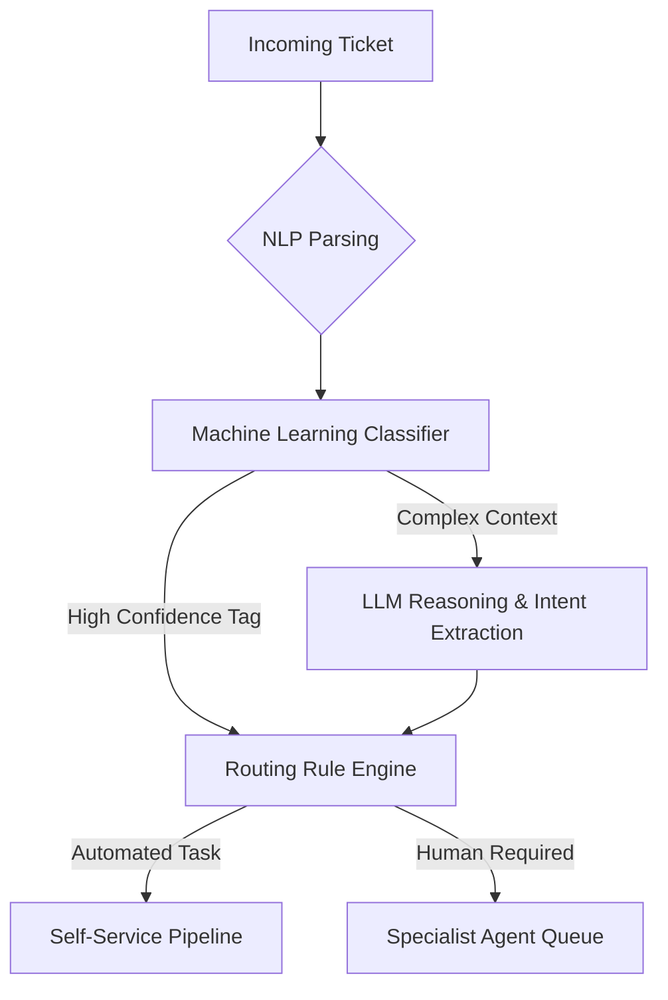
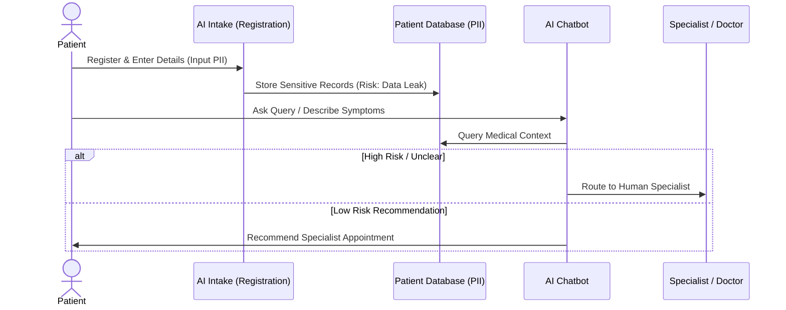
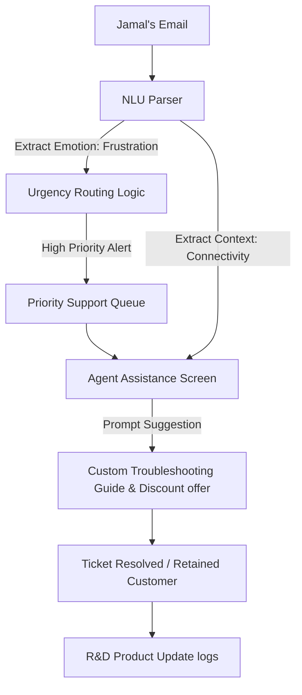

# AI-Powered Ticket Routing and Recommendation Systems


Welcome to the comprehensive technical documentation for **AI-Powered Ticket Routing and Recommendation Systems**. This note covers the architectural foundations, technical components, machine learning paradigms, data privacy constraints, and real-world implementations of modern intelligent customer interaction platforms.

---

## 📂 Module Outline

1. **Foundations of AI-Powered Ticket Routing Systems**
2. **AI Technologies in Ticket Routing**
3. **AI-Powered Recommendation Systems for Customer Service**
4. **Challenges in Designing AI-Enhanced Customer Service Systems**
5. **Applying NLU and Sentiment Analysis in Customer Interactions**

---

## 1. Foundations of AI-Powered Ticket Routing Systems

### Core Architectural Components
A modern AI-powered ticket routing pipeline consists of five critical components designed to orchestrate customer queries from ingestion to resolution:

```mermaid
graph LR
    A[1. Intake] --> B[2. Classification]
    B --> C[3. Routing]
    C --> D[4. Collaboration]
    D --> E[5. Performance Tracking]
    
    style A fill:#181824,stroke:#3b82f6,stroke-width:2px;
    style B fill:#181824,stroke:#3b82f6,stroke-width:2px;
    style C fill:#181824,stroke:#3b82f6,stroke-width:2px;
    style D fill:#181824,stroke:#3b82f6,stroke-width:2px;
    style E fill:#181824,stroke:#3b82f6,stroke-width:2px;
```



1. **Intake:** Automatically captures incoming queries across diverse omni-channel support paths (emails, live chats, phone call transcripts, social media feeds, and web portals).
2. **Classification:** Parses the query structure using Natural Language Processing (NLP) to categorize the issue type, determine severity level, and assign urgency/priority.
3. **Routing:** Dynamically assigns the classified ticket to the most appropriate human support agent queue or triggers an automated self-service resolution script.
4. **Collaboration:** Facilitates cross-functional ticket handling, ensuring full context conservation when handovers occur between virtual assistants and human specialists.
5. **Performance Tracking:** Generates real-time diagnostic analytics, monitoring Service Level Agreements (SLAs), resolution speeds, customer satisfaction (CSAT), and queue bottlenecks.

---

### Key Case Studies

> [!NOTE]
> **Joanne Cabinetry Case Study**
> *   **Context:** A small-scale cabinetry manufacturer transitioning from manual mailboxes.
> *   **Implementation:** Basic rules-based routing to automatically segment incoming customer requests into separate departments (e.g., Sales, General Support, Custom Design/Manufacturing).
> *   **Outcome:** Improved response times and reduced inter-departmental manual forward delays.

> [!IMPORTANT]
> **Passenger Paul Case Study (Priority Routing)**
> *   **Scenario:** Passenger Paul faces a flight cancellation, causing high stress and urgency.
> *   **Workflow:** The AI intake detects the cancellation signal and customer anxiety, bypasses the standard general queue, and routes Paul directly to a specialized flight-rebooking agent.
> *   **Value:** Prevents customer churn and ensures high-priority issues are resolved by the most competent personnel instantly.

> [!TIP]
> **Humana Watson Case Study**
> *   **Context:** A major health insurance provider managing high call volumes.
> *   **Implementation:** IBM Watson-driven virtual agents integrated into the call routing hierarchy.
> *   **Results:**
>     *   **33%** reduction in operational costs.
>     *   Successfully processed over **7,000+ calls daily**.
>     *   Achieved **90% to 95%** classification accuracy.

---

## 2. AI Technologies in Ticket Routing

Ticket routing architectures rely on a combination of Natural Language Processing (NLP), Machine Learning (ML), and Large Language Models (LLMs) to understand, classify, and dispatch tasks:



### Technology Matrix in Routing

*   **Natural Language Processing (NLP):** Tokenizes text, extracts semantic features, and maps syntactic relationships (e.g., parsing part-of-speech structure in a chat transcript).
*   **Machine Learning (ML):** Uses classification algorithms (e.g., Random Forests, Support Vector Machines) trained on historical logs to assign category tags (e.g., Billing, Technical Support).
*   **Large Language Models (LLMs):** Leverages deep contextual comprehension to handle highly ambiguous, unstructured emails and infer complex intents or sentiment shifts.

---

### Case Studies: Automated Workflows

*   **Uber Support Tickets:** Processes millions of customer and driver tickets globally. The AI model extracts ticket categories and automatically routes them to localized divisions (e.g., Driver Payment Issues, Passenger Safety, Vehicle Telemetry Support) with high-speed dispatching.
*   **Tinny App Crash vs. Alan Password Reset:**
    *   *System Telemetry (Tinny):* The intake identifies a software crash code. The routing model bypasses general billing queues and routes the ticket directly to the **Software Engineering Debugging Queue**.
    *   *Self-Service (Alan):* The intake identifies a basic password reset request. The routing engine initiates a **fully automated self-service pipeline**, emailing a secure reset link to the user without requiring human intervention.

---

## 3. AI-Powered Recommendation Systems for Customer Service

Recommendation systems analyze customer profiles, purchase history, and real-time interaction context to suggest relevant items, actions, or knowledge base articles.

### Recommendation Paradigms

| Feature / Architecture | Collaborative Filtering | Content-Based Filtering | Hybrid Recommender Systems |
| :--- | :--- | :--- | :--- |
| **Logic** | Recommends items based on user similarity matrices (Users who liked $X$ also liked $Y$). | Recommends items based on item feature similarity to past items a user interacted with. | Combines Collaborative and Content-based approaches to form predictions. |
| **Data Sources** | User ratings, purchase histories, and collective behavior metrics. | Item descriptions, specifications, tags, and category metadata. | User logs, item metadata, and contextual behavioral telemetry. |
| **Strengths** | Discovers unexpected interests; does not require deep metadata knowledge. | Highly personalized; avoids cold-start issues for new items. | Minimizes limitations of single approaches; handles the cold-start problem. |
| **Weaknesses** | Suffers from the "Cold Start" problem (cannot recommend to new users or new items). | Tends to lock users into a narrow recommendations bubble. | Computationally expensive; complex pipeline design. |

---

### Industry Taxonomy

Recommendation systems are widely deployed across sectors to customize user experiences:
*   **E-Commerce:** Suggests related products, accessories, and promotional items based on cart contents.
*   **Streaming Services:** Customizes landing feeds and playlists based on viewing histories (e.g., Netflix, Spotify).
*   **Social Media:** Orders news feeds and recommends connections/profiles based on engagement patterns.
*   **Online Learning:** Suggests subsequent courses or diagnostic exercises based on student skill levels.
*   **Travel Industry:** Suggests additional flights, hotel upgrades, or excursions during booking processes.

---

### Case Study: Macy's "Macy's On Call"

> [!NOTE]
> **Macy's Mobile In-Store Recommender**
> *   **Technology:** Powered by IBM Watson.
> *   **Implementation:** Integrated with in-store physical beacons and image search APIs.
> *   **Workflow:** When a customer approaches a specific beacon, the mobile app recommends coordinating clothing accessories or provides direct guidance to departments.
> *   **Outcome:** Enhanced the brick-and-mortar retail shopping experience, offering self-guided navigation and personalized product matching.

---

## 4. Challenges in Designing AI-Enhanced Customer Service Systems

Deploying autonomous classification and recommendation engines introduces systemic risks related to algorithmic bias, data security, and compliance.

### Systemic Biases in AI Design

*   **Popularity Bias:** The model repeatedly recommends high-volume items, drowning out niche, custom, or newly added products.
*   **Demographic Bias:** Algorithmic recommendations are skewed due to historical demographic imbalances in training datasets.
*   **Geographic Bias:** Recommendation models favor specific urban locations or regions, leading to poor customer experiences for users outside those zones.

> [!CAUTION]
> **Case Study: JessTreas Boutique E-Commerce**
> *   **Issue:** JessTreas deployed a basic recommendation engine that relied heavily on raw sales volume metrics.
> *   **Outcome:** The system suffered from severe **Popularity Bias**. It only recommended a few high-volume mass-produced items on the homepage, while custom, high-margin boutique items were hidden from users, causing sales stagnation.

---

### Design Framework: Five Mitigation Pillars
When designing or auditing an AI customer service workflow, system architects must address five core domains:

```
  ┌──────────────────────────────────────────────────────────┐
  │                   AI System Audit                        │
  └─────┬──────────────┬──────────────┬──────────────┬───────┘
        │              │              │              │
        ▼              ▼              ▼              ▼
  ┌───────────┐  ┌───────────┐  ┌───────────┐  ┌───────────┐
  │ Data &    │  │   Bias    │  │  Routing  │  │ Account-  │
  │ Privacy   │  │Mitigation │  │ Strategy  │  │ ability   │
  └───────────┘  └───────────┘  └───────────┘  └───────────┘
```

1. **Data Collection & Privacy:** Does the system gather only the data required? Are explicit opt-ins enforced?
2. **Bias Mitigation:** Are training datasets diverse? How does the model account for tail-end or new items?
3. **Routing Strategy:** Is the system capable of routing sensitive issues directly to human escalation paths?
4. **Recommendation Strategy:** Does the model balance popularity metrics with novelty and exploration?
5. **Accountability & Transparency:** Can the system explain *why* a decision, rating, or route was chosen?

---

### Case Study: Healthcare Facility AI Ticket Routing

A healthcare provider implemented an AI ticket routing system to handle patient inquiries. The workflow contains critical vulnerabilities and mitigation requirements:



*   **Vulnerability (Unauthorized Access):** AI developers accessed raw clinical databases containing sensitive Personally Identifiable Information (PII) for model training without data masking, violating patient privacy.
*   **Critical Pipeline Design Requirement:** Implement end-to-end encryption, strict role-based access control (RBAC), and isolate training pipelines from active production medical databases.

---

### Case Study: Brite Fit Yes Compliance Audit

The fitness app **Brite Fit Yes** provides personalized workout recommendations based on biometric data (steps, heart rate, calories, sleep). An independent audit revealed major design failures across three core pillars:

1. **Privacy & Data Handling (Audit Result: FAIL):**
    *   *Violation:* The app tracked users' GPS location data continuously, despite it being unnecessary for workout recommendations.
    *   *Violation:* The company sold sensitive health metrics to third-party advertisers under ambiguous terms without explicit user agreement.
2. **Bias & Fairness (Audit Result: FAIL):**
    *   *Violation:* The training dataset consisted primarily of metrics from young, highly active individuals. As a result, the model recommended dangerous, high-intensity workouts to older adults or users with health conditions.
    *   *Violation:* The algorithm recommended workouts requiring specialized equipment not available in the user's geographic region, with no transparency explaining the recommendations.
3. **Security & Compliance (Audit Result: FAIL):**
    *   *Violation:* User data was stored with insufficient encryption, exposing it to data breaches.
    *   *Violation:* Non-compliant with GDPR **Article 5 (Data Minimization)** and **Article 7 (User Consent)**.
    *   *Consequence:* The company faced legal actions, loss of customer trust, and a potential fine of **€20 million or 4% of annual global turnover**, whichever is higher.

---

## 5. Applying NLU and Sentiment Analysis in Customer Interactions

Natural Language Understanding (NLU) enables systems to extract semantic meaning, emotional tone, and intent from unstructured customer communications.

### Sentiment Analysis Paradigms

```mermaid
graph TD
    Text[Input: "The service was not fast"] --> Rule[Rule-Based Classifier]
    Text --> ML[Machine Learning Classifier]
    
    Rule --> |Lexicon Match| Match[Identifies 'fast' as +]
    Match --> |Negation Shift| Neg[Shift to - due to 'not']
    Neg --> OutRule[Sentiment: Negative]
    
    ML --> |Feature Map| Vector[Convert text to dense vector]
    Vector --> |Deep Learning Classifier| Model[Contextual Classification]
    Model --> OutML[Sentiment: Negative]
    
    style Rule fill:#181824,stroke:#eab308,stroke-width:2px;
    style ML fill:#142217,stroke:#22c55e,stroke-width:2px;
```

#### Rule-Based Sentiment Analysis
*   **Mechanism:** Uses pre-defined lexicons (lists of positive/negative words), patterns, negations, and syntactic rules.
*   **Example:** Evaluates *"The service was not fast"* by identifying the positive keyword "fast", detecting the negation "not", and reversing the sentiment score to negative.
*   **Limitation:** Highly rigid; fails to parse complex syntax, sarcasm, or double negations, and requires manual maintenance.

#### Machine Learning Sentiment Analysis
*   **Mechanism:** Uses probabilistic classification models trained on large labeled datasets.
*   **Example:** Classifies *"This purchase made me really happy"* as positive by mapping the semantic similarity of the word vectors to historical training examples of positive feedback (e.g., *"I'm thrilled with the product"*).
*   **Advantage:** Adapts dynamically, identifies contextual dependencies, and continuously improves as it processes new telemetry.

---

### Core Features of NLU

Using the customer post: *"I absolutely love the camera on this phone. It's incredibly sharp and captures vibrant colors. However, the battery life is disappointing."*

1. **Metadata Analysis:** Identifies and classifies semantic tokens:
    *   *Entities:* Camera (Object), Phone (Device), Battery Life (Feature).
    *   *Keywords:* "sharp", "disappointing".
2. **Context Inference:** Determines high-level themes not explicitly mentioned:
    *   Infers concepts like "photography quality" or "device usability".
    *   Categorizes the post under "consumer electronics reviews".
3. **Emotion Extraction:** Identifies specific emotional markers:
    *   Detects *Joy/Satisfaction* in the camera description.
    *   Detects *Disappointment/Frustration* in the battery description.
4. **Sentiment Score Calculation:** Calculates polarity scores:
    *   Evaluates *"I absolutely love..."* as strongly positive ($+$) due to the modifier "absolutely" amplifying the verb "love".
5. **Communication Pattern Assessment:** Reviews writing style, preferences, and recurring trends across multiple posts to track customer satisfaction trends.

---

### Case Study: Smart Home Device Troubleshooting (Jamal)

Jamal sent a highly frustrated email complaining about connectivity issues with a newly purchased smart home device. The customer service platform processed the ticket through an NLU loop:



*   **Urgency Dispatching:** NLU identified high negative sentiment and frustration, automatically escalating Jamal's email to a high-priority queue.
*   **Personalized Experience:** The system suggested a customized troubleshooting guide and prompted the agent to offer a loyalty discount code.
*   **Retention Outcome:** Jamal’s experience was converted from negative to positive, preventing churn.
*   **Continuous R&D Feedback:** The system aggregated Jamal's connectivity logs with other NLU logs. The R&D team utilized this feedback to identify a firmware bug and release an update.

---

### Case Study: Česká Spořitelna Banking Modernization

**Česká Spořitelna**, a Czech banking firm with 4.5 million clients, partnered with IBM Consulting to modernize its operations (1,500 contact agents and 4,500 branch reps). They deployed a hybrid system combining NLU, LLMs, and AWS:

1. **Enhanced Search (Agent Assist):** Uses NLU to interpret user query context in real-time, directing branch agents to accurate documents and reducing manual search time.
2. **Improved Sentiment-Based Routing:** Analyzes incoming text to identify customer frustration or unspoken context, routing high-stress inquiries to senior agents or supervisors.
3. **Automated Interaction Summaries:** The NLU system automatically summarizes conversations. If a ticket is forwarded, the receiving agent gets a concise summary, preventing the customer from repeating details.
4. **Automated Email Handling:** Automatically parses incoming emails, extracting primary themes, emotional tones, and intents to speed up response times.

---

### Action Plan Scenario: Telecommunications Provider

A telecom provider facing negative publicity due to poor customer service implemented an NLU and sentiment-based routing system to resolve its core challenges:

*   **Challenge 1: Large Volume of Customer Queries (High Wait Times)**
    *   *NLU Solution:* NLU pre-classifies email/chat topics automatically, resolving standard queries via self-service and routing complex cases to the correct department immediately, reducing wait times.
*   **Challenge 2: Inappropriate Agent Tone (Ignoring Urgency)**
    *   *NLU Solution:* Sentiment analysis detects high customer anger or urgency. The routing system escalates these tickets to empathetic agents and highlights the client's emotional state on the agent's dashboard.
*   **Challenge 3: Need for Repetition During Rerouting**
    *   *NLU Solution:* The NLU engine generates structured summaries of every interaction, passing the summary along the ticket path so subsequent agents have full context.
*   **Challenge 4: Multiple Follow-up Questions**
    *   *NLU Solution:* NLU extracts key entities and metadata (e.g., account numbers, device models, issue tags) from the customer's initial description, minimizing the need for follow-up questions.
*   **Challenge 5: Inaccurate or Inconsistent Responses**
    *   *NLU Solution:* Agent Assist utilizes NLU to query internal wikis based on context, providing agents with pre-approved, accurate templates.
*   **Challenge 6: Ineffective Ticket Routing (Wrong Departments)**
    *   *NLU Solution:* Replaces manual triage with automated NLU-based ticket classification, routing queries directly to the correct department first.

---

## 🛠️ Navigating the Notes
To explore other topics in this module:
*   [← Single-Agent Architectures](ai-agents-power.md)
*   [← Multi-Agent Frameworks](multi-agent-systems.md)
