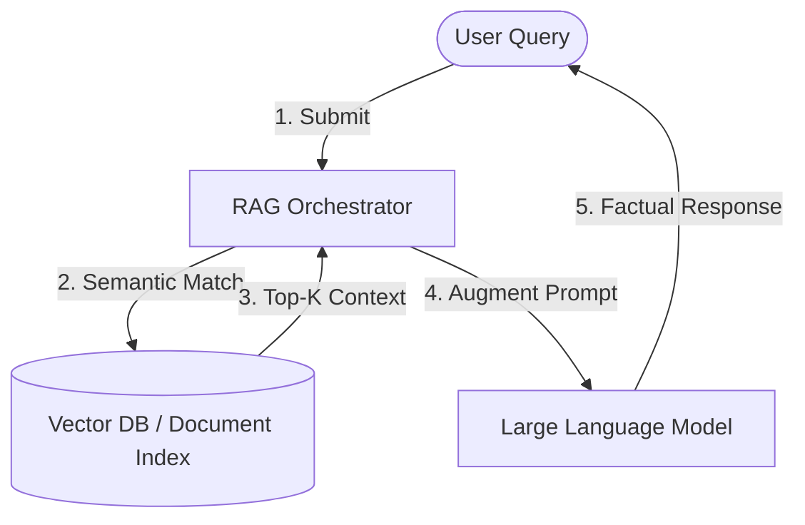

# 🔍 Module 3: RAG & Embeddings

Welcome to the documentation for **Module 3: RAG & Embeddings**. This section explores how to optimize Large Language Models (LLMs) by grounding their generation pipelines in semantic search databases and external API directories.

---

## 🎖️ Earned Digital Credentials

In this module, I earned the following skills credential:

| Credential / Badge | Subject Matter | Documented Ledger |
| :---: | :--- | :---: |
|  | **Introduction to Retrieval-Augmented Generation** | [smarter-ai-embeddings.md](file:///c:/Programming/Ai%20-%20Engineer/ai4future/docs/03-rag-embeddings/smarter-ai-embeddings.md) |

---

## 📂 Directory Contents & Technical Summaries

### 1. 🧠 [Build Smarter AI with Embeddings (RAG)](file:///c:/Programming/Ai%20-%20Engineer/ai4future/docs/03-rag-embeddings/smarter-ai-embeddings.md)
*   **The RAG Architecture:** Details how RAG decouples model reasoning from static knowledge storage, resolving issues with stale parameters, lack of attribution, and hallucinations.
*   **The Student Metaphor:** Maps standard LLMs to closed-book exam takers and RAG-enabled LLMs to open-book reference researchers.
*   **Pipeline Execution:** Traces the data flow: *User Query ➔ Semantic Search ➔ Context Filtering ➔ Prompt Augmentation ➔ Factual Response Generation*.
*   **Production Case Studies:**
    *   *Enterprise HR Assistant:* Links employee queries to live corporate wikis to prevent policy contradictions.
    *   *Dubai Budget Travel Assistant:* Traces real-time extraction of budget parameters, hotel index searches, price filtering, and cited response synthesis.

### 2. 🧮 [Vector Embeddings](file:///c:/Programming/Ai%20-%20Engineer/ai4future/docs/03-rag-embeddings/vector-embeddings.md)
*   *Core Concepts:* Explores vector representations of semantic tokens, cosine similarity spaces, and indexing structures for high-dimensional vector databases.

---

## 🗺️ Architectural Concept Map

The data flow within a standard Retrieval-Augmented Generation pipeline is illustrated below:

---

## 🛠️ Navigating the Notes

To explore the documents directly:
*   Read about RAG pipelines: [smarter-ai-embeddings.md](file:///c:/Programming/Ai%20-%20Engineer/ai4future/docs/03-rag-embeddings/smarter-ai-embeddings.md)
*   Read about Vector Embeddings: [vector-embeddings.md](file:///c:/Programming/Ai%20-%20Engineer/ai4future/docs/03-rag-embeddings/vector-embeddings.md)
