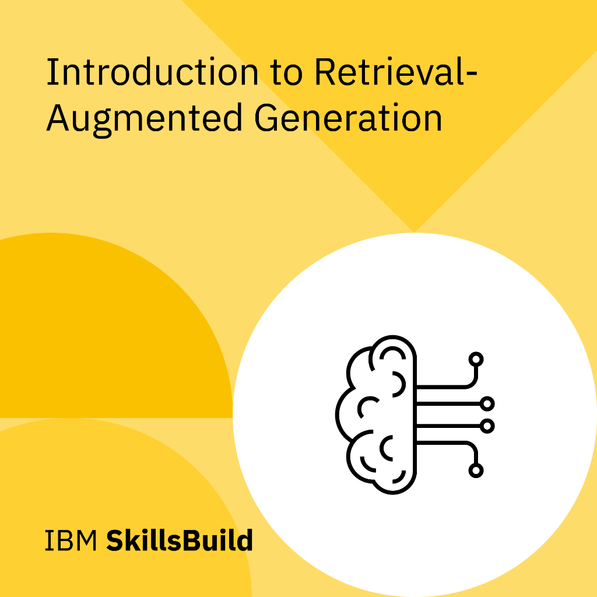
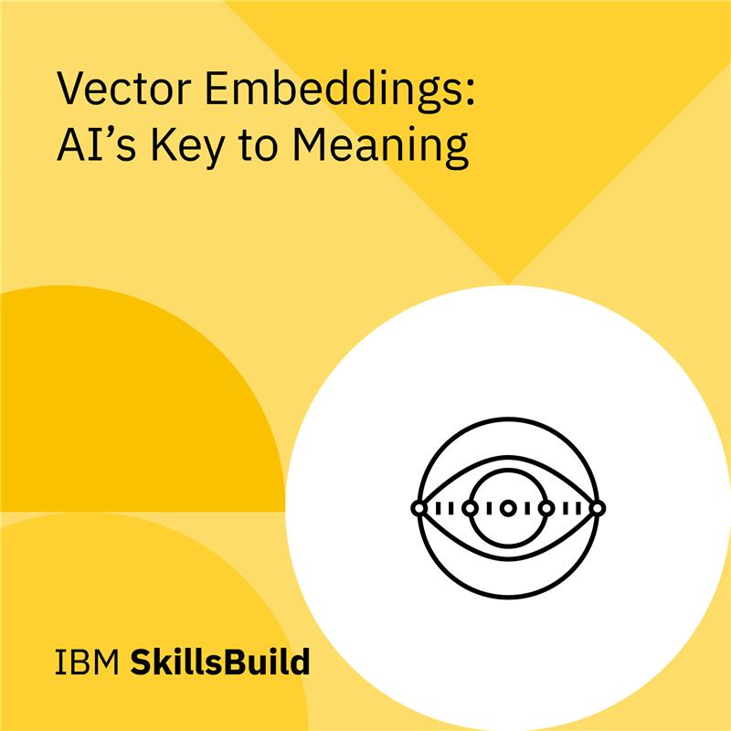

# 🔍 Module 3: RAG & Embeddings

Welcome to the documentation for **Module 3: RAG & Embeddings**. This section explores how to optimize Large Language Models (LLMs) by grounding their generation pipelines in semantic search databases and external API directories, avoiding parameters staleness and model hallucinations.

---

## 📂 What's in this Folder

| File / Resource | Access Badge | Technical Focus | Core Key Concepts |
| :--- | :---: | :--- | :--- |
| **Smarter AI with Embeddings** |  | Retrieval-Augmented Generation (RAG) architecture and execution pathways | Open-Book student metaphor, pipeline execution steps, and industry cases |
| **Vector Embeddings** |  | Representation of tokens in vector spaces and index architectures | Semantic features, dimensionality projection, and similarity bounds |

---

## 🎖️ Earned Digital Credentials

In this module, I earned the following skills credentials:

| Credential / Badge | Subject Matter | Documented Ledger |
| :---: | :--- | :---: |
|  | **Introduction to Retrieval-Augmented Generation** | [smarter-ai-embeddings.md](smarter-ai-embeddings.md) |
|  | **Vector Embeddings: AI's Key to Meaning** | [vector-embeddings.md](vector-embeddings.md) |

---

## 🧮 Theoretical & Mathematical Foundations

Retrieval-Augmented Generation hinges on mapping unstructured text inputs into a high-dimensional vector space $\mathbb{R}^d$ and retrieving relevant documents using distance metrics.

---

### 1. Cosine Similarity Space
Cosine similarity measures the cosine of the angle $\theta$ between two non-zero vectors $A, B \in \mathbb{R}^d$. It computes the orientation match rather than length difference, bounding the output within $[-1, 1]$:
$$\text{similarity}(A, B) = \cos(\theta) = \frac{A \cdot B}{\|A\| \|B\|} = \frac{\sum_{i=1}^n A_i B_i}{\sqrt{\sum_{i=1}^n A_i^2} \sqrt{\sum_{i=1}^n B_i^2}}$$

*   $\cos(\theta) = 1$: Vectors point in identical directions (exact semantic alignment).
*   $\cos(\theta) = 0$: Vectors are orthogonal (statistically independent concepts).
*   $\cos(\theta) = -1$: Vectors point in diametrically opposite directions.

---

### 2. Distance Metrics in Vector Databases
When querying vector databases (such as Milvus, Pinecone, or Qdrant) at runtime, candidate embeddings are ranked using one of the following distance metrics:

#### A. Euclidean Distance ($L_2$ Distance)
Measures the straight-line distance between two points in Euclidean space:
$$d_{L2}(A, B) = \|A - B\|_2 = \sqrt{\sum_{i=1}^n (A_i - B_i)^2}$$
*Usage:* Ideal when vector magnitudes are important (e.g., when word frequency affects meaning).

#### B. Inner Product ($IP$)
Computes the dot product of two vectors:
$$d_{IP}(A, B) = A \cdot B = \sum_{i=1}^n A_i B_i$$
*Usage:* Heavily optimized for search when vector embeddings are pre-normalized to unit length ($\|A\|_2 = \|B\|_2 = 1$), in which case the Inner Product simplifies to Cosine Similarity.

#### C. Manhattan Distance ($L_1$ Distance)
Measures distance along axes at right angles (grid-like metric):
$$d_{L1}(A, B) = \|A - B\|_1 = \sum_{i=1}^n |A_i - B_i|$$

---

## 🗺️ Architectural Concept Map

The data flow within a standard Retrieval-Augmented Generation pipeline is illustrated below:

```mermaid
graph TD
    User([User Query]) -->|1. Submit| Orchestrator[RAG Orchestrator]
    Orchestrator -->|2. Semantic Match| VectorDB[(Vector DB / Document Index)]
    VectorDB -->|3. Top-K Context| Orchestrator
    Orchestrator -->|4. Augment Prompt| LLM[Large Language Model]
    LLM -->|5. Factual Response| User

    style VectorDB fill:#0d2636,stroke:#00b4d8,stroke-width:2px;
    style LLM fill:#1e1a3a,stroke:#7209b7,stroke-width:2px;
```

---

## 🛠️ Navigating the Notes

To explore the documents directly:
*   Read about RAG pipelines: [smarter-ai-embeddings.md](smarter-ai-embeddings.md)
*   Read about Vector Embeddings: [vector-embeddings.md](vector-embeddings.md)

---

[← Agentic Systems](../02-agentic-systems/) | [Next: Cloud & Security →](../04-infra-security/)
