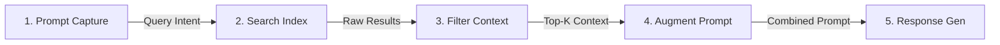

# Build Smarter AI with Embeddings (Retrieval-Augmented Generation)

## Overview

Large Language Models (LLMs) excel at broad, general-purpose text comprehension and generation. However, standard LLMs suffer from critical limitations when deployed in production enterprise environments:
*   **Stale Parameters:** Training data represents a static snapshot frozen in time (cutoff date).
*   **Lack of Attribution:** Model outputs are probabilistic generations with no verifiable source citations.
*   **Hallucinations:** Models can confidently produce false, incomplete, or nonsensical data.

**Retrieval-Augmented Generation (RAG)** is an architectural framework that addresses these limitations by decoupling the model's reasoning capabilities from its knowledge base. Instead of relying solely on static weights, a RAG pipeline queries external, trusted database indexes (public databases, internal document stores, APIs) at runtime. It injects relevant, up-to-date information directly into the prompt context window, ensuring the LLM's generated outputs are accurate, grounded in facts, and verifiable.

---

## Key Technical Details

### 1. The Core Benefits of RAG
*   **Cost-Efficient Scaling:** Eliminates the computational overhead and complexity of continuous model fine-tuning or retraining. Knowledge bases can be updated instantly by updating database indices, keeping operational costs low.
*   **Real-Time Data Currency:** Integrates LLMs with active data pipelines (APIs, live databases, streaming data), keeping the system aligned with current conditions (e.g., market trends, pricing fluctuations).
*   **Factual Grounding:** Constrains the LLM to write answers using only the retrieved documents, lowering hallucination rates and increasing prediction fidelity.
*   **Auditable Transparency (Source Citations):** Retains metadata (URLs, file paths, page numbers) from source documents, allowing the LLM to generate verifiable citations for its responses.
*   **Data Isolation & RBAC Compliance:** Keeps proprietary or confidential data out of model parameters, mitigating training data leakage. It allows role-based access control (RBAC) to be applied at the database retrieval level before data ever hits the model.

### 2. Enterprise Use Cases
*   **Enterprise QA (Question Answering):** Automates answers to time-sensitive queries (e.g., HR policy updates, calendar shifts) by retrieving facts from secure internal company wikis and databases.
*   **Research Synthesis:** Aggregates and correlates data from high-velocity sources (e.g., market charts, academic publications, legal registries) to assist analysts in rapid synthesis.
*   **Fact-Grounded Content Generation:** Ingests live news indices or statistical summaries before drafting reports, ensuring output credibility and including source links.
*   **Domain-Specific Ingestion:** Integrates highly specialized medical, legal, or financial datasets into the context window at runtime, keeping the base model clean of toxic or private information.

---

## Architectural & Theoretical Notes

### 1. RAG Core Pipeline Architecture
The workflow below illustrates how a query is intercepted, augmented with external data, and processed by the LLM:

### 2. The Student Metaphor: Standard LLM vs. RAG LLM
*   **Standard LLM (Closed-Book Exam):** Like a student taking an exam without access to books. The student must rely solely on memory (training parameters). If they encounter obscure details or facts changed since they studied, they must guess, leading to errors (hallucinations).
*   **RAG-enabled LLM (Open-Book Exam):** Like a student taking an exam with access to a library. When asked a question, they look up the exact topic in reference books (retrieval phase) and write an answer grounded in the retrieved text (generation phase).

### 3. Detailed Step-by-Step Execution
1.  **Prompt Capture & Intent Parsing:** The orchestrator intercepts the user's natural language query and extracts structural parameters (location, temporal ranges, intent).
2.  **Information Search (Querying):** The orchestrator queries external indexes (vector databases, semantic indices, web search APIs) using the extracted parameters.
3.  **Context Filtering & Retrieval:** The search engine filters out noise, ranks candidates, and selects the top-K highest-quality document chunks.
4.  **Prompt Augmentation:** The orchestrator inserts the filtered context directly into a structured prompt template alongside the user's query, creating an enriched context.
5.  **Response Generation:** The LLM receives the augmented prompt, processes the text, and synthesizes a clear, accurate, and cited recommendation.

---

### Case Studies

#### Case Study A: RAG in Enterprise HR Operations
*   **Scenario:** An international corporation deploys an HR assistant helping employees with holiday policies, salary schedules, and benefit guidelines.
*   **The Problem:** The initial assistant used static weights. When corporate policies changed, it served outdated or contradictory answers, causing confusion and overloading human HR teams.
*   **The RAG Solution:** The company integrated RAG, linking the assistant to the company's live policy database. The assistant now queries the live policy directory before generating any advice.
*   **Business Outcome:** The system scales to handle bulk inquiries, while maintaining data security, privacy, and policy alignment.

#### Case Study B: Dubai Travel Assistant Workflow
*   **Scenario:** A traveler asks: *"What are the most budget-friendly hotels in Dubai for this weekend?"*
*   **Execution Lifecycle:**
    *   *Step 1 (Capture):* Extracts target keys: `"budget-friendly"` (cost parameter), `"Dubai"` (location), `"this weekend"` (temporal range).
    *   *Step 2 (Search):* Queries active hotel portals, reservation registries, and travel blogs.
    *   *Step 3 (Retrieve):* Filters prices, room availability, and guest reviews to pull the top matches.
    *   *Step 4 (Augment):* Builds the context: `"Hotel X: $110/night, 4-star, excellent reviews. Hotel Y: $90/night, lower cost, slightly lower ratings."`
    *   *Step 5 (Generate):* The LLM synthesizes a concise recommendation comparison based strictly on these facts.

---

## References & Resources

*   *What is RAG (retrieval-augmented generation)?*, IBM Research, October 2024.
*   *What are AI Hallucinations?*, IBM Research, September 2023.
*   *Retrieval-Augmented Generation for Knowledge-Intensive NLP Tasks*, Lewis et al., 2020.
