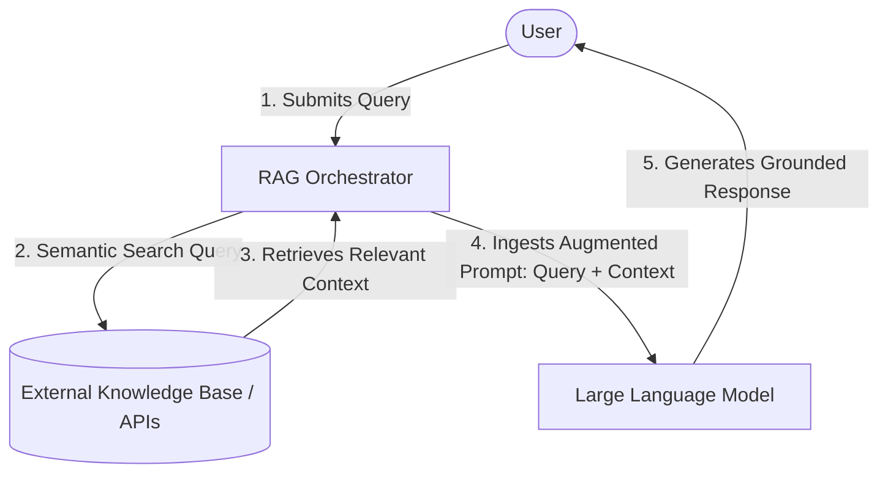
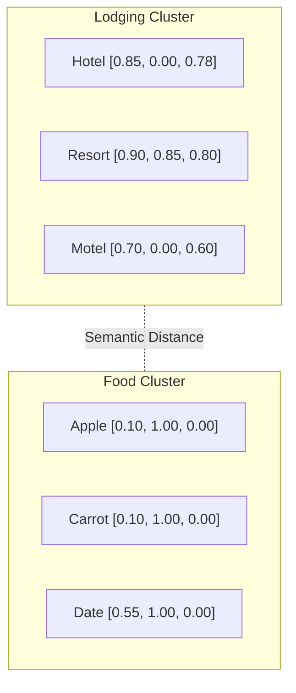
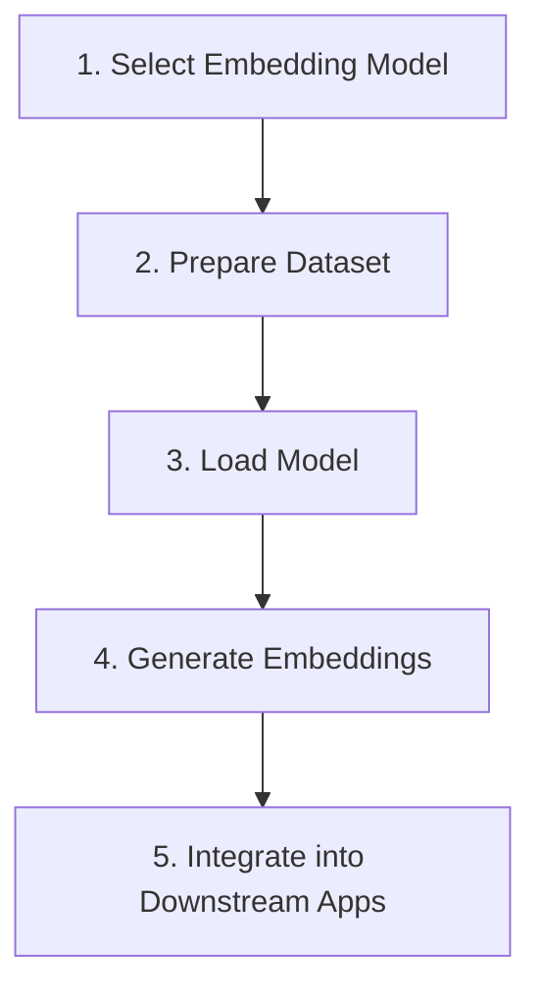

# Build Smarter AI with Embeddings (Retrieval-Augmented Generation)

## Overview

Large Language Models (LLMs) excel at broad, general-purpose text comprehension and generation. However, standard LLMs suffer from critical limitations when deployed in production enterprise environments:
*   **Stale Parameters:** Training data represents a static snapshot frozen in time (cutoff date).
*   **Lack of Attribution:** Model outputs are probabilistic generations with no verifiable source citations.
*   **Hallucinations:** Models can confidently produce false, incomplete, or nonsensical data.

**Retrieval-Augmented Generation (RAG)** is an architectural framework that addresses these limitations by decoupling the model's reasoning capabilities from its knowledge base. Instead of relying solely on static weights, a RAG pipeline queries external, trusted database indexes (public databases, internal document stores, APIs) at runtime. It injects relevant, up-to-date information directly into the prompt context window, ensuring the LLM's generated outputs are accurate, grounded in facts, and verifiable.

---

## Key Technical Details

### 1. The Core Benefits of RAG
*   **Cost-Efficient Scaling:** Eliminates the computational overhead and complexity of continuous model fine-tuning or retraining. Knowledge bases can be updated instantly by updating database indices, keeping operational costs low.
*   **Real-Time Data Currency:** Integrates LLMs with active data pipelines (APIs, live databases, streaming data), keeping the system aligned with current conditions (e.g., market trends, pricing fluctuations).
*   **Factual Grounding:** Constrains the LLM to write answers using only the retrieved documents, lowering hallucination rates and increasing prediction fidelity.
*   **Auditable Transparency (Source Citations):** Retains metadata (URLs, file paths, page numbers) from source documents, allowing the LLM to generate verifiable citations for its responses.
*   **Data Isolation & RBAC Compliance:** Keeps proprietary or confidential data out of model parameters, mitigating training data leakage. It allows role-based access control (RBAC) to be applied at the database retrieval level before data ever hits the model.

### 2. Enterprise Use Cases
*   **Enterprise QA (Question Answering):** Automates answers to time-sensitive queries (e.g., HR policy updates, calendar shifts) by retrieving facts from secure internal company wikis and databases.
*   **Research Synthesis:** Aggregates and correlates data from high-velocity sources (e.g., market charts, academic publications, legal registries) to assist analysts in rapid synthesis.
*   **Fact-Grounded Content Generation:** Ingests live news indices or statistical summaries before drafting reports, ensuring output credibility and including source links.
*   **Domain-Specific Ingestion:** Integrates highly specialized medical, legal, or financial datasets into the context window at runtime, keeping the base model clean of toxic or private information.

---

## Architectural & Theoretical Notes

### 1. RAG Core Pipeline Architecture
The workflow below illustrates how a query is intercepted, augmented with external data, and processed by the LLM:

### 2. The Student Metaphor: Standard LLM vs. RAG LLM
*   **Standard LLM (Closed-Book Exam):** Like a student taking an exam without access to books. The student must rely solely on memory (training parameters). If they encounter obscure details or facts changed since they studied, they must guess, leading to errors (hallucinations).
*   **RAG-enabled LLM (Open-Book Exam):** Like a student taking an exam with access to a library. When asked a question, they look up the exact topic in reference books (retrieval phase) and write an answer grounded in the retrieved text (generation phase).

### 3. Detailed Step-by-Step Execution
1.  **Prompt Capture & Intent Parsing:** The orchestrator intercepts the user's natural language query and extracts structural parameters (location, temporal ranges, intent).
2.  **Information Search (Querying):** The orchestrator queries external indexes (vector databases, semantic indices, web search APIs) using the extracted parameters.
3.  **Context Filtering & Retrieval:** The search engine filters out noise, ranks candidates, and selects the top-K highest-quality document chunks.
4.  **Prompt Augmentation:** The orchestrator inserts the filtered context directly into a structured prompt template alongside the user's query, creating an enriched context.
5.  **Response Generation:** The LLM receives the augmented prompt, processes the text, and synthesizes a clear, accurate, and cited recommendation.

---

## Curriculum Notes: Build Smarter AI with Embeddings

This section aggregates notes from the curriculum modules focused on generating, optimizing, and utilizing vector embeddings across text, image, audio, graph, and multimodal spaces.

---

### Section 1: The Role of Vector Embeddings in AI Search

Unstructured data represents the vast majority of real-world information. To search, analyze, and relate this data, models convert unstructured inputs into dense numerical arrays called **Vector Embeddings**.

#### Case Study: Improving Search at an E-commerce Platform
*   **Ayaan (Software Team Lead)** is tasked with improving his company's e-commerce search engine because customers complain about search results: some see too many unrelated recommendations, and others cannot find items unless they match exact words, causing search abandonment and a drop in sales.
*   **Leila (Senior ML Engineer)** suggests upgrading from keyword-matching to **vector embeddings**.
*   **Traditional Rule-Based/Keyword Search:** Matches exact strings and characters (e.g., rating > 4, category = "action"). Failed to retrieve "returns info" when a user typed "send back order."
*   **Embedding-Based AI Search:** Captures semantic meaning, contexts, and hidden relationships, mapping similar concepts close together in a continuous space.

#### Dimensional Mapping and Vector Clusters
To visualize semantic relationships, we project words into a low-dimensional coordinate plane $\mathbb{R}^3$ based on concepts like $[ \text{leisure}, \text{edible}, \text{accommodation} ]$:

$$\mathbf{v}_{\text{Hotel}} = \begin{pmatrix} 0.85 \\ 0.00 \\ 0.78 \end{pmatrix}, \quad \mathbf{v}_{\text{Resort}} = \begin{pmatrix} 0.90 \\ 0.85 \\ 0.80 \end{pmatrix}, \quad \mathbf{v}_{\text{Motel}} = \begin{pmatrix} 0.70 \\ 0.00 \\ 0.60 \end{pmatrix}$$

$$\mathbf{v}_{\text{Apple}} = \begin{pmatrix} 0.10 \\ 1.00 \\ 0.00 \end{pmatrix}, \quad \mathbf{v}_{\text{Carrot}} = \begin{pmatrix} 0.10 \\ 1.00 \\ 0.00 \end{pmatrix}, \quad \mathbf{v}_{\text{Date}} = \begin{pmatrix} 0.55 \\ 1.00 \\ 0.00 \end{pmatrix}$$

*   **Spatial Proximity:** Lodging terms (`Hotel`, `Resort`, `Motel`) cluster together because they share high values in the lodging/accommodation dimensions. Food terms (`Apple`, `Carrot`, `Date`) cluster separately.
*   **Polysemy (Eş Seslilik / Çok Anlamlılık):**
    *   The word `Date` has multiple meanings. It can represent a fruit (mapping closely to `Apple` and `Carrot` in a food context) or a calendar appointment/meeting planning (aligning with `Hotel` and leisure context).
    *   Advanced embedding models solve this dynamically by generating context-aware vectors depending on the surrounding text.

---

### Section 2: Generating Text Embeddings

Text embeddings can represent units of text at three main hierarchical levels:
1.  **Word Embeddings:** Represent individual words, capturing synonyms (e.g., `Detective`, `Investigation`, `Mystery` cluster closely).
2.  **Sentence Embeddings:** Represent the semantic intent of entire sentences or phrases (e.g., mapping a query like *"How to manage my calendar"* to a resource labeled *"Time Management"*).
3.  **Document Embeddings:** Capture the overall themes, structure, tone, and arguments of entire articles, emails, or reports.

#### The 5-Step Ingestion & Generation Pipeline
Regardless of the text model, the production pipeline follows these key steps:

1.  **Select Model:** Pick a model based on resource constraints, context window, and language support (e.g., BERT, Cohere, OpenAI).
2.  **Prepare Dataset:** Preprocess the raw input text. This includes:
    *   Removing boilerplate HTML, tags, and syntax symbols.
    *   Standardizing text format (e.g., converting to lowercase, removing double spaces).
    *   Replacing common abbreviations or colloquial shortcuts.
    *   Tokenizing the text (segmenting it into operational chunks).
3.  **Load Model:** Instantiate the model architecture in the backend execution environment.
4.  **Generate Embeddings:** Pass the preprocessed text chunks to the model to output high-dimensional numerical vectors.
5.  **Integrate:** Load vectors into a vector database (e.g., Pinecone, Milvus) to enable semantic search or downstream LLM context ingestion.

---

### Section 3: Models for Generating and Optimizing Text Embeddings

#### Prediction-Based vs. Frequency-Based Models
*   **Frequency-Based Models (e.g., TF-IDF, GloVe):** Capture global statistical patterns. **GloVe (Global Vectors)** compiles a co-occurrence matrix containing counts of how often words appear next to each other across a corpus.
    *   *Example:* If a corpus says *"Apples and bananas are sweet. Lemons are sour."*, the matrix tracks the proximity of `Apples`/`Bananas` to `Sweet`, and `Lemons` to `Sour`, capturing global associations.
*   **Prediction-Based Models (e.g., Word2Vec):** Predict words based on local surrounding contexts.

#### Word2Vec Architecture: CBOW vs. Skip-gram
Word2Vec is a classic predictive model utilizing a shallow neural network with two major architectural styles:

| Feature | Continuous Bag of Words (CBOW) | Skip-gram |
| :--- | :--- | :--- |
| **Operational Logic** | Predicts a **target word** from its surrounding context words. | Predicts **context words** given a single target word. |
| **Visual Flow** | `[Context Words]` $\rightarrow$ **`[Target Word]`** | **`[Target Word]`** $\rightarrow$ `[Context Words]` |
| **Speed** | Extremely fast to train; efficient for large datasets. | Slower to train; requires more training steps. |
| **Semantic Quality** | Better for frequent words; matches general word patterns. | Captures subtle semantic details; handles rare words better. |
| **Typical Use Cases** | Text classification, spam filtering, quick topic grouping. | Sentiment analysis, complex recommendations, analogical reasoning. |

> [!NOTE]  
> **Skip-gram Prediction Example:**  
> If the target word is `Cat`, a Skip-gram model calculates probabilities to predict context words like `Pet`, `Milk`, or `Purrs`.

#### Optimization: Dimensionality Reduction (PCA & t-SNE)
Because modern text embedding vectors can stretch across hundreds of dimensions, optimization is necessary to reduce computation time, memory footprints, and improve model generalizability.
*   **Principal Component Analysis (PCA):** A linear reduction technique. It projects high-dimensional vectors to a lower dimension while preserving maximum variance. It is fast and efficient, making it ideal as a first-pass noise filter (e.g., dropping 300 dimensions to 50).
*   **t-Distributed Stochastic Neighbor Embedding (t-SNE):** A non-linear reduction technique. It maps complex high-dimensional spaces to 2D or 3D planes by preserving local neighbor relationships. It is computationally expensive but excellent for human-readable visualization and anomaly detection.
*   **Best Practice:** Combine them by running PCA first to reduce dimensionality to a moderate size, then run t-SNE on the result to generate clean visual clusters.

---

### Section 4: Image, Audio, and Graph Embeddings

Embeddings are not limited to text. Modern AI systems convert diverse data modalities into numerical vectors, enabling multi-modal understanding.

*   **Image Embeddings:** Convert raw pixel matrices (RGB channels) into a latent space capturing visual features (shapes, edges, color profiles).
*   **Audio Embeddings:** Capture structural audio signals (tone, pitch, timbre, rhythm, frequency). Used in:
    *   *Voice recognition:* Biometric speaker authentication.
    *   *Automated transcription:* Mapping phonetic patterns to text strings.
    *   *Emotion detection:* Analyzing voice modulation and stress in customer support centers.
*   **Graph Embeddings:** Project relational networks (nodes representing entities, edges representing connections) into continuous vector spaces. Used in:
    *   *Social recommendations:* Suggesting connections based on shared followers, career roles, or skills.
    *   *Fraud detection:* Identifying suspicious ring networks where multiple cards connect to similar IPs or addresses.
    *   *Knowledge graphs:* Mapping relational structures (e.g., representing "Paris" $\rightarrow$ "Capital of" $\rightarrow$ "France").

#### Multimodal AI Integration
Multimodal models project different data formats (text, images, audio, graphs) into a **unified embedding space**. This allows direct mathematical comparison between modalities.
*   *Multimodal Search Example:* A query for "Eiffel Tower" can search a database using the text string `"Eiffel Tower"`, photos of the tower, or coordinate graphs of landmarks.
*   *Autonomous Vehicles:* Self-driving systems fuse camera images (object detection) with routing graphs (road maps) and radar data inside a single embedding model to make real-time steering and braking decisions.
*   *Benefits:* Enables human-like perception, supports direct cross-modal translations, improves prediction safety, and allows apps to process multi-format customer support tickets.

---

### Section 5: Generating Image Embeddings

The generation pipeline for image embeddings mirrors the 5-step pipeline of text, but uses visual data prep and vision model architectures.

#### Visual Feature Extraction Hierarchy
As an image passes through deep layers of an embedding model, the network extracts features hierarchically:
1.  **Low-Level Features:** Identifies simple pixel changes, edges, borders, and sharp boundaries.
2.  **Mid-Level Features:** Groups edges into geometric forms, basic shapes, and texture patterns.
3.  **High-Level Features:** Combines shapes into semantic concepts (e.g., a wheel, a tail, a human face) to evaluate overall context.

#### Core Vision Models: CNNs vs. Vision Transformers (ViTs)
*   **Convolutional Neural Networks (CNNs):** Use spatial filters (convolutions) to slide across images, capturing hierarchical local visual patterns.
    *   **VGG (Visual Geometry Group):** A classic, deep CNN architecture. It uses uniform convolutional layers, which makes it highly structured but computationally heavy and slow to train.
    *   **ResNet (Residual Network):** Introduces **residual connections** (skip connections) that allow gradients to bypass intermediate layers during backpropagation. This mitigates the vanishing gradient problem, allowing networks to be much deeper. Highly effective for high-resolution medical scans (e.g., chest X-rays, MRI scans, CT scans) where subtle details are critical.
*   **Vision Transformers (ViTs):** Reject the convolutional sliding filter approach. Instead, they slice an image into a grid of 16x16 pixel patches (visual tokens), project them linearly, and process them using a **self-attention mechanism**.
    *   *Advantage:* Captures global relationships across the entire image from the start, rather than building up from local neighborhoods. Highly suited for large-scale context tasks like satellite imagery analysis, environmental monitoring, land-use mapping, and disaster damage assessments.

---

### Section 6: Optimizing Image Embeddings

Image embedding models generate vectors with hundreds or thousands of dimensions (e.g., 512, 1024, or 2048). Optimizing these embeddings is critical for performance and task accuracy.

#### Dimensionality Reduction for Images
Using the entire high-dimensional vector for retrieval leads to computational bottlenecks and high storage costs.
*   **PCA (Principal Component Analysis):** Reduces high-dimensional image vectors to compact representations by discarding noise while retaining dimensions that capture critical differences (e.g., preserving features that separate a cat from a dog).
*   **t-SNE:** Projects dimensions into 2D or 3D coordinate systems to group similar visual themes together, allowing humans to easily inspect the vector space.

#### Case Study A: Cataloging Museum Artifacts
*   **Scenario:** A museum uses an image recognition system to allow visitors and curators to search its collection of sculptures, paintings, and artifacts.
*   **The Pipeline:**
    1.  The system generates 2048-dimensional embeddings for each artifact (sculptures represent 3D geometry; paintings represent color patterns and brushwork).
    2.  **PCA** reduces the dimensions from 2048 down to 256. This discards visual noise and less relevant details, making comparison calculations much faster and reducing the database storage footprint.
    3.  **t-SNE** projects the 256-dimensional vectors into a 2D space. Curators use this map to discover visual similarities, locate duplicates, analyze catalog patterns, and correct misclassified items.

#### Domain Adaptation: Transfer Learning & Fine-Tuning
A vision model trained on generic datasets (like ImageNet's everyday photos) might struggle to identify specialized details (like lung nodules in X-rays). We adapt the model using two techniques:
*   **Transfer Learning:** Reusing the weights of a model trained on one dataset (e.g., ImageNet) as a starting point for a new, related task. The model already understands basic features (edges, curves, colors) and does not need to be trained from scratch.
*   **Fine-Tuning:** A subset of transfer learning where we continue training the pretrained model on a smaller, domain-specific dataset (e.g., labeled chest X-rays). This adjusts the model's weights to capture the target domain's unique visual features.

#### Case Study B: Fashion Search Optimization at "StyleMe"
**StyleMe** is a popular online fashion retail platform. They want customers to easily locate similar apparel and matching accessories (e.g., finding bags or shoes that complement their style) using image-based searches.

```mermaid
flowchart TD
    In[Catalog Images] --> Step1[1. Transfer Learning: Extract Initial 1024-D Vectors]
    Step1 --> Step2[2. Fine-Tuning: Train on Interaction Data Clicks/Cart Adds]
    Step2 --> Step3[3. Dimensionality Reduction: PCA 1024-D to 256-D]
    Step3 --> Step4[4. Testing: Evaluate Speed vs. Retrieval Relevancy]
    Step4 --> Out[Optimized StyleMe Search Engine]
    
    style Step1 fill:#1e293b,stroke:#475569,stroke-width:2px;
    style Step2 fill:#1e3a8a,stroke:#3b82f6,stroke-width:2px;
    style Step3 fill:#14532d,stroke:#22c55e,stroke-width:2px;
    style Step4 fill:#581c87,stroke:#a855f7,stroke-width:2px;
```

1.  **Step 1: Extract Initial Embeddings:** StyleMe uses an image embedding model pretrained on fashion-specific images. The model generates initial 1024-dimensional vectors capturing colors, textures, and apparel cuts.
2.  **Step 2: Fine-Tune Embeddings:** The team fine-tunes the model using real customer interaction data (e.g., items users clicked on, viewed together, or added to their carts). This helps the model align its embeddings with customer perception of similar styles.
3.  **Step 3: Reduce Dimensions:** StyleMe applies PCA to compress the vectors from 1024 dimensions down to 256. This speeds up similarity searches and database lookups without compromising recommendation accuracy.
4.  **Step 4: Test Optimization Results:** The team runs performance tests comparing the optimized model with the previous version. The compressed, fine-tuned model delivers significantly faster search results and more relevant product recommendations.

---

## References & Resources

*   *What is RAG (retrieval-augmented generation)?*, IBM Research, October 2024.
*   *What are AI Hallucinations?*, IBM Research, September 2023.
*   *Retrieval-Augmented Generation for Knowledge-Intensive NLP Tasks*, Lewis et al., 2020.
*   *What is transfer learning?*, IBM Research, February 2024.
*   *What is fine-tuning?*, IBM Research, March 15, 2024.

