# Module 3: Vector Embeddings

Welcome to the technical ledger on **Vector Embeddings: AI's Key to Meaning**. This document details the foundational principles of vector embeddings, their conversion mechanics across multi-modal data streams, real-world business use cases, and how they optimize Retrieval-Augmented Generation (RAG) workflows.


---

## 1. Essentials of Vector Embeddings

Most real-world information—including text, images, and audio—is unstructured. For Artificial Intelligence to process and comprehend this data, it must be transformed into a standardized numerical format. This is accomplished through **Vector Embeddings**.

> [!IMPORTANT]  
> **Definition:**  
> **Vector Embeddings** are high-dimensional numerical representations of data (in the form of dense vectors) that capture semantic relationships, contexts, and deeper meanings. 
> - **Vectors:** Arrays of continuous floating-point numbers representing positions in space.
> - **Embedding:** A mapping process that ensures similar objects are positioned close to one another in the vector space.

### A. Dimensional Representation of Words
Consider a simplified 3-dimensional embedding space $\mathbb{R}^3$ mapping six common words:

$$\mathbf{v}_{\text{Hotel}} = \begin{pmatrix} 0.85 \\ 0.92 \\ 0.78 \end{pmatrix}, \quad \mathbf{v}_{\text{Resort}} = \begin{pmatrix} 0.90 \\ 0.85 \\ 0.80 \end{pmatrix}, \quad \mathbf{v}_{\text{Motel}} = \begin{pmatrix} 0.70 \\ 0.65 \\ 0.60 \end{pmatrix}$$

$$\mathbf{v}_{\text{Apple}} = \begin{pmatrix} 0.45 \\ 0.75 \\ 0.80 \end{pmatrix}, \quad \mathbf{v}_{\text{Date}} = \begin{pmatrix} 0.55 \\ 0.70 \\ 0.85 \end{pmatrix}, \quad \mathbf{v}_{\text{Carrot}} = \begin{pmatrix} 0.10 \\ 0.20 \\ 0.30 \end{pmatrix}$$

When mapped onto a 2D spatial coordinate plane, distinct semantic clusters emerge:

```mermaid
kgraph
    subgraph Vector Space Clustering
        direction LR
        subgraph Lodging Cluster
            Hotel[("Hotel [0.85, 0.92, 0.78]")]
            Resort[("Resort [0.90, 0.85, 0.80]")]
            Motel[("Motel [0.70, 0.65, 0.60]")]
            Hotel <--> Resort
            Resort <--> Motel
        end
        subgraph Food Cluster
            Apple[("Apple [0.45, 0.75, 0.80]")]
            Date[("Date [0.55, 0.70, 0.85]")]
            Carrot[("Carrot [0.10, 0.20, 0.30]")]
            Apple <--> Date
            Date <--> Carrot
        end
    end
    
    style Lodging Cluster fill:#151c24,stroke:#3b82f6,stroke-width:2px;
    style Food Cluster fill:#16241a,stroke:#22c55e,stroke-width:2px;
```

#### Key Spatial Observations:
1.  **Semantic Proximity:** Words sharing similar meanings, such as `Hotel`, `Resort`, and `Motel` (lodging/accommodation concepts), cluster tightly together.
2.  **Semantic Distance:** Unrelated words, such as `Hotel` and `Apple`, are mapped far apart because they share no conceptual overlap.
3.  **Intra-Cluster Nuances:** `Apple` and `Date` are fruits, while `Carrot` is a vegetable. Consequently, the embedding for `Carrot` is positioned slightly farther from `Apple` and `Date` than they are from each other, preserving hierarchical relations.
4.  **Handling Polysemy ("Date" Concept):** Eş sesli/Çok anlamlı (polysemous) words like `Date` have multiple meanings:
    - *Food context:* Closely aligned with `Apple` and other food items.
    - *Appointment/Event context:* Aligned with planning, scheduling, and hospitality locations (`Hotel`/`Resort`).
    - *Resolution:* Advanced transformer models dynamically contextualize words, generating embeddings that sit in the middle of these distinct semantic neighborhoods depending on the input text.

> [!NOTE]  
> **Search Flexibility Case Study**  
> If a user enters the query: *"Where can I book a resort?"*, an AI search engine powered by vector embeddings recognizes that `Hotel`, `Motel`, and `Resort` are semantically connected. The system will retrieve relevant options for resorts even if the exact keyword "resort" is missing from a particular lodging document, resulting in a more flexible and accurate search experience.

---

## 2. From Vectors to Value: Data Modalities & Use Cases

Embeddings act as a universal language for AI models. Any complex data format can be projected into this continuous space.

```mermaid
flowchart TD
    InputData[Unstructured Data Input] --> TypeSelection{Data Modality}
    
    TypeSelection -->|Text Documents| TextEncoder[Text Encoder / LLM]
    TypeSelection -->|Photo Galleries| ImageEncoder[Vision Encoder: ViT]
    TypeSelection -->|Voice / Sound| AudioEncoder[Audio Signal Processor]
    
    TextEncoder -->|Captures Semantic Meaning| VectorOut[Numerical Vector Representation]
    ImageEncoder -->|Captures Features: Color, Texture, Shape| VectorOut
    AudioEncoder -->|Captures Features: Pitch, Tone, Rhythm| VectorOut
    
    VectorOut -->|Cosine / L2 Matching| Application[Downstream AI Applications]
    
    style TypeSelection fill:#1c1917,stroke:#6b7280,stroke-width:2px;
    style VectorOut fill:#1e1b4b,stroke:#ec4899,stroke-width:2px;
```



### A. Data Modality Embeddings
*   **Text Embeddings:** Capture relationships between words, sentences, paragraphs, and full documents. Used by Large Language Models (LLMs) to interpret user intent.
*   **Image Embeddings:** Represent visual parameters (color distributions, textures, shapes). Used in facial recognition and image retrieval engines.
*   **Audio Embeddings:** Convert wave patterns into numerical values while preserving characteristics like pitch, tone, and rhythm. Used in voice assistants and recommendation algorithms.

### B. Core Business Use Cases
*   **Semantic Search Systems:** Bypasses keyword constraints. A query for *"easy dinner recipes"* maps close to phrases like *"quick meals"*, *"30-minute recipes"*, and *"simple weeknight dishes"*.
*   **Question and Answering (Q&A):** Chatbots convert queries and target documentation databases into vectors. Comparing them maps the query *"How do I reset my account's password?"* to the correct document: *"Recover account access"*.
*   **Image Search & Retrieval:** Compares input image embeddings with database images to locate visually similar items.
*   **Fraud Detection:** User spending profiles, transaction amounts, and IP locations are vectorized over time. New transactions deviating from the typical behavioral vector are flagged for review.
*   **Product Recommendations:** Purchase history and browsing behaviors are converted into preference vectors, enabling systems to suggest relevant products.

---

### C. Enterprise Case Study: "Threadsy" Fashion Platform

**Threadsy** is an online fashion retailer that integrates vector embeddings across its core features:

```mermaid
grid
    layout: [1, 2]
    content: [
        "**Text Search & Chatbot Interaction**
        - A user searches for: *'Party dress for summer evenings'*. Threadsy's semantic search returns listings containing *'evening wear'* and *'summer cocktail dress'*.
        - When a customer says: *'I have a slender frame. Do you have more size options?'*, the chatbot maps *'slender frame'* to sizing guidelines and responds: *'This dress is available in six sizes, starting from Size 4.'*",
        
        "**Fraud Prevention & Recommendations**
        - **Behavior Anomaly:** A customer who typically purchases women's clothing from the US suddenly attempts a bulk order of men's clothing from a foreign IP address. The transaction vector deviates from the baseline vector and is flagged for review.
        - **Product Recommendations:** When a user views a dress, the system uses embedding proximity to suggest matching accessories or shoes favored by similar shoppers, improving conversion rates."
    ]
```

---

## 3. How Vectors Enhance AI Responses (RAG)

Traditional Large Language Models are limited by their training cutoff dates and parameter knowledge limits. **Retrieval-Augmented Generation (RAG)** addresses this by merging retrieval networks with generation models.

> [!IMPORTANT]  
> **The Open-Book Exam Metaphor:**  
> A standard LLM relies entirely on its internal weights (closed-book exam). A RAG-enabled LLM behaves like a student taking an **open-book exam**: it can actively query external textbooks (databases) to retrieve accurate, up-to-date information before compiling an answer.

### The 4-Step Vector-Supported RAG Process (Case Study: "Tech Genie")

**Tech Genie**, an online electronics retailer, replaced its keyword search with a RAG pipeline because search queries like *"How to send my order back?"* failed to retrieve articles containing the word *"returns"*.

```mermaid
flowchart LR
    q([User Query]) --> Step1[1. Meaning Representation]
    Step1 --> Step2[2. Similarity Search]
    Step2 --> Step3[3. Contextual Retrieval]
    Step3 --> Step4[4. Enhanced Generation]
    Step4 --> Ans([Accurate Response])
    
    style Step1 fill:#141724,stroke:#3b82f6,stroke-width:2px;
    style Step2 fill:#142217,stroke:#22c55e,stroke-width:2px;
    style Step3 fill:#241423,stroke:#ec4899,stroke-width:2px;
    style Step4 fill:#1e1a3a,stroke:#7209b7,stroke-width:2px;
```



#### Step 1: Meaning-Based Representation
When a customer asks, *"I need to send back my order. What do I do?"*, the RAG system processes the query through an embedding model. The output is a dense vector capturing the user's intent (product return) rather than individual keywords.

#### Step 2: Efficient Similarity Search
The system runs a similarity search, comparing the query vector against precomputed document embeddings in a Vector Database. It quickly identifies documents matching the return intent, even if the wording differs.

#### Step 3: Contextual Retrieval
The RAG system ranks the matching documents and extracts the most relevant text chunks (e.g., return policies, refund timelines, and step-by-step return instructions). It discards unrelated shipping or exchange documents.

#### Step 4: Enhanced Generation
The extracted text chunks are appended to the user's original query as context. The combined payload is sent to the LLM:
$$\text{Prompt} = \text{Context (Retrieved Documents)} + \text{Query}$$
The LLM generates a well-structured, factual response containing step-by-step guides and links to return policies.

---

## 4. Key Takeaways

1.  **Semantic Vectors:** Embeddings map categories and context into coordinate spaces, enabling algorithms to calculate conceptual similarity.
2.  **Context Over Keywords:** Similarity matching allows systems to retrieve contextually relevant records even when query and source vocabularies differ.
3.  **Multi-Modal Utility:** Text, images, and audio can be vectorized into a shared space, supporting cross-modal retrieval and analysis.
4.  **RAG Optimization:** Vector databases act as the search indexing engine for RAG pipelines, ensuring the LLM is supplied with verified, relevant context.

---

## README Reference Material

> The following technical summaries were originally featured in the repository README as a module-level overview.

*   **Context Grounding:** Mitigates LLM hallucinations by intercepting inputs and appending highly relevant contextual tokens extracted at query time.
*   **Vector Search & Cosine Similarity:** Computes semantic proximity in high-dimensional embedding spaces:
    $$\text{similarity}(A, B) = \cos(\theta) = \frac{A \cdot B}{\|A\| \|B\|} = \frac{\sum_{i=1}^n A_i B_i}{\sqrt{\sum_{i=1}^n A_i^2} \sqrt{\sum_{i=1}^n B_i^2}}$$
*   **Distance Metrics:** Compares Euclidean distance ($L_2$) vs. Inner Product ($IP$) metrics for dense vector clustering.
*   **Prerequisites:** Vector mathematics (dot products, vector normalization) and indexing patterns.
