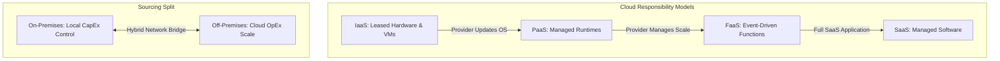

# ☁️ Module 4: Infrastructure & Security

Welcome to the documentation for **Module 4: Infrastructure & Security**. This folder outlines the transition from legacy hardware systems to elastic cloud computing, deconstructs shared responsibility models, and charts security frameworks for modern systems.

---

## 📂 Directory Contents & Technical Summaries

### 1. ⚙️ [Exploring Cloud Computing](file:///c:/Programming/Ai%20-%20Engineer/ai4future/docs/04-infra-security/cloud-computing.md)
*   **Virtualization & Hypervisors:** Explores how hardware resources are abstracted to run multiple Guest Operating Systems (Virtual Machines) on a single physical host.
*   **Physical vs. Virtual Servers:** Breaks down bare-metal hosts (compliance, high performance) and shared multi-tenant virtual machines (cost efficiency, elastic scaling).
*   **Shared Responsibility Models:** Mapped across four tiers:
    *   *IaaS (Infrastructure as a Service):* Leased virtual hardware. High client management overhead.
    *   *PaaS (Platform as a Service):* Pre-configured runtime environments. Client codes; CSP updates OS and scales infrastructure.
    *   *FaaS (Function as a Service / Serverless):* Event-triggered functions. Scales dynamically from 0; pay-per-execution.
    *   *SaaS (Software as a Service):* Completed web-based application. fully managed by the provider.
*   **Deployment Topologies:** Explores Public, Private, Hybrid (compliance data on-premises, application scales off-premises), and Multi-Cloud (distributing workloads across AWS, IBM, and Azure to mitigate vendor dependency).
*   **Future Paradigms:** Analyzes predictive auto-scaling through AI models, Edge Computing (IoT local processing loops), and Zero Trust Architecture security principles.

### 2. 🛡️ [Exploring Cybersecurity](file:///c:/Programming/Ai%20-%20Engineer/ai4future/docs/04-infra-security/cybersecurity.md)
*   *Core Concepts:* Analyzes system threat vectors, cryptographic security layers, network firewalls, and security policies for distributed architectures.

---

## 🗺️ Architectural Concept Map

The responsibilities and virtualization flows of modern cloud architectures are outlined below:

---

## 🛠️ Navigating the Notes

To study the technical ledgers:
*   Study cloud architectures and virtualization: [cloud-computing.md](file:///c:/Programming/Ai%20-%20Engineer/ai4future/docs/04-infra-security/cloud-computing.md)
*   Study security and threat mitigation: [cybersecurity.md](file:///c:/Programming/Ai%20-%20Engineer/ai4future/docs/04-infra-security/cybersecurity.md)
