# ☁️ Module 4: Infrastructure & Security

Welcome to the documentation for **Module 4: Infrastructure & Security**. This folder outlines the transition from legacy hardware systems to elastic cloud computing architectures, deconstructs shared responsibility models, and charts security threat modeling frameworks for modern systems.

---

## 📂 What's in this Folder

| File / Resource | Access Badge | Technical Focus | Core Key Concepts |
| :--- | :---: | :--- | :--- |
| **Exploring Cloud Computing** |  | Virtualization, cloud model matrices (IaaS, PaaS, SaaS, FaaS), topologies | Hypervisor types, multi-tenant virtual machines, deployment topologies |
| **Exploring Cybersecurity** |  | System threat vectors, firewall structures, and cryptographical standards | Threat modeling, Zero Trust, network boundary controls, encryption |

---

## 🧮 Theoretical & Mathematical Foundations

Cloud infrastructure depends on resources scheduling abstractions and performance scaling laws under parallel workloads.

---

### 1. Virtualization CPU Allocation & Scheduling Model
A hypervisor abstracts physical CPU cores into Virtual CPUs (vCPUs) for guest Virtual Machines. Let:
*   $C_{\text{total}}$ be the total CPU cycle capacity of the physical hardware host.
*   $C_{\text{hypervisor}}$ be the capacity consumed by hypervisor overhead (managing context switching, hypercalls, memory translation buffers).
*   $N$ be the number of active guest Virtual Machines.
*   $c_i$ be the vCPU load requested by the $i$-th Virtual Machine.

The available cycle capacity $C_{\text{usable}}$ is modeled as:
$$C_{\text{usable}} = C_{\text{total}} - C_{\text{hypervisor}}$$

Due to virtual thread context switching, cache line flushing, and scheduling latency, the hypervisor exhibits scheduling efficiency $\eta_{\text{schedule}} \in (0, 1]$. To prevent starvation and CPU throttling, the scheduler must satisfy the allocation inequality:
$$\sum_{i=1}^{N} c_i \le \eta_{\text{schedule}} \times C_{\text{usable}}$$

---

### 2. Distributed Workload Performance (Amdahl's Law)
In cloud scaling environments (e.g., executing ETL database queries or vector search ingestions across a cluster of nodes), Amdahl's Law models the theoretical speedup $S$ of a task's latency as a function of parallel processing nodes:
$$S_{\text{latency}}(s) = \frac{1}{(1 - p) + \frac{p}{s}}$$

*   $p \in [0, 1]$ is the proportion of the program/task that is parallelizable.
*   $1 - p$ is the serial execution bottleneck (e.g., initial handshakes, file I/O operations, write locks).
*   $s$ is the scaling factor (number of cloud computing execution threads or server nodes).

*Limit Behavior:* As nodes scale to infinity ($s \to \infty$), the maximum speedup is bounded strictly by the serial code:
$$\lim_{s \to \infty} S_{\text{latency}}(s) = \frac{1}{1 - p}$$

---

## 🗺️ Architectural Concept Map

The responsibilities and virtualization flows of modern cloud architectures are outlined below:

```mermaid
graph TD
    subgraph Cloud Responsibility Models
        IaaS[IaaS: Leased Hardware & VMs] -->|Provider Updates OS| PaaS[PaaS: Managed Runtimes]
        PaaS -->|Provider Manages Scale| FaaS[FaaS: Event-Driven Functions]
        FaaS -->|Full SaaS Application| SaaS[SaaS: Managed Software]
    end
    subgraph Sourcing Split
        OnPrem[On-Premises: Local CapEx Control] <-->|Hybrid Network Bridge| OffPrem[Off-Premises: Cloud OpEx Scale]
    end

    style Cloud Responsibility Models fill:#151c24,stroke:#8b5cf6,stroke-width:2px;
    style Sourcing Split fill:#1b1b1b,stroke:#6b7280,stroke-width:2px;
```

---

## 🛠️ Navigating the Notes

To study the technical ledgers:
*   Study cloud architectures and virtualization: [cloud-computing.md](cloud-computing.md)
*   Study security and threat mitigation: [cybersecurity.md](cybersecurity.md)

---

[← RAG & Embeddings](../03-rag-embeddings/) | [Next: Advanced Topics →](../05-advanced-topics/)
