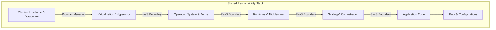
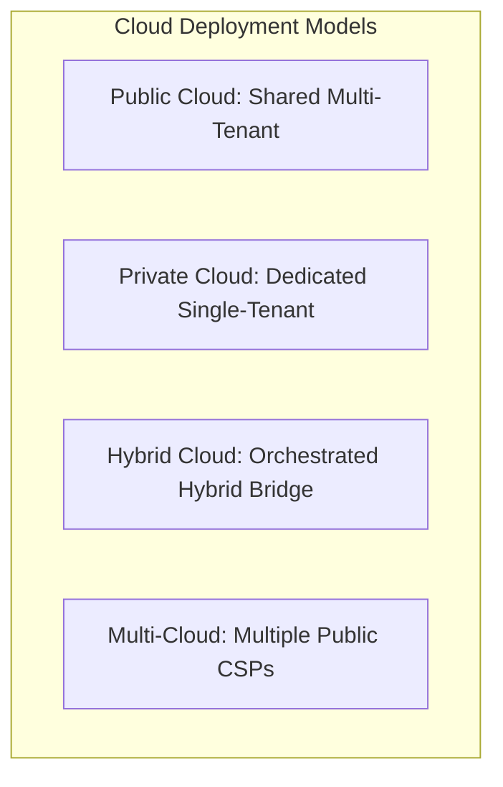
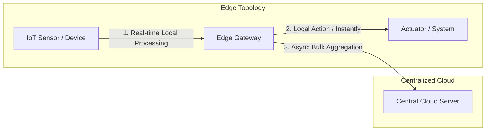

# Exploring Cloud Computing (Infrastructure & Security)

## Overview

Modern enterprise architectures have undergone a paradigm shift, transitioning from localized, capital-intensive (CapEx) hardware infrastructure to on-demand, virtualized utility computing resources (OpEx) managed over the internet. 

At its core, **Cloud Computing** is the delivery of shared, configurable computing resources—including virtual servers, storage blocks, database systems, networking configurations, and specialized software runtimes—provisioned with minimal administrative overhead or provider intervention. This virtualized model relies on **Virtualization** (the hypervisor engine) to partition a physical machine's compute capacities into multiple isolated virtual workloads, yielding maximum resource utilization, elasticity, and cost efficiency.

---

## Key Technical Details

### 1. The 4-Step Cloud Access Lifecycle
To serve payloads to client applications, the system executes a continuous data access loop:
1.  **Establish Connection:** The local client establishes a TCP/IP connection to remote servers via network gateways.
2.  **Dispatch Request:** The client sends an HTTP/HTTPS request specifying data identifiers, queries, or API parameters.
3.  **Process & Retrieve:** The cloud host server queries database indices or file clusters and prepares the payload.
4.  **Render Output:** The server transmits the payload back to the client device, rendering the interface with minimal latency.

### 2. Virtualization: The Foundational Infrastructure Engine
Virtualization abstractly separates physical computer hardware (CPU, memory, storage, network interface cards) from the executing operating systems using a software layer called a **Hypervisor**:
*   **Virtual Machines (VMs):** Software-controlled emulations of physical computers running independent guest operating systems.
*   **High Resource Utilization:** Eliminates hardware idle times by dynamically packing multiple virtual machines onto a single physical host.
*   **Dynamic Scaling:** Virtual instances can be provisioned, replicated, or destroyed programmatically in seconds.

### 3. Server Architectures: Physical vs. Virtual Servers

| Feature | Physical Servers (Bare-Metal) | Virtual Servers (VMs) |
| :--- | :--- | :--- |
| **Isolation Level** | Hard physical isolation (single tenant) | Logical virtualization-layer isolation (multi-tenant) |
| **Resource Allocation** | Dedicated hardware limits; no resource contention | Shared physical pool; dynamically reallocated |
| **Ideal For** | High-performance DBs, data-heavy apps, and strict regulatory compliance | Highly elastic workloads, cost-efficient scaling, and rapid deployment |
| **Case Study** | A healthcare entity storing sensitive patient records or a bank handling peak transaction workloads | An e-commerce platform auto-scaling to handle seasonal holiday traffic spikes |

---

## Cloud Service Models & Shared Responsibility

Cloud resources are categorized into service delivery models based on the division of management tasks between the client and the provider:

### The Service Responsibility Matrix

| Infrastructure Layer | IaaS (Infrastructure as a Service) | PaaS (Platform as a Service) | FaaS (Function as a Service) | SaaS (Software as a Service) |
| :--- | :---: | :---: | :---: | :---: |
| **Data & Configurations** | 👤 User | 👤 User | 👤 User | ☁️ Provider |
| **Application Code** | 👤 User | 👤 User | 👤 User | ☁️ Provider |
| **Scaling** | 👤 User | 👤 User | ☁️ Provider | ☁️ Provider |
| **Runtime Environment** | 👤 User | ☁️ Provider | ☁️ Provider | ☁️ Provider |
| **Operating System** | 👤 User | ☁️ Provider | ☁️ Provider | ☁️ Provider |
| **Virtualization** | ☁️ Provider | ☁️ Provider | ☁️ Provider | ☁️ Provider |
| **Physical Hardware** | ☁️ Provider | ☁️ Provider | ☁️ Provider | ☁️ Provider |

### Service Model Deep Dives

#### A. Infrastructure as a Service (IaaS)
*   **Concept (The Rented Kitchen Metaphor):** Renting a commercial kitchen space. You bring the ingredients and cook the food, but the owner maintains the stoves and building.
*   **Control Level:** High. Users lease raw VMs, storage volumes, and network pipelines. You must manage OS updates, runtimes, firewalls, and application code.
*   **Production Case Study (ML Model Training):** A machine learning startup launches high-CPU virtual instances to train heavy algorithms. By using IaaS, they scale compute capacity dynamically as datasets grow, avoiding the CapEx of purchasing physical servers.

#### B. Platform as a Service (PaaS)
*   **Concept (The Managed Kitchen Metaphor):** Renting space in a managed kitchen where ingredients, tools, and ovens are configured for you. You simply focus on cooking the recipe.
*   **Control Level:** Moderate. The CSP automates scaling, OS patches, load balancing, and runtime configurations. Developers focus entirely on application logic.
*   **Production Case Study (E-Commerce Platform):** An engineering team deploys a web app directly to a PaaS hosting engine. The platform manages database scaling, routing, and load balancing automatically, allowing one-click deployments.

#### C. Function as a Service (FaaS / Serverless)
*   **Concept (The Food Truck Metaphor):** A food truck that only fires up the grill when a customer submits an order, shutting down completely between orders to save fuel.
*   **Control Level:** Low. Code is split into small, event-triggered functions. The CSP handles all scaling from 0 to thousands of executions, charges only for active execution milliseconds, and incurs zero cost when idle.
*   **Production Case Study (Food Delivery System):** An application validation and payment processing system deployed as FaaS. When an order is placed, an event triggers a serverless function to validate the checkout data and inventory, returning to an idle state once completed.

#### D. Software as a Service (SaaS)
*   **Concept (The Restaurant Metaphor):** Ordering a finished meal. You simply sit, eat, and pay; the restaurant manages everything behind the scenes.
*   **Control Level:** Minimal. Complete software applications accessed directly via web browser or API. All underlying systems, data stores, and application code are managed by the provider.
*   **Production Case Study (Enterprise CRM):** A marketing team subscribes to a cloud-based CRM tool to track sales prospects. Rather than installing software, they pay a monthly subscription fee and log in via browser.

---

## Deployment Topologies

Organizations select deployment structures depending on security requirements, workload dynamics, and data gravity:

### 1. Public Cloud
*   **Architecture:** Multiple independent tenants share the same physical server hardware. The CSP uses logical hypervisor isolation tags to secure user data.
*   **Trade-Offs:**
    *   *Pros:* Low cost (pay-as-you-go), rapid scaling, and zero hardware maintenance.
    *   *Cons:* Multi-tenancy security concerns and lack of lower-level hardware configuration control.

### 2. Private Cloud
*   **Architecture:** Compute infrastructure dedicated exclusively to a single tenant. Can be hosted in an internal data center or managed by a third-party CSP.
*   **Trade-Offs:**
    *   *Pros:* Absolute data isolation, custom security configurations, and compliance alignment.
    *   *Cons:* High setup costs (CapEx) and slower hardware scaling limits.

### 3. Hybrid Cloud
*   **Architecture:** Binds public and private clouds (or on-premises systems) using secure communication channels, allowing workloads to cross boundaries.
*   **Trade-Offs:**
    *   *Pros:* High flexibility (run critical data on private, scale apps on public) and cost optimization.
    *   *Cons:* High orchestration complexity and transit security risks.

### 4. Multi-Cloud
*   **Architecture:** Employs services across multiple independent public cloud providers (e.g., AWS, IBM Cloud, and Azure concurrently) to prevent vendor dependency.
*   **Trade-Offs:**
    *   *Pros:* Mitigates vendor lock-in, increases redundancy, and enables selection of specialized services from different providers.
    *   *Cons:* High management overhead and complex system integration.

---

## Infrastructure Sourcing: On-Premises vs. Off-Premises

### A. On-Premises (Local Sourcing)
*   **Mechanism:** Hosting the IT stack within the company's physical facilities.
*   **Trade-Offs:** High capital expenditure (CapEx) for physical server purchases and operational overhead for maintenance (cooling, staffing), offset by total system control and audit compliance.

### B. Off-Premises (Outsourced Sourcing)
*   **Mechanism:** Renting virtualized resources hosted in the CSP's global datacenters.
*   **Trade-Offs:** Lower operational overhead, flexible scaling, and shift to operating expenditure (OpEx), offset by dependency on internet connectivity and vendor uptime SLA.

### Hybrid Infrastructure Case Study (Financial Institution)
*   **Scenario:** A retail bank wants to utilize public cloud big-data engines to perform customer trend analysis, but faces strict central bank audit requirements on transaction data.
*   **Solution:** They deploy a hybrid architecture. The core transaction ledgers and customer records are stored securely **on-premises** within the bank's local data center, while processed, anonymized data aggregates are synced to **off-premises** public cloud instances to run heavy analytical models.

---

## Future Horizons

### 1. Artificial Intelligence Integration
AI is changing cloud management from reactive monitoring to proactive automation:
*   **Automated Cloud Operations:** AI models handle load balancing, container scaling, and active resource monitoring automatically.
*   **Predictive Workload Scaling:** Machine learning models analyze historical traffic trends to scale computing resources *before* traffic spikes occur, eliminating downtime.
*   **Real-time Anomaly Detection:** Security algorithms parse cloud network packets in real-time, detecting and mitigating potential security threats proactively.

### 2. Edge Computing
Edge computing moves data processing away from centralized cloud datacenters to locations closer to the source of data generation:

*   **Key Technical Benefits:**
    *   *Low Latency:* Eliminates data round-trip delays, which is critical for autonomous vehicles, industrial robotics, and medical devices.
    *   *Reduced Bandwidth Costs:* Filters and aggregates data locally before transmitting only key payloads to the cloud, reducing network congestion.
    *   *System Reliability:* Enables systems to run locally even during network disconnects or central cloud outages.
*   **Real-World Example:** An intelligent home thermostat processes temperature readings locally to make HVAC adjustments instantly, without waiting for round-trip commands from a remote cloud server.

### 3. Emerging Security & Resilience Trends
*   **Zero Trust Architecture (ZTA):** A security design framework built on *Never Trust, Always Verify*, demanding authentication and validation for every user and device trying to access cloud resources.
*   **Disaster Recovery & Business Continuity:** Automated replication across separate geographical cloud zones, ensuring critical systems recover from outages instantly.

---

## References & Resources

*   *Gartner Says Cloud Will Become a Business Necessity by 2028*, Gartner Press Release, November 2023.
*   *What is virtualization?*, IBM Technology, 2024.
*   *Shared Responsibility Model in Cloud Computing*, AWS Security Center / Azure Trust Center, 2024.
*   *What is Edge Computing?*, IBM Edge Solutions, 2024.

---

## README Reference Material

> The following technical summaries were originally featured in the repository README as a module-level overview.

*   **Virtualization & Hypervisors:** Explores resources scaling from physical host CPUs to hypervisor-isolated guest OS (Virtual Machines).
*   **Shared Responsibility Matrix:** Breaks down the operational boundaries between client and Cloud Service Provider (CSP) across IaaS, PaaS, SaaS, and FaaS.
*   **Performance Scaling (Amdahl's Law):** Models theoretical latency improvements when parallelizing distributed workloads:
    $$S_{\text{latency}}(s) = \frac{1}{(1 - p) + \frac{p}{s}}$$
    where $p$ is the parallelizable proportion and $s$ is the scaling factor of execution nodes.
*   **Security Architectures:** Explores cryptographic protocol standards, threat-modeling methodologies, and Zero Trust validation loops.
*   **Prerequisites:** Operating system fundamentals, network routing, and IP protocol stacks.
