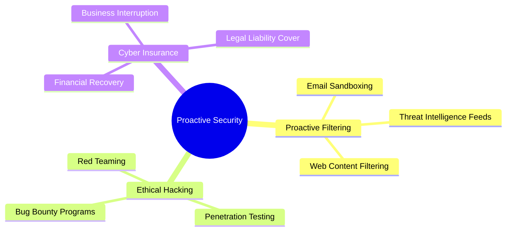

# Module 4: Exploring Cybersecurity

Welcome to the technical ledger on **Exploring Cybersecurity**. This document maps the theoretical foundations of system security, details modern digital and physical threat taxonomies, explores social engineering vulnerabilities, and outlines the emerging technologies shaping the future of defensive operations.

---

## 1. Introduction to Cybersecurity & the CIA Triad

In an interconnected digital economy, cybersecurity is a vital business investment. Organizations face continuous, automated scans and targeted intrusion campaigns.

### A. The Scope and Economics of Modern Threats
- **Attack Frequency:** A cyberattack occurs every **39 seconds** on average, with attackers compromising approximately **30,000 websites** daily.
- **Data Breaches:** Government agencies, technology providers, retail networks, and healthcare systems are prime targets due to the high market value of personal and financial records.
- **Economic Impact:** According to the **IBM 2024 Cost of a Data Breach Report**, the global average cost of a single data breach is **$4.88 million USD**. Recovery operations, regulatory fines, and reputational damage drive these costs.
- **Security Budgets:** Organizations allocate up to **10% of their total IT budget** to security controls to mitigate these risks.

> [!NOTE]  
> **Case Study: Dr. Kazim's Academic Download Incident**  
> Dr. Kazim, a university professor, downloaded research papers from an unverified "free" online repository. Shortly after, his system exhibited severe performance degradation, frequent crashes, and error messages. Dr. Kazim fell victim to **Malware** (specifically a trojan or virus disguised as a document). This scenario demonstrates how easily system integrity can be compromised when security controls are bypassed for convenience.

### B. The CIA Triad Model
Security professionals design defense architectures around the **CIA Triad** (Confidentiality, Integrity, and Availability):

```mermaid
graph TD
    subgraph CIA Triad
        C[Confidentiality] <--> I[Integrity]
        I <--> A[Availability]
        A <--> C
    end
    
    style C fill:#1e1b4b,stroke:#ec4899,stroke-width:2px;
    style I fill:#151c24,stroke:#3b82f6,stroke-width:2px;
    style A fill:#16241a,stroke:#22c55e,stroke-width:2px;
```

1. **Confidentiality:** Restricts data access to authorized entities.
   - *Example (Academic Portal):* Teachers and admins can access student records. Students and parents can view only their own accounts. Unauthorized third parties are completely blocked.
2. **Integrity:** Guarantees that data is accurate, complete, and untampered with during storage, transit, and processing.
3. **Availability:** Ensures that systems, networks, and data are accessible to authorized users when needed.

---

## 2. Taxonomy of Digital Threats

Digital threats exploit software vulnerabilities and system misconfigurations to compromise devices.

### A. Malware Classification
**Malware** is any software designed to disrupt system operations, steal data, or bypass access controls.

| Malware Type | Core Vector | Primary Objective |
| :--- | :--- | :--- |
| **Virus** | Attaches to legitimate files/programs. Requires human action to execute. | Data corruption, file destruction, system crashes. |
| **Adware** | Bundled with free software or installed via browser exploits. | Displays intrusive advertisements, tracks browsing data. |
| **Keylogger** | Installed via software exploits or physical hardware USB dongles. | Secretly records keystrokes to steal passwords and credentials. |

### B. Virus Life Cycle
A computer virus behaves similarly to a biological virus, using a host program to spread:

```mermaid
flowchart LR
    Infection[1. Infection: Payload delivery via email attachment] --> Inactive[2. Dormant State: Virus is inactive in filesystem]
    Inactive --> Activation[3. Activation: User executes the host file]
    Activation --> Propagation[4. Lateral Movement: Virus infects adjacent files and network nodes]
    
    style Infection fill:#1e1b4b,stroke:#ec4899,stroke-width:2px;
    style Inactive fill:#1b1b1b,stroke:#6b7280,stroke-width:2px;
    style Activation fill:#151c24,stroke:#3b82f6,stroke-width:2px;
    style Propagation fill:#16241a,stroke:#22c55e,stroke-width:2px;
```

> [!TIP]  
> **Defense Case Study: Birol's PC Protection**  
> Birol, a student who previously lost all his homework to a virus, implemented three key security controls to protect his new system:
> 1. **Antivirus Software:** Configured for real-time scanning to detect and quarantine malware signatures.
> 2. **Automated Patch Management:** Keeps the operating system and applications updated to close vulnerabilities.
> 3. **Safe Browsing Habits:** Restricts file downloads to verified sources and avoids opening attachments from unknown senders.

> [!WARNING]  
> **Adware Case Study: Gaye's Music Player**  
> Gaye downloaded a free music player. During installation, the installer showed pre-checked checkboxes requesting permissions to install additional software and access browser history. Gaye clicked "Next" without reading the prompts. 
> - *Consequence:* Adware was installed, displaying persistent pop-ups even when the music player was closed.
> - *Data Leakage:* The adware tracked Gaye's browser history and sold this data to advertising networks, resulting in targeted marketing ads for items she searched for (e.g., specific mobile phone brands).

---

## 3. Social Engineering

Social engineering exploits human psychology rather than software code to bypass security boundaries.

### A. Attack Methodologies
- **Phishing:** The use of deceptive emails, messages, or websites that mimic trusted brands to steal credentials or install malware.
- **Honey Trap:** The creation of a false digital identity to build trust or a romantic relationship with a target, eventually manipulating them into sending money or sharing confidential credentials.
- **Tailgating (Piggybacking):** A physical breach where an unauthorized person follows an authorized employee into a secure facility, exploiting social politeness to bypass access cards.
- **Shoulder Surfing:** Visually observing a target entering passwords, PINs, or reading sensitive files on screen in public spaces (such as cafes, airports, or trains).

```mermaid
flowchart TD
    PhishEmail[1. Target receives deceptive email: e.g., 'Update payment details on Amazon']
    PhishEmail -->|Clicking URL| FakeWeb[2. Redirected to high-fidelity clone of legitimate site]
    FakeWeb -->|Credential Entry| CredHarvest[3. Attacker harvests username, password, and MFA code]
    CredHarvest -->|Redirection| RealWeb[4. Target is redirected to real site to avoid suspicion]
    CredHarvest -->|Exploitation| AccountCompromise[5. Attacker accesses real account and transfers funds]
    
    style PhishEmail fill:#1e1b4b,stroke:#ec4899,stroke-width:2px;
    style FakeWeb fill:#1b1b1b,stroke:#6b7280,stroke-width:2px;
    style CredHarvest fill:#151c24,stroke:#3b82f6,stroke-width:2px;
    style AccountCompromise fill:#16241a,stroke:#22c55e,stroke-width:2px;
```

> [!IMPORTANT]  
> **Real-World Scenario: Shoulder Surfing**  
> An employee working on a laptop at a local cafe drafts a sensitive project proposal. A shoulder surfer sitting nearby observes the screen, reads the project details, and takes note of the employee's login credentials. This information is then leaked to competitors. 
> - *Mitigation:* Use privacy screen filters, work in secure locations, and avoid entering critical passwords in public spaces.

---

## 4. Physical & Insider Threats

A robust firewall cannot prevent a physical break-in or the direct theft of hardware.

### A. Physical Security Controls
Physical security uses layered defense-in-depth controls to deter, detect, and delay attackers:

```mermaid
graph TD
    subgraph Multi-Layered Physical Security
        Outer[1. Perimeter Boundary: Entry Badge & Reception Gate] --> Cameras[2. Active Monitoring: CCTV Security Systems]
        Cameras --> FloorGates[3. Segmented Access: Restricted SOC Access Points]
        FloorGates --> Environmental[4. Sensor Controls: Motion, Temperature, & Humidity]
        Environmental --> Endpoint[5. Device Authorization: Passwords & Biometric Fingerprints]
    end
    
    style Outer fill:#1e1b4b,stroke:#ec4899,stroke-width:2px;
    style Cameras fill:#1b1b1b,stroke:#6b7280,stroke-width:2px;
    style FloorGates fill:#151c24,stroke:#3b82f6,stroke-width:2px;
    style Environmental fill:#16241a,stroke:#22c55e,stroke-width:2px;
    style Endpoint fill:#1e1b4b,stroke:#ec4899,stroke-width:2px;
```

> [!NOTE]  
> **Case Study: Merve's SOC Workday Access Flow**  
> Merve, a Security Operations Center (SOC) analyst, completes several physical security steps every morning:
> 1. Uses an RFID badge at the lobby turnstile.
> 2. Waves to security guards who verify her identity visually.
> 3. Walks past CCTV security cameras in the corridors.
> 4. Uses her badge again to access the SOC floor, triggering motion-sensor lights.
> 5. Logs into her terminal using a complex password and biometric fingerprint verification.
> If any single control fails (e.g., her badge is lost), the next security layer prevents unauthorized access.

### B. Environmental Controls
Computer hardware is vulnerable to environmental factors. Organizations deploy sensors to detect anomalies and trigger automated corrective actions:
- **Temperature & Humidity:** Excessive heat damages circuits, while high humidity causes condensation and short circuits. Systems use climate controllers (HVAC) to maintain stable conditions.
- **Power Fluctuations:** Power surges or electromagnetic interference (EMI) can damage processors or corrupt data. Uninterruptible Power Supplies (UPS) and line conditioners are used for protection.

### C. Insider and External Physical Threats
- **Insider Threats:** Risks caused by employees, contractors, or partners who abuse their authorized access:
  - *Disgruntled Employees:* Deleting system data or planting backdoors due to workplace grievances.
  - *Sabotage:* Deliberately introducing bugs or deleting critical application functions.
  - *Retaliation/Leaks:* Leaking confidential documents or source code following personal or professional disputes.
- **External Threats:** Direct physical actions by outside actors:
  - *Device Theft:* Stealing laptops left unattended in public places.
  - *Break-ins:* Forcing entry into offices or homes to access local computers.
  - *Dumpster Diving:* Searching through trash bins for discarded invoices, passwords, or printouts containing sensitive data.

---

## 5. The Future of Cybersecurity

As technology evolves, the threat landscape shifts. Defensive strategies must adapt to new platforms and vectors.

### A. Emerging Technologies: Threats and Opportunities

#### 1. Artificial Intelligence (AI)
- **Defensive Use:** AI systems analyze network traffic in real time to detect anomalies, block phishing attempts, and identify malicious sites before users click on them.
- **Offensive Use:** Attackers use AI to generate highly convincing phishing emails, automate vulnerability scans, and create polymorphic malware.

#### 2. The Internet of Things (IoT)
- **The Challenge:** The proliferation of connected smart devices significantly expands an organization's **attack surface**.
- **Defense:** Edge devices require dedicated security frameworks, network isolation (segmentation), and regular firmware updates.

#### 3. 5G Wireless Infrastructure
- **Defensive Use:** 5G networks introduce advanced encryption standards, making eavesdropping on wireless data streams much more difficult.
- **Offensive Use:** Higher speeds and device densities allow attackers to launch larger Distributed Denial of Service (DDoS) attacks or compromise interconnected smart infrastructures like autonomous vehicles and smart cities.

#### 4. Quantum Computing
- **The Threat:** Quantum computers will be capable of breaking current public-key encryption methods (such as RSA and ECC).
- **Defense:** Cryptographers are developing **Post-Quantum Cryptography (PQC)** standards to secure data before quantum decryption becomes viable.

$$\text{RSA Decryption Complexity: } O(2^{n^{1/3}}) \quad \xrightarrow{\text{Shor's Algorithm}} \quad O(n^3)$$

#### 5. Biotechnology
- **Defensive Use:** Biological developments support advanced biometric sensors and matching algorithms, providing highly secure multi-factor authentication systems.

---

## B. Proactive Defense Strategies

Modern security models shift from reactive incident response to proactive threat mitigation:

- **Proactive Filtering:** Deploying intelligent systems to inspect incoming emails and network traffic, blocking threats before they reach the user's inbox or browser.
- **Ethical Hacking (Bug Bounty):** Inviting independent security researchers to test systems for vulnerabilities. In exchange, researchers receive financial rewards or public recognition based on the severity of their findings.
- **Cyber Insurance:** A risk transfer mechanism where organizations purchase insurance policies to cover the costs of data breaches, ransomware recovery, legal defense, and business interruption.

---

## 6. Key Cryptographic Formulas

To verify the mathematical strength of cryptographic implementations:

### A. Asymmetric Encryption: Key Generation (RSA)
For any two distinct prime numbers $p$ and $q$, let:
$$n = p \times q$$
$$\phi(n) = (p - 1) \times (q - 1)$$

Select a public exponent $e$ such that:
$$1 < e < \phi(n) \quad \text{and} \quad \gcd(e, \phi(n)) = 1$$

Compute the private exponent $d$ such that:
$$d \equiv e^{-1} \pmod{\phi(n)}$$

The public key is $(e, n)$ and the private key is $(d, n)$. For a message $m$, the encryption and decryption transformations are:
$$c \equiv m^e \pmod{n}$$
$$m \equiv c^d \pmod{n}$$

### B. Cryptographic Hash Randomness (Shannon Entropy)
To evaluate the randomness of cryptographic key structures or hashing outputs:
$$H(X) = -\sum_{i=1}^{n} P(x_i) \log_2 P(x_i)$$
where $P(x_i)$ is the probability of bit state $x_i$ occurring in hash stream $X$. Under ideal hashing algorithms (e.g., SHA-256), $H(X) \approx 1$ bit per output position, signifying maximum entropy and zero predictability.

---

## 7. Key Takeaways

1. **Defense-in-Depth:** A secure system uses multiple layers of digital, physical, and administrative controls (e.g., Merve's access routine).
2. **Human Vulnerability:** Social engineering (phishing, shoulder surfing) targets human behavior rather than software flaws. Security awareness training is essential.
3. **Proactive Over Reactive:** Proactive security controls (filtering, ethical hacking, bug bounties) reduce remediation costs by resolving vulnerabilities before exploitation.
4. **Encryption Strength:** Modern security relies on mathematically provable encryption (such as RSA) to guarantee confidentiality and integrity, though quantum computing requires a shift to post-quantum standards.
