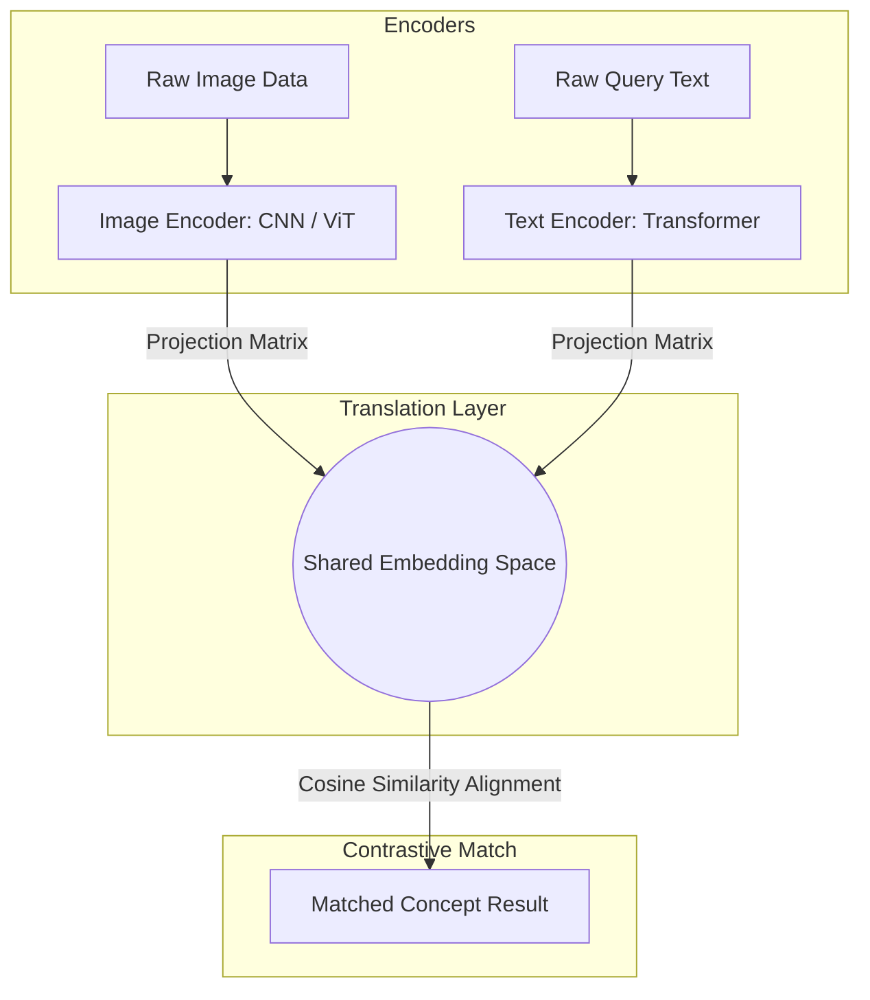

# 🚀 Module 5: Advanced Topics

Welcome to the documentation for **Module 5: Advanced Topics**. This folder covers advanced topics in AI engineering, focusing on multimodal models that align visual, auditory, and semantic data, alongside emerging paradigms like quantum computing.

---

## 🎖️ Earned Digital Credentials

In this module, I earned the following skills credential:

| Credential / Badge | Subject Matter | Documented Ledger |
| :---: | :--- | :---: |
|  | **Multimodal Retrieval-Augmented Generation** | [multimodal-ai.md](file:///c:/Programming/Ai%20-%20Engineer/ai4future/docs/05-advanced-topics/multimodal-ai.md) |

---

## 📂 Directory Contents & Technical Summaries

### 1. 👁️ [Multimodal AI](file:///c:/Programming/Ai%20-%20Engineer/ai4future/docs/05-advanced-topics/multimodal-ai.md)
*   **Unimodal vs. Multimodal Learning:** Compares single-input models (e.g. text-only sentiment classifiers) with multi-modal architectures that synthesize text, audio, and video inputs to build a rich contextual understanding.
*   **Alignment Mechanisms (CLIP Model):** Details how separate text and image encoders translate diverse raw inputs into a shared embedding space, enabling cross-modal semantic matching.
*   **Production Challenges:** Explores semantic sync latency, data alignment complexity during model training, and heavy GPU computing constraints.
*   **Enterprise Case Studies:**
    *   *Logistics Support (Truck Telemetry):* Drivers upload photos of engine faults alongside voice recordings. The multimodal model synthesizes the inputs to generate accurate mechanic dispatches.
    *   *Dormitory Kitchen Safety:* Safety cameras feed real-time video to a model, identifying kitchen hazards (unattended pots, stove fires) and broadcasting safety alerts.
    *   *Miami Video Query:* Traces traveler queries matching social media video frames to retrieve location details and travel guides.

### 2. 🌌 [Quantum Computing](file:///c:/Programming/Ai%20-%20Engineer/ai4future/docs/05-advanced-topics/quantum-computing.md)
*   *Core Concepts:* Explores quantum bits (qubits), superposition states, quantum entanglement, and the mathematical framework of quantum gates.

---

## 🗺️ Architectural Concept Map

The alignment and translation of multiple data modalities into a single semantic embedding space is illustrated below:

---

## 🛠️ Navigating the Notes

To open the files directly:
*   Study multimodal integration systems: [multimodal-ai.md](file:///c:/Programming/Ai%20-%20Engineer/ai4future/docs/05-advanced-topics/multimodal-ai.md)
*   Study quantum computing principles: [quantum-computing.md](file:///c:/Programming/Ai%20-%20Engineer/ai4future/docs/05-advanced-topics/quantum-computing.md)
