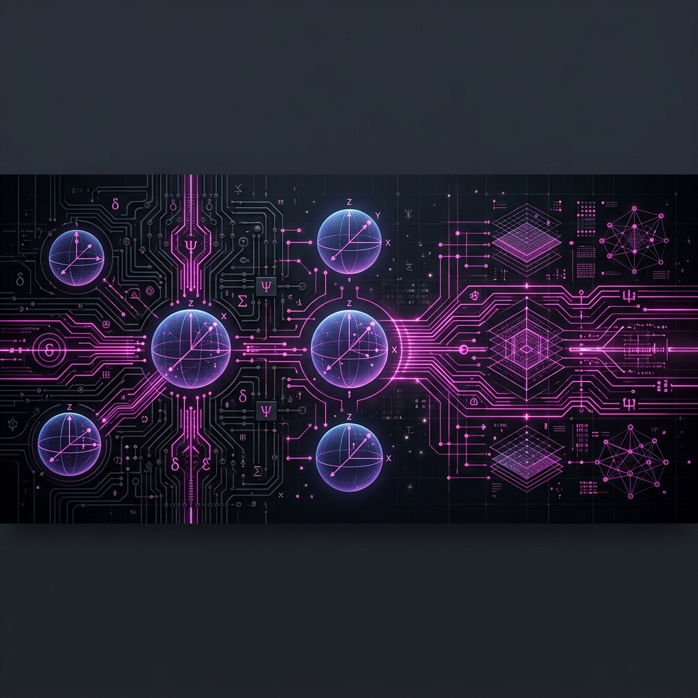

# 🚀 Module 5: Advanced Topics

Welcome to the documentation for **Module 5: Advanced Topics**. This folder covers advanced paradigms in modern engineering, focusing on multimodal AI architectures that align visual and semantic data streams, alongside emerging paradigms like quantum computing.

---

## 📂 What's in this Folder

| File / Resource | Access Badge | Technical Focus | Core Key Concepts |
| :--- | :---: | :--- | :--- |
| **Multimodal AI** |  | Alignment of text, image, and video modalities into shared vector spaces | CLIP model architectures, visual-semantic alignment, and safety case studies |
| **Quantum Computing** |  | Quantum bits, superposition, entanglement, and logic gates | Qubits representation, quantum gates matrices, and information metrics |

---

## 🎖️ Earned Digital Credentials

In this module, I earned the following skills credential:

| Credential / Badge | Subject Matter | Documented Ledger |
| :---: | :--- | :---: |
|  | **Multimodal Retrieval-Augmented Generation** | [multimodal-ai.md](multimodal-ai.md) |

---

## 🧮 Theoretical & Mathematical Foundations

---

### 1. Multimodal Alignment & Contrastive InfoNCE Loss (CLIP Model)
Contrastive Language-Image Pre-training (CLIP) maps visual data and natural language descriptions to a shared semantic vector space. Let $v_i \in \mathbb{R}^d$ be the normalized visual embedding of image $i$, and $t_i \in \mathbb{R}^d$ be the normalized text embedding of sentence $i$.

The cosine similarity matrix is computed, where the similarity score is scaled by a learnable temperature parameter $\tau$:
$$\text{similarity}(v_i, t_j) = \frac{\cos(v_i, t_j)}{\tau} = \frac{v_i^T t_j}{\tau \cdot \|v_i\| \|t_j\|}$$

For a batch of size $B$, the network is optimized by minimizing the symmetric cross-entropy **InfoNCE Loss** across image-to-text and text-to-image matching:
$$\mathcal{L}_{i \to t} = -\frac{1}{B} \sum_{i=1}^{B} \log \frac{e^{v_i^T t_i / \tau}}{\sum_{j=1}^{B} e^{v_i^T t_j / \tau}}$$
$$\mathcal{L}_{t \to i} = -\frac{1}{B} \sum_{i=1}^{B} \log \frac{e^{t_i^T v_i / \tau}}{\sum_{j=1}^{B} e^{t_i^T v_j / \tau}}$$
$$\mathcal{L}_{\text{CLIP}} = \frac{1}{2} \left( \mathcal{L}_{i \to t} + \mathcal{L}_{t \to i} \right)$$

---

### 2. Quantum Computing Mechanics
Quantum computing replaces standard binary bits with quantum bits (qubits) governed by the laws of quantum mechanics.

#### A. Qubit State Vector
A qubit's state $|\psi\rangle$ is represented as a linear combination (superposition) of the basis states $|0\rangle$ and $|1\rangle$:
$$|0\rangle = \begin{pmatrix} 1 \\ 0 \end{pmatrix}, \quad |1\rangle = \begin{pmatrix} 0 \\ 1 \end{pmatrix}$$
$$|\psi\rangle = \alpha|0\rangle + \beta|1\rangle = \begin{pmatrix} \alpha \\ \beta \end{pmatrix}$$
where $\alpha, \beta \in \mathbb{C}$ are complex probability amplitudes. The conservation of probability requires the normalization condition:
$$|\alpha|^2 + |\beta|^2 = 1$$
*   $|\alpha|^2$: Probability of measuring state $|0\rangle$.
*   $|\beta|^2$: Probability of measuring state $|1\rangle$.

#### B. Quantum logic gates (Unitary Transformations)
Quantum gates act on qubit states and are modeled as unitary matrices ($U^\dagger U = I$):

*   **Hadamard Gate ($H$):** Creates an equal superposition state:
    $$H = \frac{1}{\sqrt{2}}\begin{pmatrix} 1 & 1 \\ 1 & -1 \end{pmatrix}$$
    $$H|0\rangle = \frac{1}{\sqrt{2}}\begin{pmatrix} 1 & 1 \\ 1 & -1 \end{pmatrix}\begin{pmatrix} 1 \\ 0 \end{pmatrix} = \frac{1}{\sqrt{2}}\begin{pmatrix} 1 \\ 1 \end{pmatrix} = \frac{1}{\sqrt{2}}|0\rangle + \frac{1}{\sqrt{2}}|1\rangle = |+\rangle$$

*   **Pauli-X Gate (Quantum NOT):** Flips the state values:
    $$X = \begin{pmatrix} 0 & 1 \\ 1 & 0 \end{pmatrix}$$
    $$X|0\rangle = |1\rangle, \quad X|1\rangle = |0\rangle$$

*   **Controlled-NOT Gate (CNOT):** Entangles two qubits (control and target):
    $$\text{CNOT} = \begin{pmatrix} 1 & 0 & 0 & 0 \\ 0 & 1 & 0 & 0 \\ 0 & 0 & 0 & 1 \\ 0 & 0 & 1 & 0 \end{pmatrix}$$

---

## 🗺️ Architectural Concept Map

The alignment and translation of multiple data modalities into a single semantic embedding space is illustrated below:

```mermaid
graph TD
    subgraph Encoders
        InputImage[Raw Image Data] --> ImageEnc[Image Encoder: CNN / ViT]
        InputText[Raw Query Text] --> TextEnc[Text Encoder: Transformer]
    end
    subgraph Translation Layer
        ImageEnc -->|Projection Matrix| SharedSpace((Shared Embedding Space))
        TextEnc -->|Projection Matrix| SharedSpace
    end
    subgraph Contrastive Match
        SharedSpace -->|Cosine Similarity Alignment| OutputMatch[Matched Concept Result]
    end

    style Encoders fill:#141724,stroke:#3b82f6,stroke-width:2px;
    style SharedSpace fill:#241423,stroke:#ec4899,stroke-width:2px;
```

---

## 🛠️ Navigating the Notes

To open the files directly:
*   Study multimodal integration systems: [multimodal-ai.md](multimodal-ai.md)
*   Study quantum computing principles: [quantum-computing.md](quantum-computing.md)

---

[← Cloud & Security](../04-infra-security/) | [Root Overview](../../README.md)
