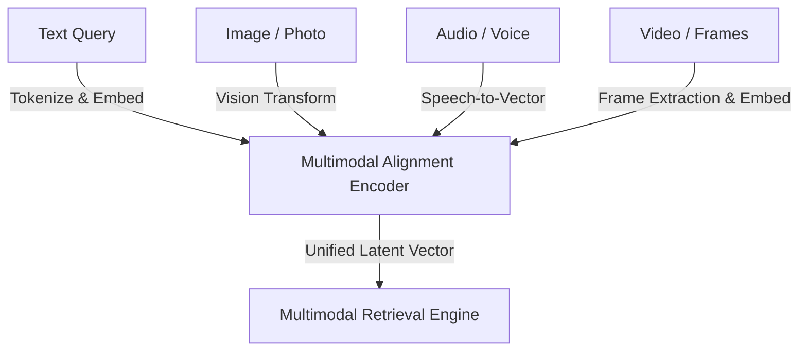
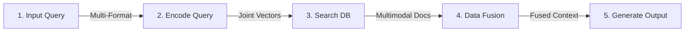

# Multimodal AI & Multimodal Retrieval-Augmented Generation (Multimodal RAG)

## Overview

Traditional RAG architectures are strictly limited to text pipelines, which limits their effectiveness when processing real-world data sources (such as mechanical diagrams, medical scans, voice logs, or video feeds). **Multimodal Retrieval-Augmented Generation (Multimodal RAG)** expands this boundary by processing, aligning, and embedding multiple modalities (text, images, audio, video) into unified representation spaces. This allows models to cross-reference multiple modalities to generate grounded, context-aware responses.

By connecting LLMs to external multimodal databases, developers can build systems that reason across diverse data streams without updating the base model's parameters, reducing costs, and preventing hallucinations.

---

## Key Technical Details

### 1. Text-Only RAG vs. Multimodal RAG Matrix

| Feature | Text-Only RAG | Multimodal RAG |
| :--- | :--- | :--- |
| **Input Modality** | Single text-only input channel. | Multiple concurrent input types (text, images, audio, video). |
| **Retrieval Scope** | Text-based documents from relational/vector databases. | Multimodal data sources including text blocks, image vectors, and video segments. |
| **Output Format** | Text-only generated responses. | Rich output generation in the form of text, formatted images, or video responses. |

### 2. Engineering Benefits of Multimodal RAG
*   **Comprehension of Complex Queries:** Ingests non-text signals directly to interpret query intent. By combining inputs, it achieves a deeper, holistic interpretation of user prompts.
*   **Cross-Modal Accuracy:** Cross-references diverse media types to resolve ambiguities (e.g., verifying a written instruction against a diagram or voice pronunciation).
*   **Reduced Hallucination Rate:** Grounds generation with authoritative, multi-source visual and acoustic data. If a text string is vague (e.g., *"The screen is flickering"*), it parses attached screenshots or audio diagnostics to match hardware records.
*   **Enhanced User Experience (UX):** Enables hands-free or visual interaction patterns, increasing accessibility and system usability.
*   **Access to Real-Time & Domain-Specific Data:** Integrates real-time data sources (APIs, live feeds), ensuring outputs are grounded in current, specialized information. This overcomes the limitations of static models that lose relevance over time.

---

## Architectural & Theoretical Notes

### 1. Multimodal Alignment Pipeline
To perform semantic similarity searches across different modalities, Multimodal RAG projects text, images, and audio into a shared coordinate system (latent space) using a joint encoder (e.g., CLIP, ImageBind):

### 2. The Italian Chef Metaphor: Structuring Context
*   **The Metaphor:** Imagine a master Italian chef preparing a complex lasagna or creamy risotto. The chef does not just throw raw elements together; they carefully select fresh tomatoes, basil, aged Parmigiano-Reggiano, and handmade pasta, preparing and layering each ingredient systematically to produce a unified, rich dish.
*   **The Alignment:** The final output of a Multimodal RAG model is like the chef’s signature dish. The system acts as the chef by accessing distinct, specialized knowledge databases (image libraries, audio registers, video archives, document stores), extracting the relevant components, and carefully combining (layering) them to enrich the base model's comprehension.

### 3. Detailed Step-by-Step Multimodal RAG Workflow
The execution pipeline processes data across five distinct stages:

1.  **Step 1: Query Input (Sorgu Girişi):** The user submits a query. The input can be in multiple formats: text, images, voice records, short videos, or combinations thereof.
2.  **Step 2: Query Encoding (Sorguyu Kodlama):** The system routes the multimodal inputs through a joint multimodal encoder, converting them into embedded vectors. These are numerical representations that allow the RAG system to interpret and compare different forms of data in a shared vector space.
3.  **Step 3: Information Retrieval (Bilgi Alma):** The system runs similarity search algorithms using the embedded query vectors to retrieve relevant data (text documents, images, audio samples, or video recordings) matching the query.
4.  **Step 4: Data Fusion (Veri Füzyonu):** The system combines all retrieved data and different inputs into a unified text context (using titles, descriptions, video transcripts, etc.), preparing it for the LLM to interpret and analyze correctly.
5.  **Step 5: Output Generation (Çıktı Üretme):** The merged/fused data and the original query are passed to the LLM. The LLM generates a response reflecting the query's intent and the context of the retrieved information (e.g., written, visual, or audio answers).

---

### Case Studies

#### Case Study A: Logistics Fleet Support App (Tenzin's Pilot)
*   **The Problem:** S Drivers reported truck malfunctions via a text-only support form. Drivers often omitted technical details, leading to slow ticket resolution times, excessive downtime, and unnecessary dispatches of mechanics.
*   **The Multimodal RAG Intervention:** Tenzin deployed a multimodal assistant. Drivers can now record voice notes describing the issue and upload photos of dashboard warning indicators or damaged parts.
*   **System Action:** The system parses the voice audio and photo features, queries technical manuals, maintenance history databases, and mechanic wikis, and synthesizes an actionable repair guide.
*   **Business Outcome:** Reduces manual dispatch bottlenecks, lowers driver downtime, and increases first-time fix rates.

#### Case Study B: Ananya's Dormitory Cooking Guide
*   **Scenario:** Ananya, a university student in a dorm, finds a photo of an appealing pasta dish. She wants to identify the recipe and cook it using only basic ingredients found in a student tuck shop.
*   **Execution Lifecycle:**
    *   *Step 1 (Input):* Uploads the raw photo of the pasta and writes: *"What pasta dish is this, and how can I make it with basic ingredients available in a student hostel's tuck shop?"*
    *   *Step 2 (Encode):* A multimodal encoder processes the image features (identifying a creamy tomato pasta) and the text query (capturing the recipe identification and resource constraint intent) into aligned numerical vectors.
    *   *Step 3 (Retrieve):* The system queries a multimodal database, retrieving recipe documents, similar images of Pasta al Pomodoro e Panna to confirm the dish's identity, and short videos demonstrating basic kitchen equipment requirements.
    *   *Step 4 (Fusion):* Fuses the visual matches, filters out complex/professional recipes to select only those suitable for a beginner dorm setup, and organizes the final instructions into a clean context template.
    *   *Step 5 (Generate):* The LLM consumes the context and outputs: *"This dish is Creamy Tomato Pasta (Pasta al Pomodoro e Panna). You can make it with penne pasta, tomatoes, cream, and garlic using a single pan and stove."*, accompanied by step-by-step instructions.

#### Case Study C: Travel & Tourism Assistant (Gayle's Miami Trip)
*   **Scenario:** Gayle is a travel enthusiast planning a trip to Miami. She finds a video clip of a Miami beach on social media and wants to get travel details about the location.
*   **Execution Lifecycle:**
    *   *Input & Query:* Gayle uploads the video clip and prompts the assistant for location details and suggestions.
    *   *System Action:* The system parses the video frames and text prompts, queries geographical and tourist databases, and identifies the exact beach.
    *   *Output:* The assistant provides travel tips, logistics suggestions, and cafe recommendations near the identified beach.

---

## References & Resources

*   *Inference scaling to improve multimodal RAG*, IBM Research, June 2025.
*   *What is RAG (retrieval-augmented generation)?*, IBM Research, October 2024.
*   *ImageBind: One Embedding Space To Bind Them All*, Girdhar et al., Meta AI, 2023.

---

## README Reference Material

> The following technical summaries were originally featured in the repository README as a module-level overview.

*   **Multimodal Alignment (CLIP):** Connects disparate unimodal encoders (Vision ViT and Text Transformer) into a shared semantic embedding space using contrastive InfoNCE loss:
    $$\text{InfoNCE Loss} = -\log \frac{e^{\cos(v_i, t_i)/\tau}}{\sum_{j} e^{\cos(v_i, t_j)/\tau}}$$
