# Exploring Quantum Computing

Welcome to the comprehensive technical documentation for **Exploring Quantum Computing**. This document details the physical limits of classical computing, quantum mechanical principles applied to computer science, the architecture of quantum computers, and the engineering details of cryogenic dilution refrigerators.

---

## 📂 Module Outline

1. **Introduction to Quantum Computing**
2. **How Quantum Computers Work**
3. **Anatomy of Quantum Computers**

---

## 1. Introduction to Quantum Computing

### The Physical Limits of Classical Silicon Scaling
Classical computers process information via silicon microchips containing billions of microscopic switches called **transistors**. For decades, computing power scaled exponentially by reducing transistor dimensions (Moore's Law). However, as transistors approach the sub-nanometer atomic scale (only a few atoms wide), they hit two fundamental physical limits:

1.  **Quantum Tunneling & Unpredictability:** At atomic scales, classical physics breaks down. Electrons exhibit quantum behaviors, such as tunneling through physical barriers. This makes transistor states unpredictable, introducing computational errors.
2.  **Thermal Dissipation (Extreme Heat):** High transistor densities generate extreme thermal energy due to electrical resistance. At sub-nanometer scales, this heat is sufficient to melt the silicon substrate, causing hardware failure.

---

### Quantum Mechanics vs. Classical Physics
Quantum computing leverages the laws of quantum mechanics—the physics governing matter at atomic and subatomic scales—which differ fundamentally from macroscopic classical behavior:

```
┌────────────────────────────────────────────────────────────────────────┐
│                        Classical vs. Quantum                           │
├──────────────────────────────────────┬─────────────────────────────────┤
│  Classical Behavior (Macro-Scale)    │  Quantum Behavior (Subatomic)   │
├──────────────────────────────────────┼─────────────────────────────────┤
│  • Predictable, deterministic paths  │  • Probabilistic states         │
│  • Distinct, isolated locations      │  • Exists in superposition      │
│  • Unaffected by passive observation │  • Collapses upon measurement   │
└──────────────────────────────────────┴─────────────────────────────────┘
```

*   **The Falling Apple Analogy:** A macroscopic apple falling from a tree follows a single, predictable, deterministic path to the ground. 
*   **The Electron-Sized Apple:** If the apple were shrunk to the size of an electron, it would traverse multiple potential paths simultaneously. Its exact path and landing point are probabilistic. Before observation, the particle exists in a wave of probabilities (superposition). Upon observation, the system collapses into a single deterministic state.

---

### Comparative Advantage: When to Use Quantum Computers
Quantum computers are not a general-purpose replacement for classical computers. They are specialized processors suited for multi-variable combinatorially explosive problems:

*   **Classical Strengths:** Linear data processing, everyday productivity tasks, and systems with low variable counts.
*   **Quantum Strengths:** Problems with thousands of variables that interact in a massive number of ways, yielding billions of potential states.
    *   *Real-World Example (Pharmacology):* Simulating how a drug molecule interacts with human cells or proteins. Classical computers fail at simulating molecular-level quantum interactions due to electron-electron variables. Quantum computers simulate these interactions directly, accelerating drug discovery pipelines.

---

## 2. How Quantum Computers Work

### Classical Sequential Processing
Classical computers represent information using binary digits (**bits**), where each bit is physically represented by a transistor in one of two states: **1 (Open/On)** or **0 (Closed/Off)**. 
*   *Data Representation:* The letter "A" is stored as the 8-bit byte `01000001`.
*   *Algorithm Processing:* Classical computers resolve database searches sequentially (checking options one by one):

```mermaid
graph TD
    Start[Search Target: 7 /0111/] --> Step1[Compare 2 /0010/]
    Step1 --> |First bit matches, second fails| Step2[Compare 5 /0101/]
    Step2 --> |First two bits match, third fails| Step3[Compare 7 /0111/]
    Step3 --> |All bits match| Match[Target Found / Stop Search]
    
    style Start fill:#181824,stroke:#3b82f6,stroke-width:2px;
    style Match fill:#142217,stroke:#22c55e,stroke-width:2px;
```



---

### Quantum Information Principles
Quantum computing replaces classical bits with **qubits** (quantum bits), which exploit three key principles of quantum mechanics:

#### A. Superposition
*   **Concept:** A qubit can represent a linear combination of both the $0$ and $1$ states simultaneously, with specific probability amplitudes assigned to each.
*   **The Spinning Coin Metaphor:** A coin resting on a table represents a classical bit (heads or tails). A coin spinning in the air represents a qubit in superposition, existing as a blur of both states until it lands (measurement forces collapse).
*   **Mathematical State Vector:**
    $$|\psi\rangle = \alpha|0\rangle + \beta|1\rangle \quad \text{subject to} \quad |\alpha|^2 + |\beta|^2 = 1$$
    where $|\alpha|^2$ is the probability of measuring state $|0\rangle$, and $|\beta|^2$ is the probability of measuring state $|1\rangle$.

#### B. Interference
*   **Concept:** Quantum algorithms apply constructive and destructive interference to state probability amplitudes. This systematically amplifies the probability of measuring the correct solution while canceling out incorrect outcomes.

#### C. Entanglement
*   **Concept:** A quantum connection between two or more qubits. The measurement of one entangled qubit instantaneously determines the state of the other, regardless of physical distance.
*   **Entangled Coins:** If two coins are entangled such that they must exhibit opposite states, spinning and landing Coin A as heads instantly forces Coin B to land as tails.
*   **The Laundry Separator Metaphor:** A red and a blue sock are entangled across two baskets. The moment a quantum processor detects the red sock in Basket 1, it instantly knows the blue sock is in Basket 2 without checking it.

---

### The 5-Step Hybrid Quantum-Classical Processing Loop
Quantum processors run within a hybrid loop, handing computational data back to classical infrastructure:

```mermaid
graph TD
    Sub[1. Superposition: Initialize Qubits] --> Int[2. Interference: Apply Quantum Algorithm]
    Int --> Meas[3. Measurement: Waveface Collapse]
    Meas --> Loop{4. Re-run Iterations for Confidence}
    Loop --> |Aggregate Telemetry| Class[5. Classical Post-Processing: Decide Final Answer]
    
    style Sub fill:#181824,stroke:#3b82f6,stroke-width:2px;
    style Int fill:#181824,stroke:#3b82f6,stroke-width:2px;
    style Meas fill:#181824,stroke:#3b82f6,stroke-width:2px;
    style Loop fill:#181824,stroke:#3b82f6,stroke-width:2px;
    style Class fill:#142217,stroke:#22c55e,stroke-width:2px;
```



1.  **Initialize Superposition:** The quantum computer sets qubits into a superposition state representing all possible variables.
2.  **Apply Interference:** The quantum algorithm modifies probability amplitudes, increasing the probability weight of the target answer.
3.  **Measurement:** The system is measured, collapsing the superposition state into a single deterministic result.
4.  **Re-run Algorithm:** Due to the probabilistic nature of quantum systems, steps 1-3 are executed multiple times to build statistical confidence.
5.  **Classical Post-Processing:** A classical computer aggregates the multiple quantum outputs, processes the frequency patterns, and isolates the final answer.

---

## 3. Anatomy of Quantum Computers

### Physical Structure and Components
A quantum computer consists of a gilded tower suspended inside a vacuum chamber, resembling an upside-down chandelier:

```
              ┌────────────────────────────────┐  ◄── Room Temperature Stage (300 K)
              │   Coaxial Microwave Cables     │
              ├────────────────────────────────┤  ◄── 4 Kelvin Stage (HEMT Cryo-Amps)
              │    Thermal Expansion Loops     │
              ├────────────────────────────────┤  ◄── Cryogenic Attenuators & Filters
              │      Isolators / Directional   │
              ├────────────────────────────────┤  ◄── Mixing Chamber Plate (15 mK)
              │    Quantum Processor (Qubits)  │
              └────────────────────────────────┘
```

*   **Quantum Chip:** Located at the absolute bottom of the tower, this contains the physical qubits and executing circuits.
*   **Microwave Coaxial Cables:** Carry control signals down to the chip and output signals back up.
    *   *Thermal Expansion Loops:* The cables contain small circular loops to absorb mechanical expansion and contraction during cooling cycles, preventing brittle fracturing.
*   **Filters:** Block thermal and electromagnetic noise from room-temperature equipment, ensuring only clean signals reach the sensitive qubits.
*   **Cryogenic Amplifiers (HEMT):** Positioned at the 4K stage to boost the weak quantum output signals above the classical noise floor.
*   **Isolators:** Force signals to flow in a single direction, preventing back-scattered thermal noise from traveling down and disrupting the quantum processor.
*   **Copper Hardware:** Internal frames are machined from high-purity copper due to its thermal conductivity, maintaining uniform temperatures across plates.

---

### Cryogenic Environment: The Dilution Refrigerator
To keep qubits stable, the quantum processor is housed in a **Dilution Refrigerator** (Seyreltme Soğutucusu):

*   **Matryoshka Doll Construction:** Nested thermal shields shield the inner core from room-temperature radiation.
*   **Thermal Gradient:**
    *   *Top Stage:* Room temperature ($\sim 300\text{ K}$).
    *   *Mid Stages:* Cooled using liquid nitrogen ($\sim 77\text{ K}$) and cryogenic helium compressors ($\sim 4\text{ K}$).
    *   *Bottom Mixing Chamber:* Cooled using a Helium-3/Helium-4 dilution cycle down to **$15\text{ milikelvin}$ ($0.015\text{ K}$)**, which is colder than deep space.
*   **Network Analyzer (Ağ Analizörü):** Used in testing to measure the exact frequency and phase response of qubits, ensuring they align with design parameters.

---

## 🛠️ Navigating the Notes
To explore other topics in this module:
*   [← Multimodal AI](multimodal-ai.md)
